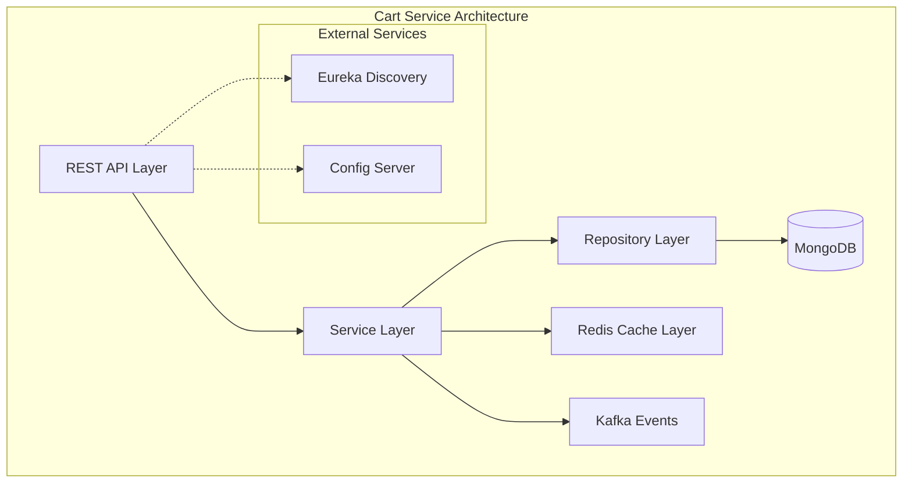
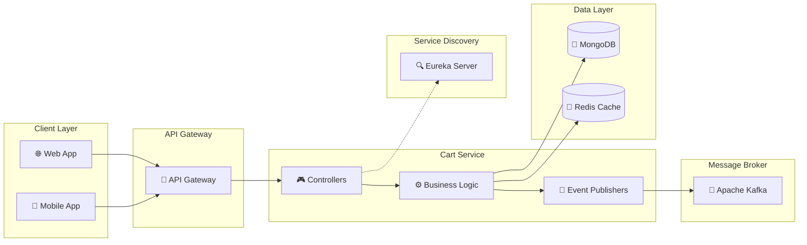
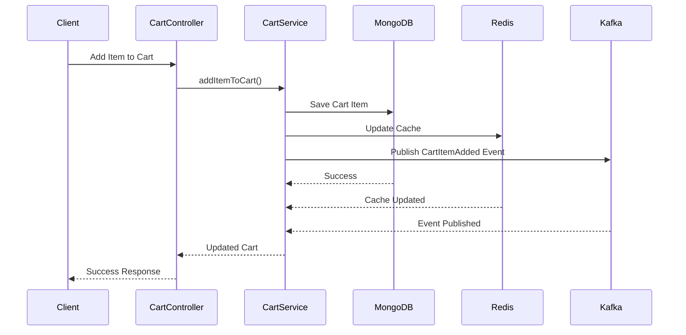
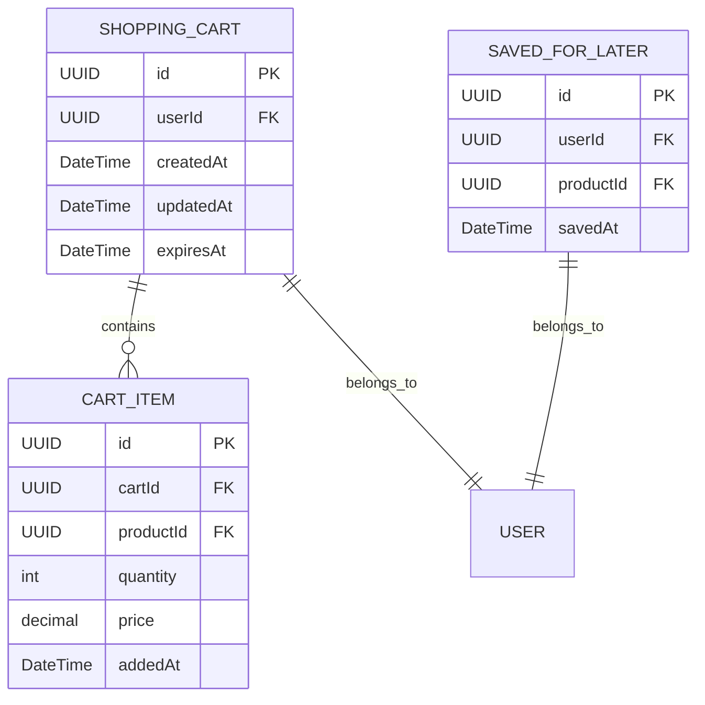
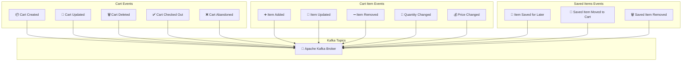
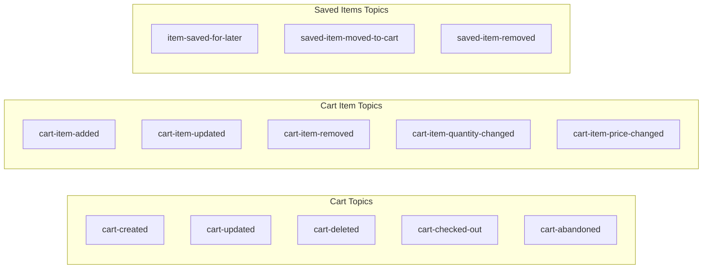
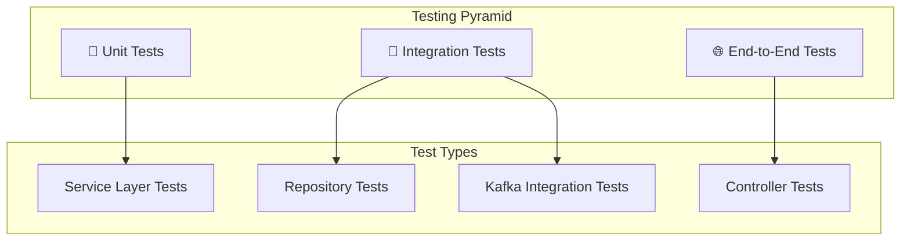
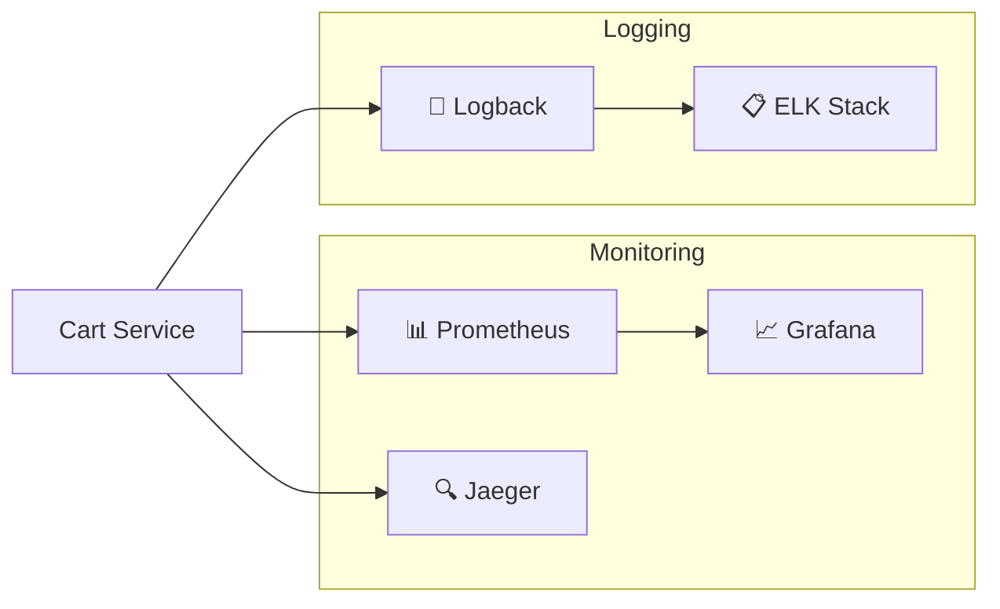
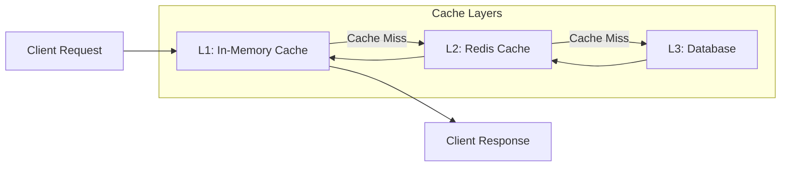

# 🛒 Cart Service - E-commerce Microservice

[](https://spring.io/projects/spring-boot) [](https://www.oracle.com/java/) [](https://www.mongodb.com/) [](https://redis.io/) [](https://kafka.apache.org/)

A robust, scalable cart management microservice built with Spring Boot, featuring real-time event-driven architecture, intelligent caching, and comprehensive cart operations.

## 🏗️ Architecture Overview



## 🚀 Technology Stack

<div align="center">

| Technology | Description | Version |
|------------|-------------|---------|
|  **Spring Boot** | Application Framework | 3.4.4 |
|  **MongoDB** | Primary Database | Latest |
|  **Redis** | Caching Layer | Latest |
|  **Apache Kafka** | Event Streaming | Latest |
|  **Eureka** | Service Discovery | 2024.0.1 |
|  **Swagger** | API Documentation | 2.7.0 |

</div>

## 🎯 Core Features

### 🛍️ Shopping Cart Management
- ✅ **Create/Read/Update/Delete** cart operations
- ✅ **Add/Remove items** with quantity management
- ✅ **Real-time price calculations** and totals
- ✅ **Cart expiration** and cleanup mechanisms

### 💾 Save for Later
- ✅ **Wishlist functionality** for delayed purchases
- ✅ **Move items** between cart and saved list
- ✅ **Bulk operations** for multiple items

### 🔄 Cart Synchronization
- ✅ **localStorage sync** for guest users
- ✅ **Conflict resolution** strategies
- ✅ **Cross-device synchronization**

### 📡 Event-Driven Architecture
- ✅ **Real-time notifications** via Kafka
- ✅ **Microservice communication** patterns
- ✅ **Event sourcing** for audit trails

## 🏛️ System Architecture



## 📊 Data Flow Architecture



## 🗄️ Database Schema



## 🎪 Event Architecture



## 🚀 Quick Start

### 📋 Prerequisites

Before running the Cart Service, ensure you have the following installed:

- ☕ **Java 17** or higher
- 🐳 **Docker** (for running dependencies)
- 🔧 **Maven 3.6+**
- 🍃 **MongoDB** (port 27017)
- 🔴 **Redis** (port 6379)
- 🔄 **Apache Kafka** (port 9092)
- 🔍 **Eureka Discovery Server** (port 8761)

### 🐳 Docker Setup (Recommended)

```bash
# Start all dependencies with Docker Compose
docker run -d --name mongodb -p 27017:27017 mongo:latest
docker run -d --name redis -p 6379:6379 redis:latest
docker run -d --name kafka -p 9092:9092 \
  -e KAFKA_ZOOKEEPER_CONNECT=localhost:2181 \
  -e KAFKA_ADVERTISED_LISTENERS=PLAINTEXT://localhost:9092 \
  confluentinc/cp-kafka:latest
```

### 🏃‍♂️ Running the Service

1. **Clone the repository**
```bash
git clone <repository-url>
cd Cart-Service
```

2. **Build the application**
```bash
./mvnw clean compile
```

3. **Run the application**
```bash
./mvnw spring-boot:run
```

4. **Verify the service is running**
```bash
curl http://localhost:8087/api/carts/actuator/health
```

## 📚 API Documentation

### 🎯 Endpoints Overview

The Cart Service provides RESTful APIs accessible at: `http://localhost:8087/api/carts`

### 🛒 Shopping Cart Endpoints

| Method | Endpoint | Description |
|--------|----------|-------------|
| `GET` | `/{userId}` | Get cart by user ID |
| `POST` | `/{userId}/items` | Add item to cart |
| `PUT` | `/{userId}/items/{productId}` | Update item quantity |
| `DELETE` | `/{userId}/items/{productId}` | Remove item from cart |
| `GET` | `/{userId}/total` | Get cart total |
| `POST` | `/{userId}/checkout` | Checkout cart |
| `POST` | `/{userId}/sync` | Sync localStorage cart |

### 💾 Save for Later Endpoints

| Method | Endpoint | Description |
|--------|----------|-------------|
| `GET` | `/{userId}/saved` | Get saved items |
| `POST` | `/{userId}/saved` | Save item for later |
| `DELETE` | `/{userId}/saved/{productId}` | Remove saved item |
| `POST` | `/{userId}/saved/{productId}/move-to-cart` | Move to cart |
| `GET` | `/{userId}/saved/count` | Get saved items count |

### 📖 Interactive API Documentation

Once the service is running, access the Swagger UI at:
**http://localhost:8087/api/carts/swagger-ui/index.html**

## 🔧 Configuration

### 📝 Application Configuration

```yaml
# Core Service Configuration
server:
  port: 8087
  servlet:
    context-path: /api/carts

spring:
  application:
    name: cart-service
  
  # MongoDB Configuration
  data:
    mongodb:
      database: Cart-service
      host: localhost
      port: 27017
  
  # Redis Configuration
  redis:
    host: localhost
    port: 6379
    timeout: 2000
  
  # Kafka Configuration
  kafka:
    bootstrap-servers: localhost:9092
    producer:
      key-serializer: org.apache.kafka.common.serialization.StringSerializer
      value-serializer: org.springframework.kafka.support.serializer.JsonSerializer
    consumer:
      group-id: cart-service-group
      auto-offset-reset: earliest

# Eureka Configuration
eureka:
  client:
    service-url:
      defaultZone: http://localhost:8761/eureka/
```

### 🎛️ Environment Variables

| Variable | Description | Default |
|----------|-------------|---------|
| `MONGODB_HOST` | MongoDB host | localhost |
| `MONGODB_PORT` | MongoDB port | 27017 |
| `REDIS_HOST` | Redis host | localhost |
| `REDIS_PORT` | Redis port | 6379 |
| `KAFKA_BROKERS` | Kafka bootstrap servers | localhost:9092 |
| `EUREKA_URL` | Eureka discovery URL | http://localhost:8761/eureka/ |

## 🔄 Kafka Event Topics

### 📡 Cart Events



### 📨 Event Examples

#### Cart Item Added Event
```json
{
  "eventId": "uuid",
  "timestamp": "2024-01-01T10:00:00Z",
  "eventType": "CART_ITEM_ADDED",
  "userId": "user-uuid",
  "cartId": "cart-uuid",
  "productId": "product-uuid",
  "quantity": 2,
  "price": 29.99,
  "subtotal": 59.98
}
```

#### Cart Checkout Event
```json
{
  "eventId": "uuid",
  "timestamp": "2024-01-01T10:00:00Z",
  "eventType": "CART_CHECKED_OUT",
  "userId": "user-uuid",
  "cartId": "cart-uuid",
  "itemCount": 5,
  "totalAmount": 149.95
}
```

## 🏗️ Project Structure

```
Cart-Service/
├── 📁 src/main/java/com/Ecommerce/Cart/Service/
│   ├── 🎮 Controllers/           # REST Controllers
│   ├── ⚙️ Services/             # Business Logic
│   ├── 🗄️ Repositories/         # Data Access Layer
│   ├── 📦 Models/               # Domain Models
│   ├── 🎪 Events/               # Event Models
│   ├── 🔧 Config/               # Configuration Classes
│   ├── 👂 Listeners/            # Event Listeners
│   ├── 📬 Payload/              # Request/Response DTOs
│   ├── ⚠️ Exception/            # Exception Handling
│   └── 🕰️ ScheduledTasks/       # Scheduled Jobs
├── 📁 src/main/resources/
│   ├── 📄 application.yaml      # Main Configuration
│   └── 📄 bootstrap.yml         # Bootstrap Configuration
└── 📄 pom.xml                   # Maven Dependencies
```

## 🧪 Testing

### 🚀 Running Tests

```bash
# Run all tests
./mvnw test

# Run integration tests
./mvnw test -Dtest=**/*IntegrationTest

# Run with coverage
./mvnw test jacoco:report
```

### 📊 Testing Strategy



## 📈 Performance & Monitoring

### 🎯 Key Metrics

- **Response Time**: < 100ms for cached requests
- **Throughput**: 1000+ requests/second
- **Cache Hit Ratio**: > 90%
- **Event Processing**: < 10ms latency

### 📊 Monitoring Endpoints

| Endpoint | Description |
|----------|-------------|
| `/actuator/health` | Health check |
| `/actuator/metrics` | Application metrics |
| `/actuator/info` | Application info |
| `/actuator/kafka` | Kafka metrics |

### 🔍 Observability Stack



## 🚀 Deployment

### 🐳 Docker Deployment

```dockerfile
FROM openjdk:17-jre-slim
COPY target/cart-service-0.0.1-SNAPSHOT.jar app.jar
EXPOSE 8087
ENTRYPOINT ["java", "-jar", "/app.jar"]
```

```bash
# Build Docker image
docker build -t cart-service:latest .

# Run container
docker run -d \
  --name cart-service \
  -p 8087:8087 \
  -e MONGODB_HOST=mongodb \
  -e REDIS_HOST=redis \
  -e KAFKA_BROKERS=kafka:9092 \
  cart-service:latest
```

### ☸️ Kubernetes Deployment

```yaml
apiVersion: apps/v1
kind: Deployment
metadata:
  name: cart-service
spec:
  replicas: 3
  selector:
    matchLabels:
      app: cart-service
  template:
    metadata:
      labels:
        app: cart-service
    spec:
      containers:
      - name: cart-service
        image: cart-service:latest
        ports:
        - containerPort: 8087
        env:
        - name: MONGODB_HOST
          value: "mongodb-service"
        - name: REDIS_HOST
          value: "redis-service"
        - name: KAFKA_BROKERS
          value: "kafka-service:9092"
```

## 🤝 Contributing

### 🛠️ Development Setup

1. **Fork the repository**
2. **Create a feature branch**
   ```bash
   git checkout -b feature/amazing-feature
   ```
3. **Make your changes**
4. **Add tests**
5. **Commit your changes**
   ```bash
   git commit -m 'Add some amazing feature'
   ```
6. **Push to the branch**
   ```bash
   git push origin feature/amazing-feature
   ```
7. **Open a Pull Request**

### 📋 Code Style

- Follow **Spring Boot** best practices
- Use **Lombok** for boilerplate code
- Write comprehensive **JavaDoc** comments
- Maintain **85%+** test coverage
- Follow **RESTful** API design principles

## 📜 API Examples

### 🛒 Add Item to Cart

```bash
curl -X POST http://localhost:8087/api/carts/123e4567-e89b-12d3-a456-426614174000/items \
  -H "Content-Type: application/json" \
  -d '{
    "productId": "456e4567-e89b-12d3-a456-426614174001",
    "quantity": 2,
    "price": 29.99
  }'
```

### 💾 Save Item for Later

```bash
curl -X POST http://localhost:8087/api/carts/123e4567-e89b-12d3-a456-426614174000/saved \
  -H "Content-Type: application/json" \
  -d '{
    "productId": "456e4567-e89b-12d3-a456-426614174001"
  }'
```

### 🔄 Sync Cart

```bash
curl -X POST http://localhost:8087/api/carts/123e4567-e89b-12d3-a456-426614174000/sync \
  -H "Content-Type: application/json" \
  -d '{
    "items": [
      {
        "productId": "456e4567-e89b-12d3-a456-426614174001",
        "quantity": 1,
        "price": 19.99,
        "addedAt": "2024-01-01T10:00:00Z"
      }
    ],
    "conflictStrategy": "SUM_QUANTITIES"
  }'
```

## 🔒 Security

### 🛡️ Security Features

- **JWT Authentication** integration ready
- **Input validation** with Bean Validation
- **SQL Injection** protection via MongoDB
- **Rate limiting** capabilities
- **CORS** configuration

### 🔐 Security Configuration

```java
@Configuration
@EnableWebSecurity
public class SecurityConfig {
    // Security configuration ready for JWT integration
}
```

## 📊 Performance Optimization

### ⚡ Caching Strategy



### 🚀 Performance Tips

- **Use caching** for frequently accessed carts
- **Implement pagination** for large result sets
- **Optimize database queries** with proper indexing
- **Use async processing** for non-critical operations

## 🐛 Troubleshooting

### 🔍 Common Issues

#### MongoDB Connection Issues
```bash
# Check MongoDB status
docker ps | grep mongo
# View MongoDB logs
docker logs mongodb
```

#### Redis Connection Issues
```bash
# Test Redis connection
redis-cli ping
# Check Redis status
docker ps | grep redis
```

#### Kafka Issues
```bash
# List Kafka topics
kafka-topics.sh --list --bootstrap-server localhost:9092
# Check consumer groups
kafka-consumer-groups.sh --list --bootstrap-server localhost:9092
```

### 📋 Health Checks

```bash
# Service health
curl http://localhost:8087/api/carts/actuator/health

# Database connectivity
curl http://localhost:8087/api/carts/actuator/health/mongo

# Cache status
curl http://localhost:8087/api/carts/actuator/health/redis
```

## 📄 License

This project is licensed under the MIT License - see the [LICENSE](LICENSE) file for details.


## 🙏 Acknowledgments

- Spring Boot team for the amazing framework
- MongoDB team for the flexible database
- Redis team for the blazing-fast cache
- Apache Kafka team for the event streaming platform

---

<div align="center">

**🛒 Happy Shopping Cart Development! 🛒**

Made with ❤️ using Spring Boot

[⬆ Back to top](#-cart-service---e-commerce-microservice)

</div>