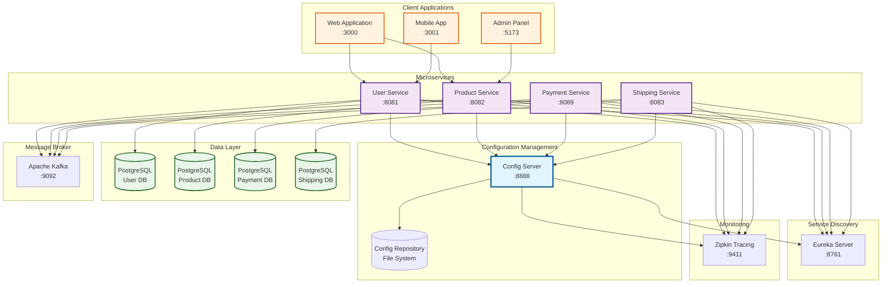
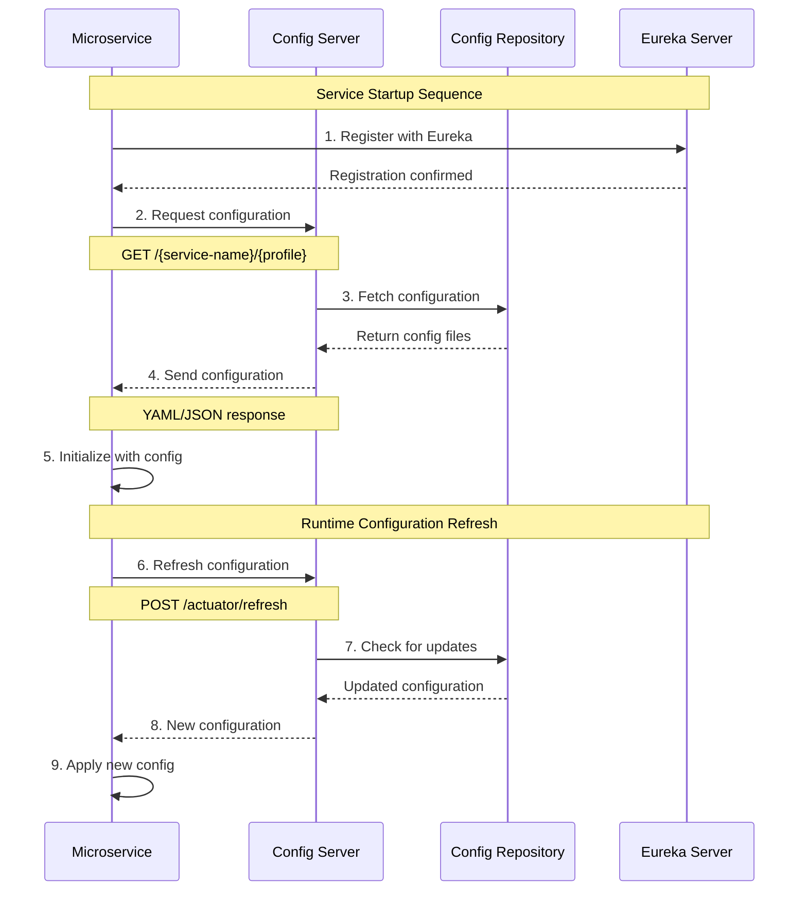
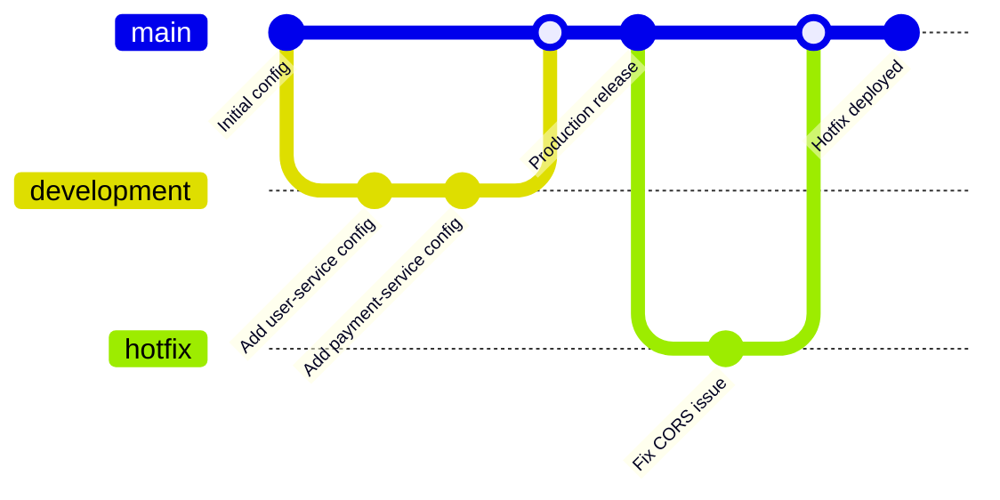

# 🔧 Config Service - Microservices Configuration Server

<div align="center">


**Centralized Configuration Management for E-commerce Microservices**

</div>

## 📋 Table of Contents

- [🏗️ Architecture Overview](#️-architecture-overview)
- [✨ Features](#-features)
- [🔧 Prerequisites](#-prerequisites)
- [🚀 Getting Started](#-getting-started)
- [📁 Project Structure](#-project-structure)
- [⚙️ Configuration](#️-configuration)
- [🔌 Service Integration](#-service-integration)
- [📊 Monitoring & Health](#-monitoring--health)
- [🐳 Docker Support](#-docker-support)
- [🤝 Contributing](#-contributing)

## 🏗️ Architecture Overview



## ✨ Features

### 🎯 Core Features
- **Centralized Configuration Management** - Single source of truth for all microservice configurations
- **Environment-Specific Configs** - Support for development, staging, and production environments
- **Dynamic Configuration Refresh** - Hot-reload configurations without service restart
- **Service Discovery Integration** - Seamless integration with Netflix Eureka
- **Distributed Tracing** - Built-in Zipkin integration for request tracking

### 🔒 Security & CORS
- **CORS Configuration** - Pre-configured for multiple client origins
- **Secure Property Management** - Environment-based property overrides
- **Health Check Endpoints** - Comprehensive health monitoring

### 📊 Observability
- **Actuator Endpoints** - Health, info, and metrics exposure
- **Distributed Tracing** - Request tracking across services
- **Custom Metrics** - Application-specific monitoring

## 🔧 Prerequisites

Before running the Config Service, ensure you have:

| Technology | Version | Purpose |
|------------|---------|---------|
|  | 21+ | Runtime Environment |
|  | 3.6+ | Build Tool |
|  | Latest | Version Control |
|  | Latest | Containerization |

## 🚀 Getting Started

### 📥 Clone the Repository

```bash
git clone <repository-url>
cd Config-Service
```

### 🏃‍♂️ Run with Maven

```bash
# Clean and compile
./mvnw clean compile

# Run the application
./mvnw spring-boot:run
```

### 🐳 Run with Docker

```bash
# Build Docker image
docker build -t config-service .

# Run container
docker run -p 8888:8888 config-service
```

### 🧪 Verify Installation

```bash
# Check health endpoint
curl http://localhost:8888/actuator/health

# Get application configuration
curl http://localhost:8888/application/default
```

## 📁 Project Structure

```
Config-Service/
├── 📁 src/
│   ├── 📁 main/
│   │   ├── 📁 java/com/Ecommerce/Config_Service/
│   │   │   └── 📄 ConfigServiceApplication.java
│   │   └── 📁 resources/
│   │       └── 📄 application.yaml
│   └── 📁 test/
├── 📁 config-repo/                    # Configuration Repository
│   ├── 📄 application.yml            # Global configurations
│   ├── 📄 user-service.yml          # User service config
│   ├── 📄 product-service.yaml      # Product service config
│   ├── 📄 payment-service.yml       # Payment service config
│   └── 📄 shipping-service.yml      # Shipping service config
├── 🐳 Dockerfile
├── 📋 compose.yaml
└── 📄 pom.xml
```

## ⚙️ Configuration

### 🌐 Server Configuration

```yaml
server:
  port: 8888                          # Config server port

spring:
  application:
    name: config-server
  cloud:
    config:
      server:
        git:
          uri: file:./config-repo     # Local file system
          default-label: main
```

### 🔍 Service Discovery

```yaml
eureka:
  instance:
    preferIpAddress: true
    instanceId: ${spring.application.name}:${server.port}
    hostname: localhost
  client:
    registerWithEureka: true
    fetchRegistry: true
    serviceUrl:
      defaultZone: http://localhost:8761/eureka/
```

### 🌍 CORS Configuration

The global CORS configuration supports multiple client origins:

```yaml
cors:
  configuration:
    allowed-origins:
      - "http://localhost:3000"       # React App
      - "http://localhost:5173"       # Vite Dev Server
      - "http://localhost:8761"       # Eureka Dashboard
      - "http://localhost:8099"       # API Gateway
    allowed-methods:
      - "GET"
      - "POST"
      - "PUT" 
      - "DELETE"
      - "OPTIONS"
      - "PATCH"
```

## 🔌 Service Integration

### Configuration Flow



### 📝 Service Configuration Examples

#### Payment Service
```yaml
server:
  port: 8089

datasource:
  host: localhost
  port: 5432
  username: postgres
  password: ${DB_PASSWORD:defaultpass}
  database: payment_system

kafka:
  brokers: localhost:9092
  topics:
    payment:
      created: payment-created
      updated: payment-updated
```

#### Shipping Service
```yaml
server:
  port: 8083

shipping:
  default-carrier: Standard Shipping
  estimated-delivery-days: 3
  cost:
    base-rate: 10.99
    express-multiplier: 2.0
```

## 📊 Monitoring & Health

### 🏥 Health Endpoints

| Endpoint | Description | Example |
|----------|-------------|---------|
| `/actuator/health` | Service health status | `{"status":"UP"}` |
| `/actuator/info` | Application information | Service metadata |
| `/actuator/refresh` | Refresh configuration | Trigger config reload |

### 📈 Metrics & Tracing

```bash
# Check all actuator endpoints
curl http://localhost:8888/actuator

# View health details
curl http://localhost:8888/actuator/health

# Access Zipkin tracing
open http://localhost:9411
```

## 🐳 Docker Support

### 🏗️ Multi-Stage Dockerfile

```dockerfile
FROM ubuntu:latest
LABEL authors="DELL"

ENTRYPOINT ["top", "-b"]
```

### 🐙 Docker Compose

```yaml
services:
  zipkin:
    image: 'openzipkin/zipkin:latest'
    ports:
      - '9411:9411'
      
  config-server:
    build: .
    ports:
      - '8888:8888'
    depends_on:
      - zipkin
```

## 🔄 Configuration Management Workflow



## 🧪 Testing

### Unit Tests
```bash
./mvnw test
```

### Integration Tests
```bash
./mvnw integration-test
```

### Configuration Validation
```bash
# Test service configuration retrieval
curl http://localhost:8888/user-service/default
curl http://localhost:8888/payment-service/development
curl http://localhost:8888/shipping-service/production
```

## 🚀 Deployment

### 📦 Production Deployment

1. **Build the application**
   ```bash
   ./mvnw clean package -DskipTests
   ```

2. **Create Docker image**
   ```bash
   docker build -t config-service:1.0.0 .
   ```

3. **Deploy to production**
   ```bash
   docker run -d \
     --name config-service \
     -p 8888:8888 \
     -e SPRING_PROFILES_ACTIVE=production \
     config-service:1.0.0
   ```

### 🌍 Environment Variables

| Variable | Description | Default |
|----------|-------------|---------|
| `SERVER_PORT` | Server port | `8888` |
| `EUREKA_URL` | Eureka server URL | `http://localhost:8761/eureka` |
| `CONFIG_REPO_URI` | Configuration repository URI | `file:./config-repo` |
| `SPRING_PROFILES_ACTIVE` | Active profile | `default` |

## 🤝 Contributing

We welcome contributions! Please follow these steps:

1. **Fork the repository**
2. **Create a feature branch**
   ```bash
   git checkout -b feature/amazing-feature
   ```
3. **Commit your changes**
   ```bash
   git commit -m 'Add amazing feature'
   ```
4. **Push to the branch**
   ```bash
   git push origin feature/amazing-feature
   ```
5. **Open a Pull Request**

### 📝 Code Style
- Follow Java naming conventions
- Add appropriate comments and documentation
- Include unit tests for new features
- Update configuration examples as needed

## 📄 License

This project is licensed under the MIT License - see the [LICENSE](LICENSE) file for details.

## 🆘 Support

- 📧 **Email**: support@ecommerce.com
- 💬 **Slack**: #config-service
- 📖 **Documentation**: [Wiki](wiki)
- 🐛 **Issues**: [GitHub Issues](issues)

---

<div align="center">

**Made with ❤️ by the E-commerce Team**


</div>