# 🔍 Discovery Service - Netflix Eureka Server

<div align="center">


**Centralized Service Discovery for E-commerce Microservices Architecture**

[]()
[]()
[]()

</div>

## 📋 Table of Contents

- [🏗️ Architecture Overview](#️-architecture-overview)
- [✨ Features](#-features)
- [🔧 Prerequisites](#-prerequisites)
- [🚀 Getting Started](#-getting-started)
- [📁 Project Structure](#-project-structure)
- [⚙️ Configuration](#️-configuration)
- [🔄 Service Registration Flow](#-service-registration-flow)
- [📊 Monitoring & Dashboard](#-monitoring--dashboard)
- [🐳 Docker Support](#-docker-support)
- [🤝 Contributing](#-contributing)

## 🏗️ Architecture Overview

```mermaid
graph TB
    subgraph "Client Layer"
        WEB[Web Application<br/>React :3000]
        MOBILE[Mobile App<br/>Flutter :3001]
        ADMIN[Admin Panel<br/>Vue :5173]
    end

    subgraph "API Gateway Layer"
        GATEWAY[API Gateway<br/>Spring Cloud Gateway<br/>:8099]
    end

    subgraph "Service Discovery"
        EUREKA[🔍 Eureka Server<br/>Discovery Service<br/>:8761]
        DASHBOARD[📊 Eureka Dashboard<br/>Web UI]
    end

    subgraph "Configuration Management"
        CONFIG[⚙️ Config Server<br/>:8888]
    end

    subgraph "Core Microservices"
        USER[👤 User Service<br/>:8081]
        PRODUCT[📦 Product Service<br/>:8082]
        ORDER[🛒 Order Service<br/>:8083]
        PAYMENT[💳 Payment Service<br/>:8089]
        SHIPPING[🚚 Shipping Service<br/>:8084]
        INVENTORY[📊 Inventory Service<br/>:8085]
        NOTIFICATION[📧 Notification Service<br/>:8086]
    end

    subgraph "Infrastructure Services"
        ZIPKIN[📍 Zipkin Tracing<br/>:9411]
        KAFKA[📨 Apache Kafka<br/>:9092]
    end

    subgraph "Data Layer"
        DB1[(🗄️ User Database<br/>PostgreSQL)]
        DB2[(🗄️ Product Database<br/>PostgreSQL)]
        DB3[(🗄️ Order Database<br/>PostgreSQL)]
        DB4[(🗄️ Payment Database<br/>PostgreSQL)]
        CACHE[(⚡ Redis Cache)]
    end

    %% Client connections
    WEB --> GATEWAY
    MOBILE --> GATEWAY
    ADMIN --> GATEWAY
    
    %% Gateway service discovery
    GATEWAY --> EUREKA
    GATEWAY --> USER
    GATEWAY --> PRODUCT
    GATEWAY --> ORDER

    %% Service registrations with Eureka
    CONFIG -.->|Register| EUREKA
    USER -.->|Register| EUREKA
    PRODUCT -.->|Register| EUREKA
    ORDER -.->|Register| EUREKA
    PAYMENT -.->|Register| EUREKA
    SHIPPING -.->|Register| EUREKA
    INVENTORY -.->|Register| EUREKA
    NOTIFICATION -.->|Register| EUREKA

    %% Configuration management
    CONFIG --> USER
    CONFIG --> PRODUCT
    CONFIG --> ORDER
    CONFIG --> PAYMENT
    CONFIG --> SHIPPING

    %% Service-to-service communication via discovery
    ORDER --> USER
    ORDER --> PRODUCT
    ORDER --> INVENTORY
    PAYMENT --> NOTIFICATION
    SHIPPING --> NOTIFICATION

    %% Data connections
    USER --> DB1
    PRODUCT --> DB2
    ORDER --> DB3
    PAYMENT --> DB4
    
    %% Infrastructure connections
    USER --> CACHE
    PRODUCT --> CACHE
    ORDER --> KAFKA
    PAYMENT --> KAFKA
    SHIPPING --> KAFKA
    
    %% Monitoring
    USER --> ZIPKIN
    PRODUCT --> ZIPKIN
    ORDER --> ZIPKIN
    PAYMENT --> ZIPKIN

    %% Dashboard connection
    EUREKA --> DASHBOARD

    classDef eurekaServer fill:#ff6b6b,stroke:#c92a2a,stroke-width:4px,color:#fff
    classDef microservice fill:#4ecdc4,stroke:#26d0ce,stroke-width:2px,color:#fff
    classDef infrastructure fill:#ffe66d,stroke:#fab005,stroke-width:2px
    classDef client fill:#a29bfe,stroke:#6c5ce7,stroke-width:2px,color:#fff
    classDef database fill:#81ecec,stroke:#00cec9,stroke-width:2px
    classDef config fill:#fd79a8,stroke:#e84393,stroke-width:2px,color:#fff

    class EUREKA,DASHBOARD eurekaServer
    class USER,PRODUCT,ORDER,PAYMENT,SHIPPING,INVENTORY,NOTIFICATION microservice
    class ZIPKIN,KAFKA,CACHE infrastructure
    class WEB,MOBILE,ADMIN,GATEWAY client
    class DB1,DB2,DB3,DB4 database
    class CONFIG config
```



## ✨ Features

### 🎯 Core Features
- **Service Registry** - Central registry for all microservices in the ecosystem
- **Service Discovery** - Automatic service location and load balancing
- **Health Monitoring** - Real-time health checks and service status tracking
- **High Availability** - Supports clustering for production environments
- **Web Dashboard** - User-friendly web interface for service monitoring

### ⚡ Performance Optimizations
- **Fast Eviction** - Optimized settings for rapid detection of failed services
- **Reduced Cache TTL** - Faster service updates with shorter cache intervals
- **Custom Renewal Intervals** - Tuned heartbeat settings for better responsiveness
- **Self-Preservation Disabled** - Prevents false positives in development environments

### 🔧 Integration Features
- **Spring Cloud Integration** - Seamless integration with Spring Cloud ecosystem
- **Actuator Endpoints** - Comprehensive health and metrics monitoring
- **Distributed Tracing** - Zipkin integration for request tracking
- **Jersey Client Support** - Enhanced REST client capabilities

## 🔧 Prerequisites

Before running the Discovery Service, ensure you have:

| Technology | Version | Purpose |
|------------|---------|---------|
|  | 21+ | Runtime Environment |
|  | 3.6+ | Build Tool |
|  | Latest | Version Control |
|  | Latest | Containerization |

## 🚀 Getting Started

### 📥 Clone the Repository

```bash
git clone <repository-url>
cd Discovery-Service
```

### 🏃‍♂️ Run with Maven

```bash
# Clean and compile
./mvnw clean compile

# Run the application
./mvnw spring-boot:run
```

### 🐳 Run with Docker

```bash
# Build Docker image
docker build -t discovery-service .

# Run container
docker run -p 8761:8761 discovery-service
```

### 🌐 Access Eureka Dashboard

Once started, access the Eureka dashboard at:
```
http://localhost:8761
```

### 🧪 Verify Installation

```bash
# Check health endpoint
curl http://localhost:8761/actuator/health

# Get registered services
curl http://localhost:8761/eureka/apps
```

## 📁 Project Structure

```
Discovery-Service/
├── 📁 src/
│   ├── 📁 main/
│   │   ├── 📁 java/com/Ecommerce/Discovery_Service/
│   │   │   └── 📄 DiscoveryServiceApplication.java
│   │   └── 📁 resources/
│   │       └── 📄 application.yaml
│   └── 📁 test/
│       └── 📁 java/com/Ecommerce/Discovery_Service/
│           └── 📄 DiscoveryServiceApplicationTests.java
├── 📁 .mvn/wrapper/
├── 🐳 Dockerfile
├── 📋 compose.yaml
├── 📄 pom.xml
├── 📄 mvnw
└── 📄 mvnw.cmd
```

## ⚙️ Configuration

### 🌐 Server Configuration

```yaml
spring:
  application:
    name: eureka-server

server:
  port: 8761                    # Standard Eureka Server port
```

### 🔧 Eureka Server Optimization

```yaml
eureka:
  server:
    enableSelfPreservation: false              # Faster eviction in dev
    renewalPercentThreshold: 0.49              # Lower threshold
    renewalThresholdUpdateIntervalMs: 10000    # Update every 10s
    evictionIntervalTimerInMs: 5000            # Evict every 5s
    responseCacheUpdateIntervalMs: 3000        # Cache update every 3s
    responseCacheAutoExpirationInSeconds: 10   # Cache expires in 10s
    expectedClientRenewalIntervalSeconds: 5    # Expect renewals every 5s

  instance:
    leaseRenewalIntervalInSeconds: 5           # Heartbeat every 5s
    leaseExpirationDurationInSeconds: 15       # Mark as down after 15s

  client:
    register-with-eureka: false                # Don't register with itself
    fetch-registry: false                      # Don't fetch registry
```

### 📊 Performance Comparison

| Setting | Default | Optimized | Benefit |
|---------|---------|-----------|---------|
| Eviction Timer | 60s | 5s | 12x faster dead service detection |
| Cache Update | 30s | 3s | 10x faster service updates |
| Cache Expiration | 180s | 10s | 18x faster client updates |
| Heartbeat Interval | 30s | 5s | 6x more frequent health checks |

## 🔄 Service Registration Flow


## 📊 Monitoring & Dashboard

### 🎛️ Eureka Dashboard Features

The Eureka Dashboard provides real-time monitoring capabilities:

#### 📈 Key Metrics
- **Registered Services** - Total count of active services
- **Available Instances** - Healthy service instances
- **Service Health** - UP/DOWN/OUT_OF_SERVICE status
- **Renewal Rate** - Heartbeat frequency statistics
- **Registry Size** - Total applications in registry

#### 🖥️ Dashboard Sections

```mermaid
graph LR
    subgraph "Eureka Dashboard"
        HEADER[📊 System Status]
        GENERAL[🔧 General Info]
        INSTANCE[⚙️ Instance Info]
        REGISTRY[📋 Instances Registry]
        
        subgraph "System Status"
            ENV[Environment]
            DATACENTER[Data Center]
            TIMESTAMP[Current Time]
        end
        
        subgraph "Instance Registry"
            APP1[👤 USER-SERVICE<br/>✅ UP (2)]
            APP2[📦 PRODUCT-SERVICE<br/>✅ UP (1)]
            APP3[🛒 ORDER-SERVICE<br/>⚠️ DOWN (0)]
            APP4[💳 PAYMENT-SERVICE<br/>✅ UP (1)]
        end
    end
    
    classDef up fill:#d4edda,stroke:#155724,color:#155724
    classDef down fill:#f8d7da,stroke:#721c24,color:#721c24
    classDef info fill:#e2e3e5,stroke:#383d41,color:#383d41
    
    class APP1,APP2,APP4 up
    class APP3 down
    class HEADER,GENERAL,INSTANCE,REGISTRY info
```

### 🏥 Health Endpoints

| Endpoint | Description | Example Response |
|----------|-------------|-----------------|
| `/actuator/health` | Eureka server health | `{"status":"UP"}` |
| `/actuator/info` | Application information | Service metadata |
| `/eureka/apps` | All registered services | XML/JSON service list |
| `/eureka/apps/{service}` | Specific service info | Service instance details |

### 📊 Metrics & Monitoring

```bash
# Check Eureka server status
curl http://localhost:8761/actuator/health

# Get all registered services (JSON format)
curl -H "Accept: application/json" http://localhost:8761/eureka/apps

# Get specific service information
curl -H "Accept: application/json" http://localhost:8761/eureka/apps/USER-SERVICE

# Check actuator endpoints
curl http://localhost:8761/actuator
```

## 🐳 Docker Support

### 🏗️ Docker Configuration

```dockerfile
FROM ubuntu:latest
LABEL authors="DELL"

ENTRYPOINT ["top", "-b"]
```

### 🐙 Docker Compose

```yaml
services:
  eureka-server:
    build: .
    ports:
      - "8761:8761"
    environment:
      - SPRING_PROFILES_ACTIVE=docker
    healthcheck:
      test: ["CMD", "curl", "-f", "http://localhost:8761/actuator/health"]
      interval: 30s
      timeout: 10s
      retries: 5
      
  zipkin:
    image: 'openzipkin/zipkin:latest'
    ports:
      - '9411:9411'
    depends_on:
      - eureka-server
```

### 🚀 Multi-Environment Deployment

```bash
# Development
docker run -p 8761:8761 -e SPRING_PROFILES_ACTIVE=dev discovery-service

# Production with clustering
docker run -p 8761:8761 \
  -e SPRING_PROFILES_ACTIVE=prod \
  -e EUREKA_INSTANCE_HOSTNAME=eureka-1 \
  -e EUREKA_CLIENT_SERVICE_URL_DEFAULTZONE=http://eureka-2:8761/eureka \
  discovery-service
```

## 🔧 Service Integration

### 📝 Client Configuration

For services to register with this Eureka server, add to their `application.yml`:

```yaml
eureka:
  client:
    service-url:
      defaultZone: http://localhost:8761/eureka/
    register-with-eureka: true
    fetch-registry: true
  instance:
    prefer-ip-address: true
    lease-renewal-interval-in-seconds: 5
    lease-expiration-duration-in-seconds: 15
```

### 🔌 Maven Dependencies for Clients

```xml
<dependency>
    <groupId>org.springframework.cloud</groupId>
    <artifactId>spring-cloud-starter-netflix-eureka-client</artifactId>
</dependency>
```

### 🌐 Load Balancing

```java
@RestController
public class ServiceController {
    
    @Autowired
    private RestTemplate restTemplate;
    
    @GetMapping("/users")
    public String getUsers() {
        // Automatic load balancing via Eureka
        return restTemplate.getForObject("http://USER-SERVICE/api/users", String.class);
    }
}
```

## 🧪 Testing & Validation

### Unit Tests
```bash
./mvnw test
```

### Integration Tests
```bash
./mvnw integration-test
```

### Service Discovery Testing
```bash
# Register a test service
curl -X POST \
  http://localhost:8761/eureka/apps/TEST-SERVICE \
  -H 'Content-Type: application/json' \
  -d '{
    "instance": {
      "instanceId": "test-service-1",
      "app": "TEST-SERVICE",
      "ipAddr": "127.0.0.1",
      "port": {"$": 8080, "@enabled": true},
      "status": "UP"
    }
  }'

# Verify registration
curl http://localhost:8761/eureka/apps/TEST-SERVICE
```

## 🔍 Troubleshooting

### Common Issues

| Issue | Symptom | Solution |
|-------|---------|----------|
| Services not appearing | Empty dashboard | Check client configuration |
| Slow service updates | Delayed instance changes | Verify cache settings |
| High memory usage | Dashboard slow | Increase JVM heap size |
| Network connectivity | Registration failures | Check firewall/network |

### 📊 Monitoring Commands

```bash
# Check server logs
docker logs discovery-service

# Monitor memory usage
curl http://localhost:8761/actuator/metrics/jvm.memory.used

# Check thread pool status
curl http://localhost:8761/actuator/metrics/executor.pool.size
```

## 🚀 Production Deployment

### 🏭 High Availability Setup


### 🌍 Environment Variables

| Variable | Description | Default | Production |
|----------|-------------|---------|------------|
| `SERVER_PORT` | Server port | `8761` | `8761` |
| `EUREKA_INSTANCE_HOSTNAME` | Instance hostname | `localhost` | `eureka-server-1` |
| `EUREKA_CLIENT_SERVICE_URL_DEFAULTZONE` | Peer Eureka URLs | `http://localhost:8761/eureka/` | `http://eureka-2:8761/eureka/,http://eureka-3:8761/eureka/` |
| `SPRING_PROFILES_ACTIVE` | Active profile | `default` | `production` |

## 🤝 Contributing

We welcome contributions! Please follow these steps:

1. **Fork the repository**
2. **Create a feature branch**
   ```bash
   git checkout -b feature/amazing-feature
   ```
3. **Commit your changes**
   ```bash
   git commit -m 'Add amazing feature'
   ```
4. **Push to the branch**
   ```bash
   git push origin feature/amazing-feature
   ```
5. **Open a Pull Request**

### 📝 Development Guidelines
- Follow Spring Boot best practices
- Add comprehensive tests for new features
- Update documentation for configuration changes
- Ensure backward compatibility

## 📄 License

This project is licensed under the MIT License - see the [LICENSE](LICENSE) file for details.

## 🆘 Support

- 📧 **Email**: support@ecommerce.com
- 💬 **Slack**: #discovery-service
- 📖 **Documentation**: [Netflix Eureka Documentation](https://github.com/Netflix/eureka/wiki)
- 🐛 **Issues**: [GitHub Issues](issues)

## 📚 Additional Resources

- 📖 [Spring Cloud Netflix Documentation](https://spring.io/projects/spring-cloud-netflix)
- 🎯 [Eureka REST API Guide](https://github.com/Netflix/eureka/wiki/Eureka-REST-operations)
- 🔧 [Microservices Patterns](https://microservices.io/patterns/service-registry.html)
- 📊 [Monitoring Best Practices](https://docs.spring.io/spring-boot/docs/current/reference/html/actuator.html)

---

<div align="center">

**Made with ❤️ by the E-commerce Team**


</div>