# 🚀 E-commerce Gateway Service

<div align="center">

[](https://spring.io/projects/spring-boot)
[](https://spring.io/projects/spring-cloud)
[](https://openjdk.java.net/)
[](https://redis.io/)
[](https://kafka.apache.org/)

[](https://jenkins.io/)
[](https://www.docker.com/)
[](https://www.sonarqube.org/)
[](https://trivy.dev/)

[](https://jenkins.io/)
[](https://codecov.io/)
[](LICENSE)


</div>

## 📋 Overview

The **Gateway Service** is a central API Gateway built with **Spring Cloud Gateway** that serves as the single entry point for all client requests in our e-commerce microservices architecture. It provides authentication, authorization, rate limiting, circuit breaking, and intelligent request routing with automated CI/CD pipeline.

### ✨ Key Features

- 🔐 **JWT Authentication & Authorization**
- 🚦 **Advanced Rate Limiting** (IP & User-based)
- ⚡ **Circuit Breakers** for fault tolerance
- 🌐 **CORS Configuration**
- 📊 **BFF Pattern** with enriched responses
- 🔄 **Async Kafka Communication**
- 📈 **Comprehensive Monitoring**
- 📚 **Swagger Documentation**

## 🔄 CI/CD Pipeline with Jenkins

<div align="center">

[](https://jenkins.io/)
[](https://hub.docker.com/)
[](https://sonarqube.org/)
[](https://zipkin.io/)

</div>



```mermaid
graph LR
    subgraph "🚀 CI/CD Pipeline"
        A[📥 Checkout] --> B[🔨 Build JDK21]
        B --> C[🧪 Test]
        C --> D[🔍 SonarQube]
        D --> E[🚦 Quality Gate]
        E --> F[📦 Package]
        F --> G[🐳 Docker Build]
        G --> H[🛡️ Security Scan]
        H --> I[🏥 Health Check]
        I --> J[📤 Push Registry]
    end
```

### 🏗️ Pipeline Stages

| Stage | Tool | Duration | Features |
|-------|------|----------|----------|
| **📥 Checkout** | Git | ~30s | Sparse checkout Gateway-Service |
| **🔨 Build** | Maven 3.9.7 + JDK 21 | ~2min | Clean compile with Java 21 |
| **🧪 Tests** | JUnit + JaCoCo | ~3min | Test profiles with coverage |
| **🔍 Code Analysis** | SonarQube | ~2min | ecommerce-api-gateway-service |
| **📦 Package** | Maven | ~1min | JAR packaging |
| **🐳 Docker Build** | Docker + Compose | ~2min | Multi-service containers |
| **🛡️ Security Scan** | Trivy | ~3min | Vulnerability assessment |
| **🏥 Health Check** | cURL + Redis + Zipkin | ~1min | Multi-service validation |
| **📤 Registry Push** | Docker Hub | ~2min | Versioned images |

### 🛠️ Jenkins Configuration

#### Required Credentials
- `yahya.zakaria-dockerhub` - Docker Hub authentication
- `git-https-token` - GitHub repository access
- `sonarqube` - SonarQube server configuration

#### Quality Gates & Health Checks
- **Code Coverage**: > 85%
- **Gateway Health**: `http://localhost:8099/actuator/health`
- **Redis Health**: Container ping validation
- **Zipkin Health**: `http://localhost:9411/health`
- **Service Discovery**: Eureka registration check

#### Multi-Service Deployment
```yaml
# Automated container orchestration
services:
  - gateway-service:8099 (API Gateway)
  - redis:6379 (Rate Limiting & Cache)
  - zipkin:9411 (Distributed Tracing)
```

## 🏗️ Architecture Overview

```mermaid
graph TB
    Client[🌐 Client Applications<br/>Web/Mobile] --> Gateway[🚪 API Gateway<br/>Port: 8099]
    
    Gateway --> |Authentication| UserService[👤 User Service<br/>Port: 8081]
    Gateway --> |Product Catalog| ProductService[📦 Product Service<br/>Port: 8082]
    Gateway --> |Orders| OrderService[📋 Order Service<br/>Port: 8083]
    Gateway --> |Payments| PaymentService[💳 Payment Service<br/>Port: 8084]
    Gateway --> |Shopping Cart| CartService[🛒 Cart Service<br/>Port: 8085]
    Gateway --> |Loyalty Program| LoyaltyService[🎁 Loyalty Service<br/>Port: 8086]
    Gateway --> |Notifications| NotificationService[📧 Notification Service<br/>Port: 8087]
    Gateway --> |Shipping| ShippingService[🚚 Shipping Service<br/>Port: 8088]
    
    Gateway <--> Redis[(🔴 Redis<br/>Rate Limiting & Cache)]
    Gateway <--> Kafka[(📨 Apache Kafka<br/>Async Communication)]
    Gateway --> Eureka[🔍 Eureka Server<br/>Service Discovery]
    
    style Gateway fill:#e1f5fe
    style Redis fill:#ffcdd2
    style Kafka fill:#f3e5f5
    style Eureka fill:#e8f5e8
```



## 🔄 Request Flow Architecture


## 🛠️ Technology Stack

<div align="center">

| Technology | Purpose | Version |
|------------|---------|---------|
|  | Application Framework | 3.4.4 |
|  | Microservices Toolkit | 2024.0.1 |
|  | Runtime Platform | JDK 21 |
|  | Caching & Rate Limiting | Latest |
|  | Message Streaming | Latest |
|  | Authentication | 0.11.5 |
|  | API Documentation | 2.3.0 |
|  | Distributed Tracing | Latest |

</div>

## 🚦 Rate Limiting Strategy

```mermaid
graph LR
    subgraph "Rate Limiting Types"
        A[IP-Based<br/>Anonymous Users] --> B[Sliding Window<br/>Algorithm]
        C[User-Based<br/>Authenticated Users] --> D[Token Bucket<br/>Algorithm]
    end
    
    subgraph "Endpoint Categories"
        E[🔐 Auth Endpoints<br/>5 req/min]
        F[💳 Payment Endpoints<br/>3 req/5min]
        G[📖 Public Read<br/>200 req/min]
        H[👤 User Operations<br/>50 req/min]
    end
    
    B --> E
    B --> G
    D --> F
    D --> H
    
    style E fill:#ffcdd2
    style F fill:#ffecb3
    style G fill:#c8e6c9
    style H fill:#e1f5fe
```



## ⚡ Circuit Breaker Configuration


## 🔐 Security Architecture

```mermaid
graph TD
    Request[📱 Client Request] --> CORS{CORS Check}
    CORS -->|✅ Valid Origin| JWT{JWT Token?}
    CORS -->|❌ Invalid Origin| Reject1[❌ CORS Error]
    
    JWT -->|✅ Valid Token| RateLimit{Rate Limit Check}
    JWT -->|❌ Invalid/Missing| Reject2[❌ 401 Unauthorized]
    
    RateLimit -->|✅ Within Limits| Route[🚀 Route to Service]
    RateLimit -->|❌ Exceeded| Reject3[❌ 429 Too Many Requests]
    
    Route --> Service[🎯 Target Service]
    Service --> Response[📤 Response + Headers]
    
    style CORS fill:#e3f2fd
    style JWT fill:#f3e5f5
    style RateLimit fill:#fff3e0
    style Route fill:#e8f5e8
```



## 📦 Installation & Setup

### Prerequisites

<div align="center">

[](https://openjdk.java.net/)
[](https://docker.com/)
[](https://maven.apache.org/)
[](https://redis.io/)
[](https://kafka.apache.org/)

</div>

```bash
# Required Software
Java 21+
Maven 3.6+
Redis Server
Apache Kafka
Eureka Server (Config Server)
```

### 🏃‍♂️ Quick Start

1. **Clone the repository**
```bash
git clone <repository-url>
cd Gateway-Service
```

2. **Start infrastructure services**
```bash
# Start Redis
docker run -d --name redis -p 6379:6379 redis:latest

# Start Kafka
docker run -d --name kafka -p 9092:9092 \
  -e KAFKA_ZOOKEEPER_CONNECT=zookeeper:2181 \
  -e KAFKA_ADVERTISED_LISTENERS=PLAINTEXT://localhost:9092 \
  confluentinc/cp-kafka:latest

# Start Zipkin (for tracing)
docker run -d --name zipkin -p 9411:9411 openzipkin/zipkin:latest
```

3. **Configure application**
```yaml
# application.yaml - Key configurations
spring:
  kafka:
    bootstrap-servers: localhost:9092
  data:
    redis:
      host: localhost
      port: 6379

gateway1:
  jwt:
    secret: "your-secret-key"
```

4. **Run the application**
```bash
mvn spring-boot:run
```

5. **Access the services**
- **Gateway API**: `http://localhost:8099`
- **Swagger UI**: `http://localhost:8099/swagger-ui.html`
- **Health Check**: `http://localhost:8099/actuator/health`
- **Zipkin UI**: `http://localhost:9411`

## 🛣️ API Routes Configuration

### Public Endpoints (No Authentication)
```yaml
# Product Catalog (Read-only)
GET /api/products/**          → product-service
GET /api/categories/**        → product-service
GET /api/images/**           → product-service

# Authentication
POST /api/users/auth/signin   → user-service
POST /api/users/auth/signup   → user-service
```

### Protected Endpoints (JWT Required)
```yaml
# User Management
GET,POST,PUT,DELETE /api/users/**     → user-service

# Shopping Cart
GET,POST,PUT,DELETE /api/carts/**     → cart-service

# Orders
GET,POST,PUT,DELETE /api/orders/**    → order-service

# Payments (Highly Restricted)
POST /api/payments/**                 → payment-service
```

### BFF Endpoints (Enhanced Responses)
```yaml
# Enriched Cart with Product Details
GET /api/cart/{userId}/enriched       → cart-bff-service

# Enriched Order with Product Details  
GET /api/order/{orderId}/enriched     → order-bff-service

# Batch Order Processing
POST /api/order/batch                 → order-bff-service
```

## 📊 Monitoring & Health Checks

<div align="center">

[](https://spring.io/)
[](https://zipkin.io/)
[](https://redis.io/)

</div>

### Available Endpoints

| Endpoint | Description |
|----------|-------------|
| `/actuator/health` | Overall health status |
| `/actuator/metrics` | Application metrics |
| `/actuator/circuitbreakers` | Circuit breaker status |
| `/api/gateway/circuit-breakers` | Custom CB management |
| `/api/gateway/rate-limiting/stats` | Rate limiting statistics |

### Circuit Breaker Monitoring

```bash
# Check all circuit breakers
curl http://localhost:8099/api/gateway/circuit-breakers

# Reset specific circuit breaker
curl -X POST http://localhost:8099/api/gateway/circuit-breakers/auth-cb/reset
```

## 🔧 Configuration

### Rate Limiting Configuration
```yaml
rate-limiting:
  endpoints:
    auth:
      limit: 5
      window-seconds: 60
      key-type: IP
    payment:
      limit: 3  
      window-seconds: 300
      key-type: USER
    public-read:
      limit: 200
      window-seconds: 60
      key-type: IP
```

### Circuit Breaker Configuration
```yaml
resilience4j:
  circuitbreaker:
    instances:
      auth-cb:
        slidingWindowSize: 10
        failureRateThreshold: 50
        waitDurationInOpenState: 30s
      payment-cb:
        slidingWindowSize: 5
        failureRateThreshold: 30
        waitDurationInOpenState: 60s
```

## 🎯 BFF (Backend for Frontend) Pattern

The Gateway implements BFF pattern for complex data aggregation:


### Enhanced Response Example
```json
{
  "id": "cart-uuid",
  "userId": "user-uuid", 
  "items": [
    {
      "id": "item-uuid",
      "productId": "product-uuid",
      "quantity": 2,
      "price": 29.99,
      "subtotal": 59.98,
      "productName": "Premium Headphones",
      "productImage": "/images/headphones.jpg",
      "inStock": true,
      "availableQuantity": 15,
      "discountType": "PERCENTAGE",
      "discountValue": 10.0
    }
  ],
  "total": 59.98,
  "itemCount": 1,
  "totalQuantity": 2
}
```

## 🔄 Async Communication with Kafka

### Kafka Topics

| Topic | Purpose | Producer | Consumer |
|-------|---------|-----------|----------|
| `cart.request` | Cart data requests | Gateway | Cart Service |
| `cart.response` | Cart data responses | Cart Service | Gateway |
| `product.batch.request` | Product info requests | Gateway | Product Service |
| `product.batch.response` | Product info responses | Product Service | Gateway |
| `order.request` | Order data requests | Gateway | Order Service |
| `order.response` | Order data responses | Order Service | Gateway |

## 📈 Performance & Scalability

<div align="center">

[](https://spring.io/)
[](https://kubernetes.io/)

</div>

### Key Metrics
- **Throughput**: 1000+ requests/second
- **Latency**: < 100ms (95th percentile)
- **Availability**: 99.9% uptime
- **Circuit Breaker**: < 1s failover time

### Scaling Recommendations
```yaml
# Production Configuration
spring:
  cloud:
    gateway:
      httpclient:
        pool:
          max-connections: 100
          max-idle-time: 30s
          max-life-time: 60s
        
server:
  tomcat:
    threads:
      max: 200
      min-spare: 10
```

## 🚀 Deployment

### 🐳 Docker Deployment

<div align="center">

[](https://docker.com/)
[](https://hub.docker.com/)
[](https://docs.docker.com/compose/)

</div>

```dockerfile
FROM openjdk:21-jre-slim
COPY target/gateway-service-*.jar app.jar
EXPOSE 8099
ENTRYPOINT ["java", "-jar", "/app.jar"]
```

```bash
# Build Docker image
docker build -t gateway-service:latest .

# Run container
docker run -d \
  --name gateway-service \
  -p 8099:8099 \
  -e REDIS_HOST=redis \
  -e KAFKA_BROKERS=kafka:9092 \
  gateway-service:latest
```

### ☸️ Kubernetes Deployment

<div align="center">

[](https://kubernetes.io/)
[](https://helm.sh/)

</div>

```yaml
apiVersion: apps/v1
kind: Deployment
metadata:
  name: gateway-service
spec:
  replicas: 3
  selector:
    matchLabels:
      app: gateway-service
  template:
    metadata:
      labels:
        app: gateway-service
    spec:
      containers:
      - name: gateway-service
        image: gateway-service:latest
        ports:
        - containerPort: 8099
        env:
        - name: REDIS_HOST
          value: "redis-service"
        - name: KAFKA_BROKERS
          value: "kafka-service:9092"
```

## 🐛 Troubleshooting

### Common Issues

1. **Circuit Breaker Open**
```bash
# Check circuit breaker status
curl http://localhost:8099/api/gateway/circuit-breakers

# Reset if needed
curl -X POST http://localhost:8099/api/gateway/circuit-breakers/{name}/reset
```

2. **Rate Limit Exceeded**
```bash
# Check rate limit status
curl http://localhost:8099/api/gateway/rate-limiting/status/IP/192.168.1.1

# Reset rate limits
curl -X POST http://localhost:8099/api/gateway/rate-limiting/reset/IP/192.168.1.1
```

3. **Service Discovery Issues**
```bash
# Check Eureka registration
curl http://localhost:8761/eureka/apps/gateway-service
```

4. **Health Check Failures**
```bash
# Gateway health
curl http://localhost:8099/actuator/health

# Redis health
docker exec gateway-service-redis redis-cli ping

# Zipkin health
curl http://localhost:9411/health
```

## 📚 API Documentation

<div align="center">

[](http://localhost:8099/swagger-ui.html)
[](http://localhost:8099/v3/api-docs)

</div>

- **Swagger UI**: [http://localhost:8099/swagger-ui.html](http://localhost:8099/swagger-ui.html)
- **OpenAPI Spec**: [http://localhost:8099/v3/api-docs](http://localhost:8099/v3/api-docs)
- **Gateway Management**: [http://localhost:8099/api/gateway](http://localhost:8099/api/gateway)
- **Zipkin Tracing**: [http://localhost:9411](http://localhost:9411)

## 🧪 Testing

<div align="center">

[](https://junit.org/)
[](https://jacoco.org/)
[](https://testcontainers.org/)

</div>

### Running Tests

```bash
# Run all tests
mvn test

# Run with specific profile
mvn test -Dspring.profiles.active=test

# Run with coverage
mvn test jacoco:report
```

### Integration Testing

```bash
# Test Gateway routing
curl -X GET http://localhost:8099/api/products

# Test rate limiting
for i in {1..10}; do curl http://localhost:8099/api/auth/test; done

# Test circuit breaker
curl -X POST http://localhost:8099/api/gateway/circuit-breakers/test-cb/open
```

## 🤝 Contributing

<div align="center">

[](https://github.com/)
[](https://conventionalcommits.org/)

</div>

1. Fork the repository
2. Create a feature branch (`git checkout -b feature/amazing-feature`)
3. Commit your changes (`git commit -m 'Add amazing feature'`)
4. Push to the branch (`git push origin feature/amazing-feature`)
5. Open a Pull Request

## 🔒 Security

<div align="center">

[](https://spring.io/projects/spring-security)
[](https://owasp.org/)

</div>

### Security Features
- **JWT Token Validation**
- **CORS Protection**
- **Rate Limiting by IP/User**
- **Circuit Breaker Protection**
- **Request/Response Filtering**

## 📄 License

<div align="center">

[](LICENSE)

</div>

This project is licensed under the MIT License - see the [LICENSE](LICENSE) file for details.

## 🆘 Support

For support and questions:
- 📧 Email: support@ecommerce.com
- 📖 Documentation: [Gateway Wiki](wiki-url)
- 🐛 Issues: [GitHub Issues](issues-url)

## 🙏 Acknowledgments

<div align="center">

[](https://spring.io/)
[](https://redis.io/)
[](https://kafka.apache.org/)
[](https://zipkin.io/)

</div>

- Spring Cloud Gateway team for the powerful gateway framework
- Redis team for the high-performance caching solution
- Apache Kafka team for reliable event streaming
- Zipkin team for distributed tracing capabilities

---

<div align="center">

**🚀 Built with ❤️ by the E-commerce Team 🚀**

[](https://spring.io/projects/spring-boot)
[](https://spring.io/projects/spring-cloud)
[](https://redis.io/)
[](https://kafka.apache.org/)

[](https://github.com/username/gateway-service/stargazers)
[](https://github.com/username/gateway-service/network/members)
[](https://github.com/username/gateway-service/watchers)

[⬆ Back to top](#-e-commerce-gateway-service)

</div>
