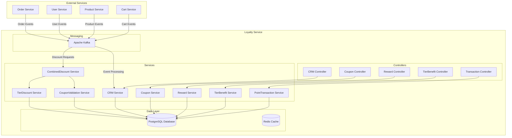
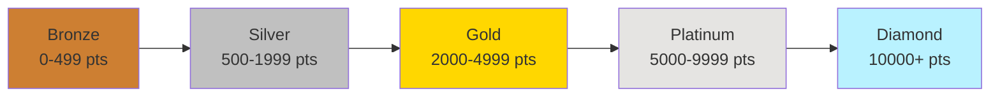
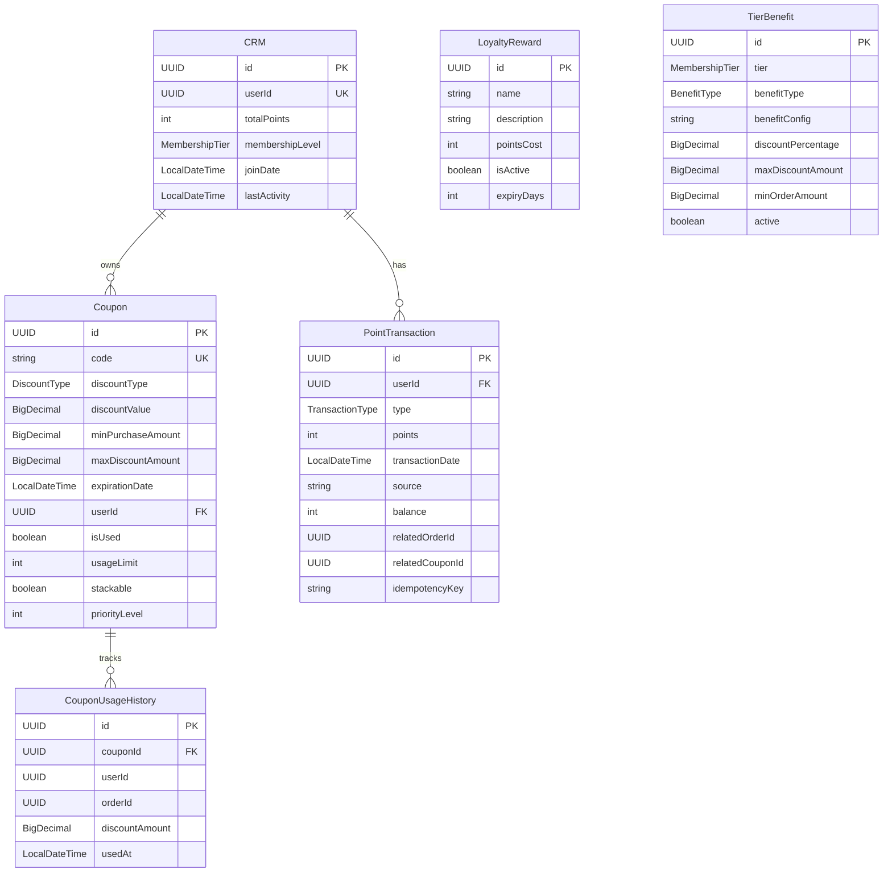
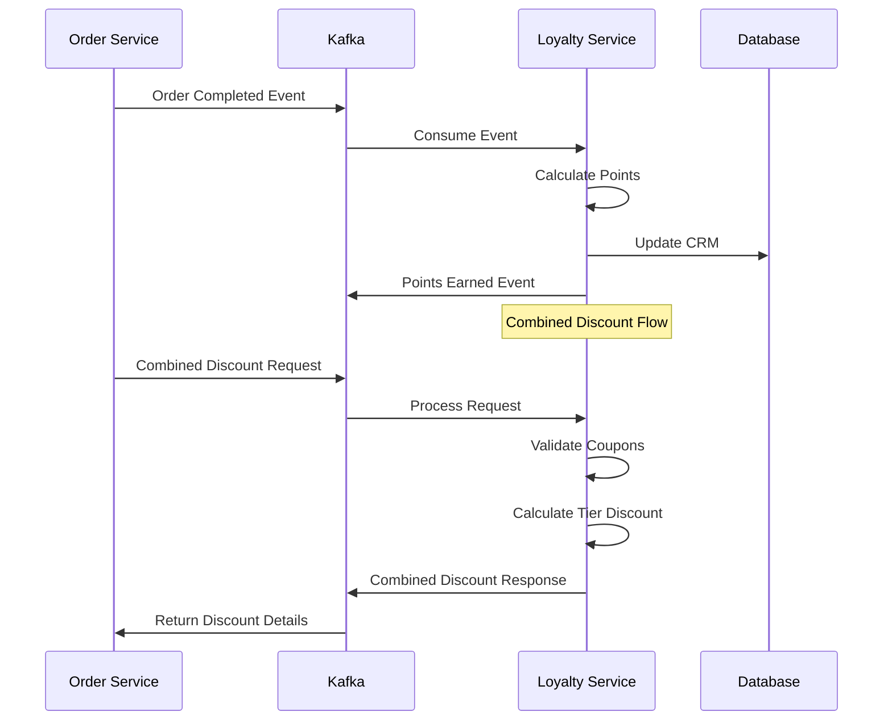

# 🎯 Loyalty Service

<div align="center">


**A comprehensive microservice for managing customer loyalty programs with points, tiers, coupons, and rewards**

</div>

---

## 🌟 Overview

The Loyalty Service is a feature-rich Spring Boot microservice designed to handle all aspects of customer loyalty programs in an e-commerce ecosystem. It provides seamless integration with other services through Kafka messaging and offers a complete solution for customer retention and engagement.

## 🏗️ Architecture



## 🎯 Core Features

### 📊 Customer Relationship Management (CRM)
- **Automatic Registration**: Users join loyalty program after spending $150+
- **Membership Tiers**: Bronze → Silver → Gold → Platinum → Diamond
- **Point Tracking**: Comprehensive point earning and redemption system
- **Loyalty Scoring**: Advanced scoring algorithm based on activity and engagement

### 🎟️ Coupon Management
- **Point-Based Generation**: Exchange loyalty points for discount coupons
- **Predefined Packages**: Standard coupon packages with set point costs
- **Validation System**: Real-time coupon validation and stacking support
- **Usage Tracking**: Complete audit trail of coupon usage

### 🏆 Reward System
- **Flexible Rewards**: Gift cards, free shipping, exclusive access
- **Point Redemption**: Secure point-to-reward exchange
- **Dynamic Pricing**: Configurable point costs for different rewards
- **Expiration Management**: Automated reward lifecycle management

### 💎 Tier Benefits
- **Progressive Benefits**: Increasing benefits with higher tiers
- **Discount Percentages**: Tier-based purchase discounts
- **Free Shipping**: Tier-specific shipping benefits
- **Priority Support**: Enhanced customer service access
- **Exclusive Access**: Early access to sales and products

## 🔄 Membership Tier System



### Tier Benefits Overview

| Tier | Points Required | Discount | Free Shipping | Birthday Bonus | Special Benefits |
|------|----------------|----------|---------------|----------------|------------------|
| 🥉 Bronze | 0-499 | - | - | 50 pts | Basic loyalty tracking |
| 🥈 Silver | 500-1999 | 3% | $75+ orders | 100 pts | Basic discounts |
| 🥇 Gold | 2000-4999 | 5% | $50+ orders | 200 pts | Priority support |
| 💎 Platinum | 5000-9999 | 7% | $25+ orders | 300 pts | Exclusive access |
| 💠 Diamond | 10000+ | 10% | All orders | 500 pts | VIP treatment + 2x points |

## 🛠️ Technology Stack

<div align="center">

| Technology | Version | Purpose |
|------------|---------|---------|
|  | 21 | Runtime Environment |
|  | 3.4.4 | Application Framework |
|  | Latest | Primary Database |
|  | Latest | Event Streaming |
|  | Latest | Containerization |
|  | 3.9.9 | Build Tool |

</div>

## 🚀 Quick Start

### Prerequisites

-  Java 21 or higher
-  PostgreSQL database
-  Apache Kafka
-  Maven 3.6+

### 🐳 Docker Setup

```bash
# Start PostgreSQL
docker run --name loyalty-postgres \
  -e POSTGRES_DB=loyalty-service \
  -e POSTGRES_USER=postgres \
  -e POSTGRES_PASSWORD=your_password \
  -p 5432:5432 -d postgres:latest

# Start Kafka (using Docker Compose)
docker-compose up -d
```

### 🔧 Configuration

Update `application.yaml`:

```yaml
spring:
  datasource:
    url: jdbc:postgresql://localhost:5432/loyalty-service
    username: postgres
    password: your_password
  
  kafka:
    bootstrap-servers: localhost:9092

loyalty:
  tier:
    bronze-threshold: 0
    silver-threshold: 500
    gold-threshold: 2000
    platinum-threshold: 5000
    diamond-threshold: 10000
```

### ▶️ Running the Service

```bash
# Clone the repository
git clone <repository-url>
cd loyalty-service

# Build the project
./mvnw clean compile

# Run the application
./mvnw spring-boot:run
```

The service will start on `http://localhost:8084`

## 📚 API Documentation

### 🌐 Swagger UI
Access the interactive API documentation at:
```
http://localhost:8084/api/loyalty/swagger-ui.html
```

### 🔑 Key Endpoints

#### CRM Management
```http
GET    /api/loyalty/crm                    # Get all CRM users
GET    /api/loyalty/crm/{userId}           # Get user CRM data
GET    /api/loyalty/crm/{userId}/loyalty-score  # Get loyalty score
```

#### Coupon Operations
```http
GET    /api/loyalty/coupons               # Get all coupons
POST   /api/loyalty/coupons/purchase      # Purchase coupon with points
POST   /api/loyalty/coupons/purchase-package  # Buy predefined package
GET    /api/loyalty/coupons/{userId}      # Get user's active coupons
POST   /api/loyalty/coupons/validate      # Validate coupon
POST   /api/loyalty/coupons/apply         # Apply coupon discount
```

#### Reward Management
```http
GET    /api/loyalty/rewards               # Get active rewards
POST   /api/loyalty/rewards/{rewardId}/redeem  # Redeem reward
```

#### Transaction History
```http
POST   /api/loyalty/transactions          # Create transaction
GET    /api/loyalty/transactions/{userId} # Get transaction history
```

## 🗄️ Database Schema



## 📡 Kafka Integration

### Event Flow Architecture



### 📋 Kafka Topics

#### Incoming Events (Consumed)
- `order-completed` - Process completed orders for points
- `user-registered` - Handle new user registrations
- `product-reviewed` - Award points for reviews
- `cart-abandoned` - Track abandoned carts
- `combined-discount-request` - Calculate combined discounts

#### Outgoing Events (Published)
- `loyalty-points-earned` - Points awarded to user
- `loyalty-points-redeemed` - Points spent by user
- `loyalty-membership-changed` - Tier upgrades/downgrades
- `loyalty-coupon-generated` - New coupon created
- `loyalty-coupon-redeemed` - Coupon used
- `loyalty-reward-redeemed` - Reward claimed
- `combined-discount-response` - Discount calculation results

## 🔧 Configuration Options

### Tier Thresholds
```yaml
loyalty:
  tier:
    bronze-threshold: 0
    silver-threshold: 500
    gold-threshold: 2000
    platinum-threshold: 5000
    diamond-threshold: 10000
```

### Point Earning Rates
```yaml
loyalty:
  points:
    order-rate: 1.0           # Points per dollar spent
    review-points: 10         # Points for product review
    signup-bonus: 100         # Welcome bonus points
    first-order-bonus: 100    # First order bonus points
    referral-bonus: 200       # Referral bonus points
```

### Factory Settings
```yaml
loyalty:
  factory:
    create-default-data: true  # Create default tier benefits and rewards
    create-test-data: false    # Create test data for development
```

## 🛡️ Key Features

### 🔄 Idempotency Support
- Prevents duplicate point transactions
- Unique transaction keys for reliability
- Kafka message deduplication

### 🔒 Optimistic Locking
- Prevents concurrent modification issues
- Automatic retry with exponential backoff
- Transaction integrity maintenance

### 📊 Combined Discount Engine
- Processes multiple discount types simultaneously
- Coupon validation and stacking
- Tier-based discount calculation
- Comprehensive discount breakdown

### 🎯 Automatic Tier Management
- Real-time tier upgrades based on points
- Configurable tier thresholds
- Benefit activation on tier changes

## 🧪 Testing

```bash
# Run all tests
./mvnw test

# Run with coverage
./mvnw test jacoco:report

# Integration tests only
./mvnw test -Dtest="*IntegrationTest"
```

## 📊 Monitoring & Observability

### Health Checks
```http
GET /api/loyalty/actuator/health
GET /api/loyalty/actuator/metrics
GET /api/loyalty/actuator/info
```

### Logging Configuration
- Structured logging with correlation IDs
- Kafka message tracing
- Performance metrics logging
- Error tracking and alerting

## 🤝 Contributing

1. Fork the repository
2. Create a feature branch (`git checkout -b feature/amazing-feature`)
3. Commit your changes (`git commit -m 'Add amazing feature'`)
4. Push to the branch (`git push origin feature/amazing-feature`)
5. Open a Pull Request

## 📄 License

This project is licensed under the MIT License - see the [LICENSE](LICENSE) file for details.

## 📞 Support

For support and questions:
- Create an issue in the repository
- Contact the development team
- Check the [Wiki](wiki) for detailed documentation

---

<div align="center">

**Built with ❤️ for customer loyalty and engagement**


</div>