# 🎯 Loyalty Service - E-commerce Microservice

<div align="center">

[](https://spring.io/projects/spring-boot)
[](https://openjdk.java.net/)
[](https://www.postgresql.org/)
[](https://kafka.apache.org/)
[](https://www.docker.com/)

[](https://jenkins.io/)
[](https://www.sonarqube.org/)
[](https://trivy.dev/)
[](https://swagger.io/)

[](https://jenkins.io/)
[](https://codecov.io/)
[](LICENSE)


</div>

**A comprehensive microservice for managing customer loyalty programs with points, tiers, coupons, and rewards**

## 🔄 CI/CD Pipeline with Jenkins

<div align="center">

[](https://jenkins.io/)
[](https://hub.docker.com/)
[](https://sonarqube.org/)

</div>



```mermaid
graph LR
    subgraph "🚀 CI/CD Pipeline"
        A[📥 Checkout] --> B[🔨 Build JDK21]
        B --> C[🧪 Test]
        C --> D[🔍 SonarQube]
        D --> E[🚦 Quality Gate]
        E --> F[📦 Package]
        F --> G[🐳 Docker Build]
        G --> H[🛡️ Security Scan]
        H --> I[🏃 Run Containers]
        I --> J[📤 Push Registry]
    end
```

### 🏗️ Pipeline Stages

| Stage | Tool | Duration | Features |
|-------|------|----------|----------|
| **📥 Checkout** | Git | ~30s | Sparse checkout Loyalty-Service |
| **🔨 Build** | Maven 3.9.7 + JDK 21 | ~2min | Clean compile with Java 21 |
| **🧪 Tests** | JUnit + JaCoCo | ~3min | Test profiles with coverage |
| **🔍 Code Analysis** | SonarQube | ~2min | ecommerce-loyalty-service |
| **🚦 Quality Gate** | SonarQube | ~3min | Extended timeout for analysis |
| **📦 Package** | Maven | ~1min | JAR packaging |
| **🐳 Docker Build** | Docker + Compose | ~2min | Multi-service containers |
| **🛡️ Security Scan** | Trivy | ~3min | Image vulnerability scanning |
| **🏃 Run Containers** | Docker Compose | ~15s | Container orchestration |
| **📤 Registry Push** | Docker Hub | ~2min | Versioned images |

### 🛠️ Jenkins Configuration

#### Required Credentials
- `yahya.zakaria-dockerhub` - Docker Hub authentication
- `git-https-token` - GitHub repository access
- `sonarqube` - SonarQube server configuration

#### Quality Gates & Coverage
- **Code Coverage**: > 85%
- **Quality Gate Timeout**: 3 minutes (extended for loyalty analysis)
- **Security Vulnerabilities**: 0 high/critical tolerance
- **Service Port**: 8084 (/loyalty endpoint)

#### Loyalty-Specific Features
```yaml
# Pipeline highlights
build:
  - Loyalty program business logic testing
  - Point calculation algorithm validation
  - Tier system integrity checks
  - Coupon validation testing
  - Reward redemption workflows

security:
  - Customer data protection scanning
  - Financial transaction security
  - Point fraud prevention checks
  - PCI compliance validation
```

## 🌟 Overview

The Loyalty Service is a feature-rich Spring Boot microservice designed to handle all aspects of customer loyalty programs in an e-commerce ecosystem. It provides seamless integration with other services through Kafka messaging and offers a complete solution for customer retention and engagement with automated CI/CD pipeline.

## 🏗️ Architecture


## 🎯 Core Features

### 📊 Customer Relationship Management (CRM)
- **Automatic Registration**: Users join loyalty program after spending $150+
- **Membership Tiers**: Bronze → Silver → Gold → Platinum → Diamond
- **Point Tracking**: Comprehensive point earning and redemption system
- **Loyalty Scoring**: Advanced scoring algorithm based on activity and engagement

### 🎟️ Coupon Management
- **Point-Based Generation**: Exchange loyalty points for discount coupons
- **Predefined Packages**: Standard coupon packages with set point costs
- **Validation System**: Real-time coupon validation and stacking support
- **Usage Tracking**: Complete audit trail of coupon usage

### 🏆 Reward System
- **Flexible Rewards**: Gift cards, free shipping, exclusive access
- **Point Redemption**: Secure point-to-reward exchange
- **Dynamic Pricing**: Configurable point costs for different rewards
- **Expiration Management**: Automated reward lifecycle management

### 💎 Tier Benefits
- **Progressive Benefits**: Increasing benefits with higher tiers
- **Discount Percentages**: Tier-based purchase discounts
- **Free Shipping**: Tier-specific shipping benefits
- **Priority Support**: Enhanced customer service access
- **Exclusive Access**: Early access to sales and products

## 🔄 Membership Tier System


### Tier Benefits Overview

| Tier | Points Required | Discount | Free Shipping | Birthday Bonus | Special Benefits |
|------|----------------|----------|---------------|----------------|------------------|
| 🥉 Bronze | 0-499 | - | - | 50 pts | Basic loyalty tracking |
| 🥈 Silver | 500-1999 | 3% | $75+ orders | 100 pts | Basic discounts |
| 🥇 Gold | 2000-4999 | 5% | $50+ orders | 200 pts | Priority support |
| 💎 Platinum | 5000-9999 | 7% | $25+ orders | 300 pts | Exclusive access |
| 💠 Diamond | 10000+ | 10% | All orders | 500 pts | VIP treatment + 2x points |

## 🛠️ Technology Stack

<div align="center">

| Technology | Version | Purpose |
|------------|---------|---------|
|  | 21 | Runtime Environment |
|  | 3.4.4 | Application Framework |
|  | Latest | Primary Database |
|  | Latest | Event Streaming |
|  | Latest | Containerization |
|  | 3.9.9 | Build Tool |

</div>

## 🚀 Quick Start

### Prerequisites

<div align="center">

[](https://openjdk.java.net/)
[](https://postgresql.org/)
[](https://kafka.apache.org/)
[](https://maven.apache.org/)

</div>

- ☕ **Java 21** or higher
- 🐘 **PostgreSQL** database
- 🔄 **Apache Kafka**
- 🔧 **Maven 3.6+**

### 🐳 Docker Setup

```bash
# Start PostgreSQL
docker run --name loyalty-postgres \
  -e POSTGRES_DB=loyalty-service \
  -e POSTGRES_USER=postgres \
  -e POSTGRES_PASSWORD=your_password \
  -p 5432:5432 -d postgres:latest

# Start Kafka (using Docker Compose)
docker-compose up -d
```

### 🔧 Configuration

Update `application.yaml`:

```yaml
spring:
  datasource:
    url: jdbc:postgresql://localhost:5432/loyalty-service
    username: postgres
    password: your_password
  
  kafka:
    bootstrap-servers: localhost:9092

loyalty:
  tier:
    bronze-threshold: 0
    silver-threshold: 500
    gold-threshold: 2000
    platinum-threshold: 5000
    diamond-threshold: 10000
```

### ▶️ Running the Service

```bash
# Clone the repository
git clone <repository-url>
cd loyalty-service

# Build the project
./mvnw clean compile

# Run the application
./mvnw spring-boot:run
```

The service will start on `http://localhost:8084`

## 📚 API Documentation

### 🌐 Swagger UI

<div align="center">

[](http://localhost:8084/api/loyalty/swagger-ui.html)
[](http://localhost:8084/api/loyalty/v3/api-docs)

</div>

Access the interactive API documentation at:
```
http://localhost:8084/api/loyalty/swagger-ui.html
```

### 🔑 Key Endpoints

#### CRM Management
```http
GET    /api/loyalty/crm                    # Get all CRM users
GET    /api/loyalty/crm/{userId}           # Get user CRM data
GET    /api/loyalty/crm/{userId}/loyalty-score  # Get loyalty score
```

#### Coupon Operations
```http
GET    /api/loyalty/coupons               # Get all coupons
POST   /api/loyalty/coupons/purchase      # Purchase coupon with points
POST   /api/loyalty/coupons/purchase-package  # Buy predefined package
GET    /api/loyalty/coupons/{userId}      # Get user's active coupons
POST   /api/loyalty/coupons/validate      # Validate coupon
POST   /api/loyalty/coupons/apply         # Apply coupon discount
```

#### Reward Management
```http
GET    /api/loyalty/rewards               # Get active rewards
POST   /api/loyalty/rewards/{rewardId}/redeem  # Redeem reward
```

#### Transaction History
```http
POST   /api/loyalty/transactions          # Create transaction
GET    /api/loyalty/transactions/{userId} # Get transaction history
```

## 🗄️ Database Schema


## 📡 Kafka Integration

### Event Flow Architecture


### 📋 Kafka Topics

#### Incoming Events (Consumed)
- `order-completed` - Process completed orders for points
- `user-registered` - Handle new user registrations
- `product-reviewed` - Award points for reviews
- `cart-abandoned` - Track abandoned carts
- `combined-discount-request` - Calculate combined discounts

#### Outgoing Events (Published)
- `loyalty-points-earned` - Points awarded to user
- `loyalty-points-redeemed` - Points spent by user
- `loyalty-membership-changed` - Tier upgrades/downgrades
- `loyalty-coupon-generated` - New coupon created
- `loyalty-coupon-redeemed` - Coupon used
- `loyalty-reward-redeemed` - Reward claimed
- `combined-discount-response` - Discount calculation results

## 🔧 Configuration Options

### Tier Thresholds
```yaml
loyalty:
  tier:
    bronze-threshold: 0
    silver-threshold: 500
    gold-threshold: 2000
    platinum-threshold: 5000
    diamond-threshold: 10000
```

### Point Earning Rates
```yaml
loyalty:
  points:
    order-rate: 1.0           # Points per dollar spent
    review-points: 10         # Points for product review
    signup-bonus: 100         # Welcome bonus points
    first-order-bonus: 100    # First order bonus points
    referral-bonus: 200       # Referral bonus points
```

### Factory Settings
```yaml
loyalty:
  factory:
    create-default-data: true  # Create default tier benefits and rewards
    create-test-data: false    # Create test data for development
```

## 🛡️ Key Features

### 🔄 Idempotency Support
- Prevents duplicate point transactions
- Unique transaction keys for reliability
- Kafka message deduplication

### 🔒 Optimistic Locking
- Prevents concurrent modification issues
- Automatic retry with exponential backoff
- Transaction integrity maintenance

### 📊 Combined Discount Engine
- Processes multiple discount types simultaneously
- Coupon validation and stacking
- Tier-based discount calculation
- Comprehensive discount breakdown

### 🎯 Automatic Tier Management
- Real-time tier upgrades based on points
- Configurable tier thresholds
- Benefit activation on tier changes

## 🧪 Testing

<div align="center">

[](https://junit.org/)
[](https://jacoco.org/)
[](https://testcontainers.org/)

</div>

```bash
# Run all tests
./mvnw test

# Run with coverage
./mvnw test jacoco:report

# Integration tests only
./mvnw test -Dtest="*IntegrationTest"
```

## 📊 Monitoring & Observability

<div align="center">

[](https://spring.io/)
[](https://prometheus.io/)

</div>

### Health Checks
```http
GET /api/loyalty/actuator/health
GET /api/loyalty/actuator/metrics
GET /api/loyalty/actuator/info
```

### Logging Configuration
- Structured logging with correlation IDs
- Kafka message tracing
- Performance metrics logging
- Error tracking and alerting

## 🚀 Deployment

### 🐳 Docker Deployment

<div align="center">

[](https://docker.com/)
[](https://hub.docker.com/)

</div>

```dockerfile
FROM openjdk:21-jre-slim
COPY target/loyalty-service-*.jar app.jar
EXPOSE 8084
ENTRYPOINT ["java", "-jar", "/app.jar"]
```

```bash
# Build Docker image
docker build -t loyalty-service:latest .

# Run container
docker run -d \
  --name loyalty-service \
  -p 8084:8084 \
  -e POSTGRES_HOST=postgres \
  -e KAFKA_BROKERS=kafka:9092 \
  loyalty-service:latest
```

### ☸️ Kubernetes Deployment

<div align="center">

[](https://kubernetes.io/)
[](https://helm.sh/)

</div>

```yaml
apiVersion: apps/v1
kind: Deployment
metadata:
  name: loyalty-service
spec:
  replicas: 3
  selector:
    matchLabels:
      app: loyalty-service
  template:
    metadata:
      labels:
        app: loyalty-service
    spec:
      containers:
      - name: loyalty-service
        image: loyalty-service:latest
        ports:
        - containerPort: 8084
        env:
        - name: POSTGRES_HOST
          value: "postgres-service"
        - name: KAFKA_BROKERS
          value: "kafka-service:9092"
```

## 🐛 Troubleshooting

### Common Issues

1. **PostgreSQL Connection Issues**
```bash
# Check PostgreSQL status
docker ps | grep postgres
# Test connection
psql -h localhost -p 5432 -U postgres -d loyalty-service
```

2. **Kafka Connection Issues**
```bash
# List Kafka topics
kafka-topics.sh --list --bootstrap-server localhost:9092
# Check consumer groups
kafka-consumer-groups.sh --list --bootstrap-server localhost:9092
```

3. **Point Calculation Issues**
```bash
# Check loyalty service health
curl http://localhost:8084/api/loyalty/actuator/health

# Verify CRM data
curl http://localhost:8084/api/loyalty/crm/{userId}
```

### Health Checks

```bash
# Service health
curl http://localhost:8084/api/loyalty/actuator/health

# Database connectivity
curl http://localhost:8084/api/loyalty/actuator/health/db

# Kafka status
curl http://localhost:8084/api/loyalty/actuator/health/kafka
```

## 🤝 Contributing

<div align="center">

[](https://github.com/)
[](https://conventionalcommits.org/)

</div>

1. Fork the repository
2. Create a feature branch (`git checkout -b feature/amazing-feature`)
3. Commit your changes (`git commit -m 'Add amazing feature'`)
4. Push to the branch (`git push origin feature/amazing-feature`)
5. Open a Pull Request

## 🔒 Security

<div align="center">

[](https://spring.io/projects/spring-security)
[](https://owasp.org/)

</div>

### Security Features
- **Customer Data Protection**: Encrypted sensitive loyalty data
- **Point Fraud Prevention**: Transaction validation and monitoring
- **PCI Compliance**: Secure handling of reward transactions
- **Audit Trail**: Complete transaction history tracking

## 📄 License

<div align="center">

[](LICENSE)

</div>

This project is licensed under the MIT License - see the [LICENSE](LICENSE) file for details.

## 📞 Support

For support and questions:
- Create an issue in the repository
- Contact the development team
- Check the [Wiki](wiki) for detailed documentation

## 🙏 Acknowledgments

<div align="center">

[](https://spring.io/)
[](https://postgresql.org/)
[](https://kafka.apache.org/)

</div>

- Spring Boot team for the excellent framework
- PostgreSQL community for the reliable database
- Apache Kafka team for event streaming capabilities
- Open source community for continuous innovation

---

<div align="center">

**🎯 Built with ❤️ for customer loyalty and engagement 🎯**

[](https://spring.io/projects/spring-boot)
[](https://openjdk.java.net/)
[](https://www.postgresql.org/)
[](https://kafka.apache.org/)

[](https://github.com/username/loyalty-service/stargazers)
[](https://github.com/username/loyalty-service/network/members)
[](https://github.com/username/loyalty-service/watchers)

[⬆ Back to top](#-loyalty-service---e-commerce-microservice)

</div>
