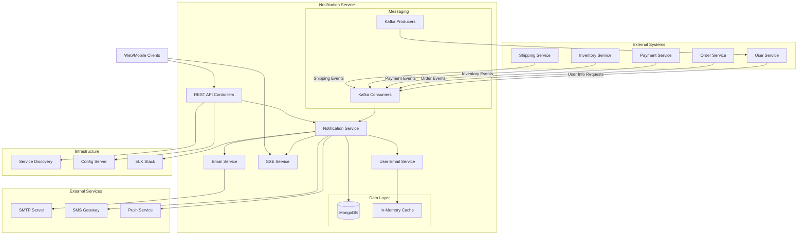
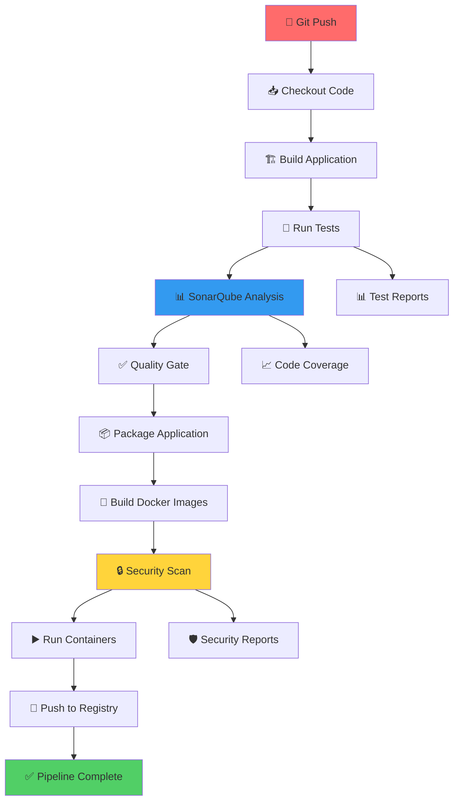
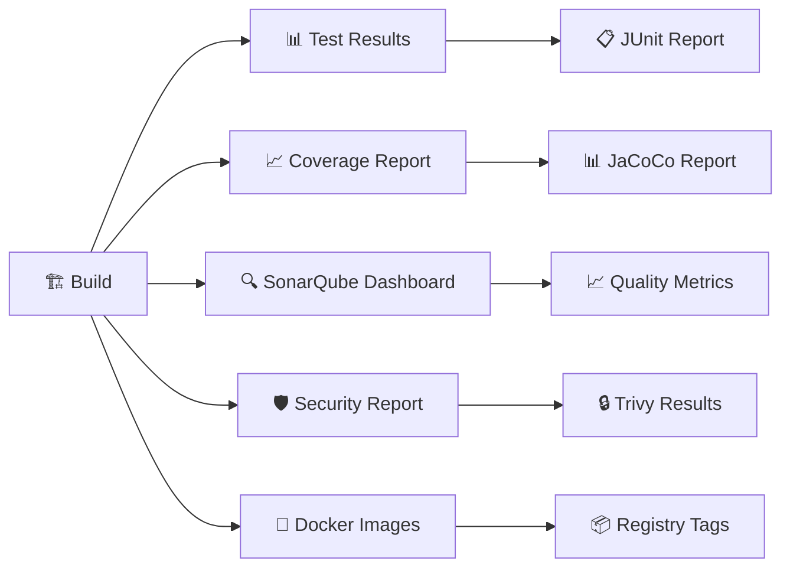
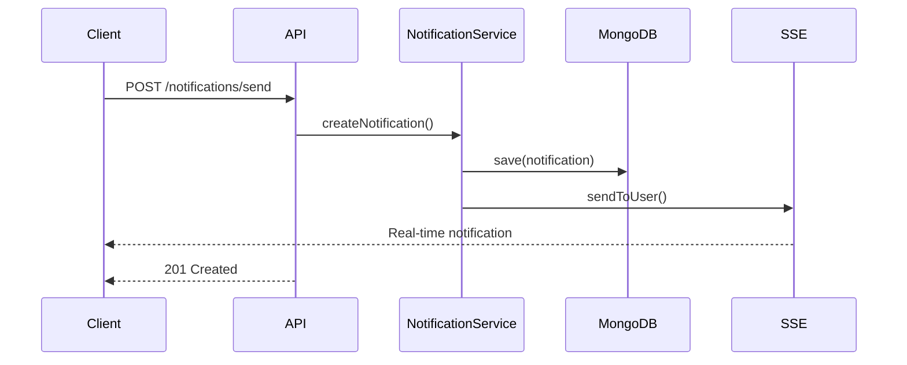
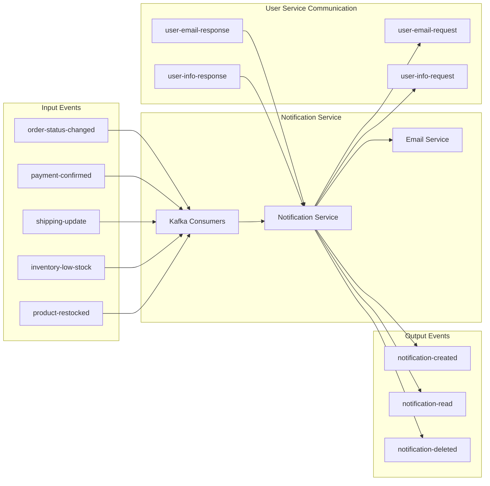
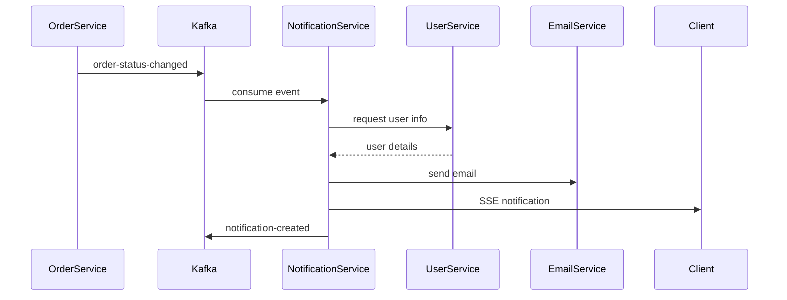
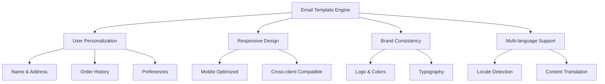

# 📧 Notification Service

<div align="center">


*A comprehensive notification microservice for e-commerce platforms with real-time notifications, email templates, and event-driven architecture*

</div>

## 🚀 Overview

The Notification Service is a robust microservice designed to handle all notification requirements in an e-commerce ecosystem. It provides multi-channel notification delivery, real-time updates via Server-Sent Events, customizable email templates, and seamless integration with other microservices through Apache Kafka.

### ✨ Key Features

- 📨 **Multi-Channel Notifications**: Email, SMS, Push, and In-App notifications
- ⚡ **Real-Time Updates**: Server-Sent Events (SSE) for instant notifications
- 📧 **Rich Email Templates**: HTML email templates with user personalization
- 🔄 **Event-Driven Architecture**: Kafka integration for asynchronous communication
- 👤 **User Preferences**: Customizable notification preferences per user
- 🎯 **Smart Routing**: Intelligent notification routing based on user preferences
- 📊 **Analytics & Monitoring**: Comprehensive logging and metrics
- 🔐 **Secure**: Built-in security features and data validation
- 🚀 **CI/CD Ready**: Complete Jenkins pipeline with automated testing and deployment

## 🏗️ Architecture



## 🛠️ Technology Stack

| Component | Technology | Version |
|-----------|------------|---------|
| **Framework** | Spring Boot | 3.4.4 |
| **Language** | Java | 21 |
| **Database** | MongoDB | Latest |
| **Messaging** | Apache Kafka | Latest |
| **Email** | Spring Mail + SMTP | - |
| **Real-time** | Server-Sent Events | - |
| **Service Discovery** | Eureka Client | - |
| **Configuration** | Spring Cloud Config | 2024.0.1 |
| **Documentation** | SpringDoc OpenAPI | 2.3.0 |
| **Monitoring** | ELK Stack | - |
| **Build Tool** | Maven | - |
| **CI/CD** | Jenkins | Latest |
| **Code Quality** | SonarQube | Latest |
| **Security Scanning** | Trivy | 0.48.3+ |
| **Containerization** | Docker | Latest |

## 🔄 CI/CD Pipeline

<div align="center">


</div>

### 🚀 Pipeline Overview

Our Jenkins CI/CD pipeline ensures code quality, security, and reliable deployment through automated testing, static analysis, security scanning, and containerized deployment.



### 🏗️ Pipeline Stages

| Stage | Description | Tools | Duration |
|-------|-------------|-------|----------|
| **📥 Checkout** | Clone repository and sparse checkout | Git | ~30s |
| **🏗️ Build** | Compile Java source code | Maven | ~1-2min |
| **🧪 Test** | Run unit tests with coverage | JUnit, JaCoCo | ~2-3min |
| **📊 Analysis** | Static code analysis | SonarQube | ~1-2min |
| **✅ Quality Gate** | Validate code quality metrics | SonarQube | ~30s |
| **📦 Package** | Create JAR artifacts | Maven | ~1min |
| **🐳 Build Images** | Create Docker containers | Docker, Docker Compose | ~2-3min |
| **🔒 Security Scan** | Vulnerability assessment | Trivy | ~2-4min |
| **▶️ Deploy** | Start application containers | Docker Compose | ~1min |
| **🚀 Publish** | Push to Docker Hub | Docker Registry | ~1-2min |

### 📋 Pipeline Configuration

#### Environment Variables

```bash
# Docker Hub Configuration
DOCKERHUB_CREDENTIALS=your-dockerhub-credentials-id
DOCKERHUB_REPO=yourusername/notification-service
IMAGE_TAG=latest

# Git Configuration
GIT_CREDENTIALS_ID=git-https-token

# SonarQube Configuration
SONAR_HOST_URL=http://localhost:9000
SONAR_AUTH_TOKEN=your-sonar-token

# Trivy Security Scanning
TRIVY_CACHE_DIR=C:\temp\trivy-cache
TRIVY_DB_REPOSITORY=ghcr.io/aquasecurity/trivy-db
TRIVY_JAVA_DB_REPOSITORY=ghcr.io/aquasecurity/trivy-java-db
```

#### Jenkins Setup Requirements

<div align="center">


</div>

**Required Jenkins Plugins:**
- 🔧 **Pipeline**: Pipeline plugin suite
- 🐳 **Docker**: Docker Pipeline plugin
- 📊 **SonarQube**: SonarQube Scanner plugin
- 🧪 **JUnit**: JUnit plugin for test results
- 📈 **JaCoCo**: JaCoCo plugin for coverage
- 🔑 **Credentials**: Credentials Binding plugin

**Required Tools Configuration:**
- ☕ **JDK 21**: Configured in Global Tool Configuration
- 📦 **Maven 3.9.7**: Configured as "Maven-3.9.7"
- 🐳 **Docker**: Available on Jenkins agent
- 🔍 **Trivy**: Auto-installed during pipeline

### 🔒 Security & Quality Assurance

#### SonarQube Integration

<div align="center">


</div>

**Quality Metrics Tracked:**
- 🐛 **Bugs**: Code bugs and potential issues
- 🔒 **Vulnerabilities**: Security vulnerabilities
- 💨 **Code Smells**: Maintainability issues
- 📊 **Coverage**: Test coverage percentage
- 🔄 **Duplications**: Code duplication analysis

**Quality Gate Criteria:**
- ✅ Coverage > 80%
- ✅ No new bugs
- ✅ No new vulnerabilities
- ✅ Maintainability rating A
- ✅ Reliability rating A

#### Security Scanning with Trivy

<div align="center">


</div>

**Security Scans Include:**
- 🔍 **OS Vulnerabilities**: Operating system packages
- 📦 **Language Dependencies**: Java/Maven dependencies
- 🐳 **Container Images**: Docker image vulnerabilities
- 📝 **Configuration Issues**: Misconfigurations
- 🔒 **Secret Detection**: Hardcoded secrets

**Vulnerability Severity Levels:**
- 🔴 **CRITICAL**: Immediate action required
- 🟠 **HIGH**: Should be fixed soon
- 🟡 **MEDIUM**: Should be fixed eventually
- 🔵 **LOW**: Nice to fix
- ⚪ **UNKNOWN**: Requires investigation

### 📊 Pipeline Monitoring

#### Build Status & Reports



#### Pipeline Notifications

**Success Notifications:**
- ✅ Pipeline completed successfully
- 📊 Links to SonarQube dashboard
- 🔒 Security scan reports available
- 🐳 Docker images published

**Failure Notifications:**
- ❌ Pipeline failed with details
- 🔍 Links to build logs
- 📊 Quality gate status
- 🛠️ Remediation suggestions

### 🚀 Pipeline Execution

#### Triggering the Pipeline

```bash
# Automatic trigger on push to main branch
git push origin main

# Manual trigger through Jenkins UI
# Navigate to Jenkins → Notification-Service → Build Now
```

#### Pipeline Artifacts

The pipeline generates and archives the following artifacts:

| Artifact | Description | Location |
|----------|-------------|----------|
| **📦 JAR File** | Compiled application | `target/*.jar` |
| **📊 Test Reports** | JUnit test results | `**/surefire-reports/*.xml` |
| **📈 Coverage Report** | JaCoCo coverage | `target/site/jacoco/**` |
| **🔒 Security Report** | Trivy scan results | `trivy-report.*` |
| **📋 Build Logs** | Complete build logs | Jenkins console |

#### Docker Images

**Generated Images:**
- 🏷️ `notification-service:latest` - Latest build
- 🔢 `notification-service:build-{BUILD_NUMBER}` - Versioned build
- 🚀 `{DOCKERHUB_REPO}:latest` - Published to registry
- 📦 `{DOCKERHUB_REPO}:build-{BUILD_NUMBER}` - Versioned registry

### 🛠️ Pipeline Maintenance

#### Regular Maintenance Tasks

**Weekly:**
- 🔄 Update Trivy vulnerability database
- 📊 Review SonarQube quality trends
- 🧹 Clean up old Docker images
- 📋 Review pipeline performance metrics

**Monthly:**
- 🔧 Update Jenkins plugins
- 📦 Update Maven dependencies
- 🔒 Rotate credentials and tokens
- 📈 Analyze build time trends

#### Troubleshooting Common Issues

| Issue | Symptom | Solution |
|-------|---------|----------|
| **Build Failure** | Compilation errors | Check Java/Maven versions |
| **Test Failures** | Test suite failures | Review test logs and fix |
| **Quality Gate** | SonarQube gate failed | Address code quality issues |
| **Security Scan** | High/Critical vulnerabilities | Update dependencies |
| **Docker Build** | Image build failures | Check Dockerfile and dependencies |
| **Registry Push** | Push to DockerHub fails | Verify credentials and connectivity |

## 📋 Prerequisites

- ☕ **Java 21** or higher
- 🐘 **MongoDB** 4.4+
- 🔄 **Apache Kafka** 2.8+
- 📦 **Maven** 3.8+
- 🐳 **Docker** (optional)
- 🏗️ **Jenkins** (for CI/CD)
- 📊 **SonarQube** (for code quality)

## 🚀 Quick Start

### 1. Clone the Repository

```bash
git clone <repository-url>
cd Notification-Service
```

### 2. Start Dependencies

```bash
# Start MongoDB
docker run -d --name mongodb -p 27017:27017 mongo:latest

# Start Kafka (requires Zookeeper)
docker run -d --name zookeeper -p 2181:2181 confluentinc/cp-zookeeper:latest
docker run -d --name kafka -p 9092:9092 --link zookeeper confluentinc/cp-kafka:latest
```

### 3. Configuration

Create `.env` file or set environment variables:

```bash
# Email Configuration
EMAIL_USERNAME=your-email@gmail.com
EMAIL_PASSWORD=your-app-password
EMAIL_FROM=noreply@yourdomain.com
EMAIL_FROM_NAME=Your Company

# Database
MONGODB_HOST=localhost
MONGODB_PORT=27017
MONGODB_DATABASE=notification-service

# Kafka
KAFKA_BOOTSTRAP_SERVERS=localhost:9092
```

### 4. Run the Application

```bash
# Using Maven
mvn spring-boot:run

# Or using JAR
mvn clean package
java -jar target/notification-service-0.0.1-SNAPSHOT.jar
```

The service will start on `http://localhost:8085`

## 📚 API Documentation

### 🔗 Base URL
```
http://localhost:8085/api/notifications
```

### 📖 Swagger UI
```
http://localhost:8085/api/notifications/swagger-ui/index.html
```

## 🎯 Core Endpoints

### Notifications Management



| Method | Endpoint | Description |
|--------|----------|-------------|
| `GET` | `/notifications/user/{userId}` | Get user notifications |
| `GET` | `/notifications/user/{userId}/unread` | Get unread notifications |
| `POST` | `/notifications/send` | Send notification |
| `PUT` | `/notifications/{id}/read` | Mark as read |
| `DELETE` | `/notifications/{id}` | Delete notification |

### Email Testing

| Method | Endpoint | Description |
|--------|----------|-------------|
| `POST` | `/email/test/send-to-one` | Test single email |
| `POST` | `/email/test/send-to-all` | Test bulk emails |
| `POST` | `/email/test/promotion` | Test promotional email |
| `GET` | `/email/types` | Get notification types |

### Real-Time Notifications (SSE)

| Method | Endpoint | Description |
|--------|----------|-------------|
| `GET` | `/sse/connect/{userId}` | Establish SSE connection |
| `POST` | `/sse/broadcast` | Broadcast system alert |
| `POST` | `/sse/disconnect/{userId}` | Close user connections |
| `GET` | `/sse/stats` | Get connection statistics |

## 🔄 Event-Driven Architecture

### Kafka Topics



### Event Processing Flow



## 📧 Email Templates

The service includes rich HTML email templates for various notification types:

### Template Types

- 💳 **Payment Confirmation**: Enhanced with order details and user address
- 🚚 **Shipping Updates**: Real-time tracking with delivery estimates
- 🎉 **Promotional Emails**: Marketing campaigns with personalization
- 👤 **Account Activity**: Security and profile updates
- 🌟 **Loyalty Points**: Rewards and tier upgrades
- 📦 **Delivery Confirmation**: Package delivery notifications

### Template Features



## 🔧 Configuration

### Application Configuration

```yaml
# application.yaml
spring:
  application:
    name: notification-service
  data:
    mongodb:
      host: localhost
      port: 27017
      database: notification-service
  kafka:
    bootstrap-servers: localhost:9092
    consumer:
      group-id: notification-service
  mail:
    host: smtp.gmail.com
    port: 587
    username: ${EMAIL_USERNAME}
    password: ${EMAIL_PASSWORD}

notification:
  email:
    from: ${EMAIL_FROM:noreply@ecommerce.com}
    from-name: ${EMAIL_FROM_NAME:ECommerce System}
    templates:
      base-url: ${BASE_URL:http://localhost:3000}

server:
  port: 8085
  servlet:
    context-path: /api/notifications
```

## 🧪 Testing

### Running Tests

```bash
# Run all tests
mvn test

# Run specific test class
mvn test -Dtest=NotificationServiceTest

# Run with coverage
mvn test jacoco:report
```

### Email Testing Endpoints

Test your email configuration:

```bash
# Test single email
curl -X POST "http://localhost:8085/api/notifications/email/test/send-to-one?email=test@example.com&type=PAYMENT_CONFIRMATION"

# Test promotional campaign
curl -X POST "http://localhost:8085/api/notifications/email/test/promotion?emails=user1@test.com,user2@test.com"
```

## 📊 Monitoring & Observability

### Health Checks

```bash
# Service health
GET /actuator/health

# Email service status
GET /email/status

# SSE connection stats
GET /sse/stats
```

### Metrics

The service provides comprehensive metrics through:

- 📈 **Spring Boot Actuator**: Built-in metrics and health checks
- 📊 **ELK Stack Integration**: Centralized logging with Logstash
- 🔍 **Kafka Monitoring**: Message processing metrics
- 📧 **Email Delivery Tracking**: Success/failure rates

### Logging

```yaml
logging:
  level:
    com.Ecommerce.Notification_Service: DEBUG
    org.springframework.kafka: INFO
  pattern:
    console: "%d{yyyy-MM-dd HH:mm:ss.SSS} [%thread] %-5level %logger{36} - %msg%n"
```

## 🔒 Security Features

- ✅ **Input Validation**: Comprehensive request validation
- 🛡️ **CORS Protection**: Configurable CORS policies
- 🔐 **Data Encryption**: Sensitive data encryption at rest
- 📝 **Audit Logging**: Complete audit trail for all operations
- 🚫 **Rate Limiting**: Protection against abuse
- 🔍 **Security Headers**: Standard security headers implementation

## 🐳 Docker Support

### Dockerfile

```dockerfile
FROM openjdk:21-jdk-slim
VOLUME /tmp
COPY target/notification-service-0.0.1-SNAPSHOT.jar app.jar
ENTRYPOINT ["java","-jar","/app.jar"]
```

### Docker Compose

```yaml
# compose.yaml
version: '3.8'
services:
  notification-service:
    build: .
    ports:
      - "8085:8085"
    environment:
      - SPRING_DATA_MONGODB_HOST=mongodb
      - SPRING_KAFKA_BOOTSTRAP_SERVERS=kafka:9092
    depends_on:
      - mongodb
      - kafka
  
  mongodb:
    image: mongo:latest
    ports:
      - "27017:27017"
  
  # ... other services
```

## 🚀 Deployment

### Production Deployment

```bash
# Build production JAR
mvn clean package -Pprod

# Run with production profile
java -jar -Dspring.profiles.active=prod target/notification-service-0.0.1-SNAPSHOT.jar
```

### Environment Variables

```bash
export SPRING_PROFILES_ACTIVE=prod
export MONGODB_URI=mongodb://prod-mongo:27017/notification-service
export KAFKA_BOOTSTRAP_SERVERS=prod-kafka:9092
export EMAIL_USERNAME=prod-email@company.com
export EMAIL_PASSWORD=secure-app-password
```

## 🤝 Contributing

1. Fork the repository
2. Create a feature branch (`git checkout -b feature/amazing-feature`)
3. Commit your changes (`git commit -m 'Add amazing feature'`)
4. Push to the branch (`git push origin feature/amazing-feature`)
5. Open a Pull Request

### Development Guidelines

- Follow Spring Boot best practices
- Write comprehensive tests
- Update documentation
- Follow conventional commit messages
- Ensure CI/CD pipeline passes

## 📄 License

This project is licensed under the MIT License - see the [LICENSE](LICENSE) file for details.

## 📞 Support

- 📧 **Email**: support@yourcompany.com
- 💬 **Slack**: #notification-service
- 📖 **Documentation**: [Wiki](wiki-url)
- 🐛 **Issues**: [GitHub Issues](issues-url)


---

<div align="center">

**Built with ❤️ for the E-Commerce Ecosystem**


</div>
