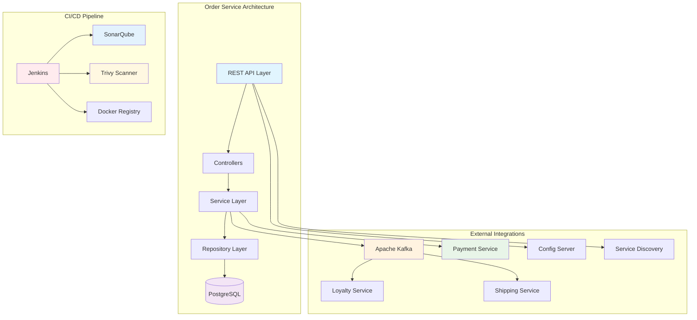
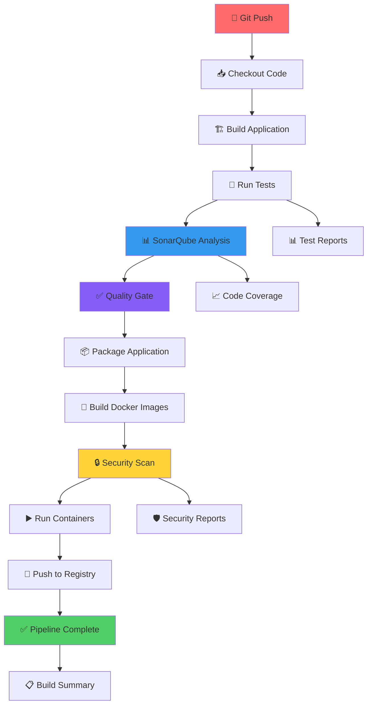
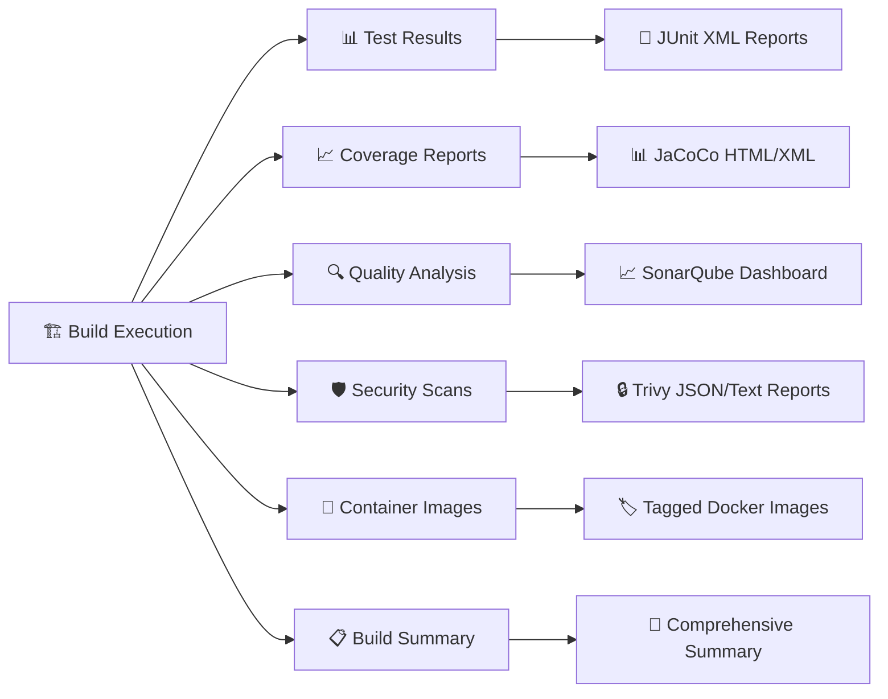
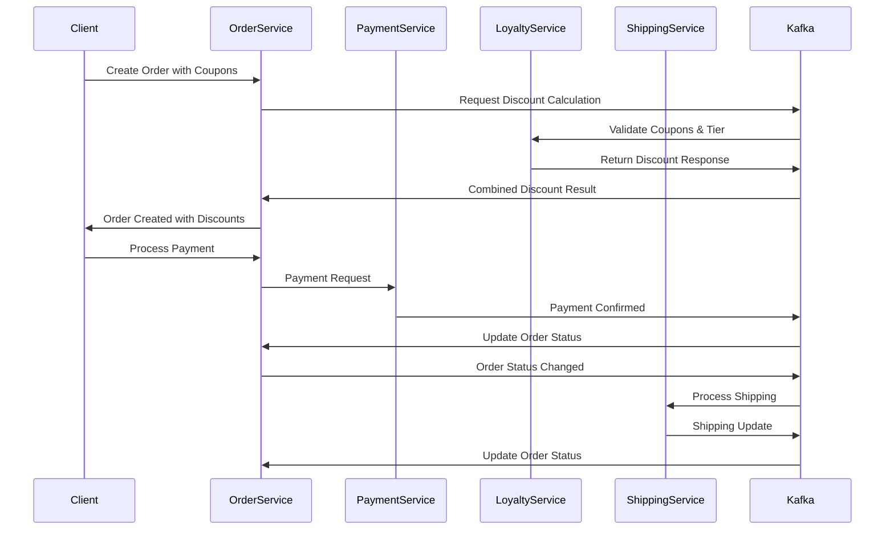
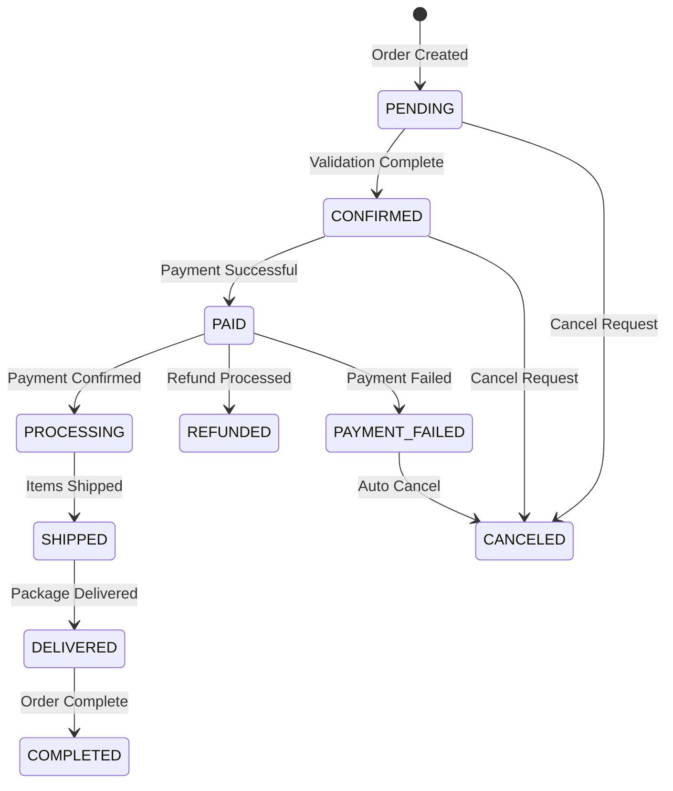

# 🛒 Order Service

<div align="center">


*A robust microservice for managing orders in an e-commerce platform with enterprise-grade CI/CD*

[](https://openjdk.java.net/projects/jdk/17/)
[](https://spring.io/projects/spring-boot)
[](LICENSE)
[]()
[]()
[]()

</div>

## 🌟 Overview

The Order Service is a core microservice in our e-commerce ecosystem, responsible for comprehensive order management including creation, status tracking, payment processing, and discount calculations. Built with Spring Boot and designed for high scalability, reliability, and enterprise-grade CI/CD automation.

## 🏗️ Architecture



## 🚀 Features

### 📦 Order Management
- ✅ **Order Creation**: Create orders with multiple items
- ✅ **Status Tracking**: Real-time order status updates
- ✅ **Order Cancellation**: Cancel orders with proper validation
- ✅ **Invoice Generation**: Automatic invoice creation

### 💰 Discount System
- ✅ **Product-level Discounts**: Individual item discounts
- ✅ **Order-level Discounts**: Bulk purchase discounts
- ✅ **Coupon Integration**: Loyalty coupon validation
- ✅ **Tier Benefits**: Membership tier-based discounts

### 💳 Payment Integration
- ✅ **Payment Processing**: Seamless payment integration
- ✅ **Payment Status Tracking**: Real-time payment updates
- ✅ **Refund Processing**: Automated refund handling

### 🔄 Event-Driven Architecture
- ✅ **Kafka Integration**: Asynchronous event processing
- ✅ **Order Events**: Creation, updates, cancellation events
- ✅ **Payment Events**: Payment confirmation/failure handling
- ✅ **Shipping Events**: Delivery status updates

### 🚀 DevOps & CI/CD
- ✅ **Automated Testing**: Comprehensive test suite with coverage reporting
- ✅ **Code Quality**: SonarQube integration with quality gates
- ✅ **Security Scanning**: Trivy vulnerability assessment
- ✅ **Containerization**: Docker-based deployment
- ✅ **Continuous Deployment**: Automated pipeline with Jenkins

## 🔄 CI/CD Pipeline

<div align="center">


</div>

### 🚀 Pipeline Overview

Our enterprise Jenkins CI/CD pipeline ensures code quality, security, and reliable deployment through automated testing, static analysis, security scanning, and containerized deployment with comprehensive monitoring.



### 🏗️ Detailed Pipeline Stages

| Stage | Description | Tools Used | Avg Duration | Artifacts |
|-------|-------------|------------|--------------|-----------|
| **📥 Checkout** | Sparse checkout of Order-Service directory | Git | ~30s | Source code |
| **🏗️ Build** | Compile Java 17 source code with Maven | Maven 3.9.7, JDK 17 | ~1-2min | Compiled classes |
| **🧪 Test** | Execute unit tests with coverage analysis | JUnit, JaCoCo | ~2-3min | Test reports, Coverage |
| **📊 Analysis** | Static code analysis and quality metrics | SonarQube | ~1-2min | Quality reports |
| **✅ Quality Gate** | Validate code quality thresholds | SonarQube | ~30s | Gate status |
| **📦 Package** | Create executable JAR with verification | Maven | ~1min | JAR artifacts |
| **🐳 Build Images** | Create and validate Docker containers | Docker, Docker Compose | ~2-3min | Docker images |
| **🔒 Security Scan** | Comprehensive vulnerability assessment | Trivy | ~2-4min | Security reports |
| **▶️ Deploy** | Start application containers for testing | Docker Compose | ~1min | Running containers |
| **🚀 Publish** | Push images to Docker Hub registry | Docker Registry | ~1-2min | Published images |

### 🛠️ Technology Stack

| Component | Technology | Version | Purpose |
|-----------|------------|---------|---------|
| **Framework** | Spring Boot | 3.4.4 | Application framework |
| **Language** | Java | 17 | Programming language |
| **Database** | PostgreSQL | 15+ | Primary data store |
| **Messaging** | Apache Kafka | 2.8+ | Event streaming |
| **Build Tool** | Maven | 3.9.7 | Dependency management |
| **CI/CD** | Jenkins | Latest | Continuous integration |
| **Code Quality** | SonarQube | Latest | Static analysis |
| **Security Scanning** | Trivy | 0.48.3+ | Vulnerability assessment |
| **Containerization** | Docker | Latest | Application packaging |
| **Documentation** | Swagger/OpenAPI | Latest | API documentation |

### 📋 Pipeline Configuration

#### Environment Variables

```bash
# Docker Hub Configuration
DOCKERHUB_CREDENTIALS=yahya.zakaria-dockerhub
DOCKERHUB_REPO=yahyazakaria123/ecommerce-app-order-service
IMAGE_TAG=latest

# Git Configuration  
GIT_CREDENTIALS_ID=GithubCredentials

# SonarQube Configuration
SONAR_PROJECT_KEY=E-commerce-Order-Service
SONAR_PROJECT_NAME="E-commerce Order Service"
SONAR_HOST_URL=http://localhost:9000

# Java/Maven Configuration
MAVEN_COMPILER_SOURCE=17
MAVEN_COMPILER_TARGET=17
MAVEN_COMPILER_RELEASE=17

# Trivy Security Scanning
TRIVY_CACHE_DIR=C:\temp\trivy-cache
TRIVY_DB_REPOSITORY=ghcr.io/aquasecurity/trivy-db
TRIVY_JAVA_DB_REPOSITORY=ghcr.io/aquasecurity/trivy-java-db
```

#### Jenkins Setup Requirements

<div align="center">


</div>

**Required Jenkins Plugins:**
- 🔧 **Pipeline Suite**: Complete pipeline functionality
- 🐳 **Docker Pipeline**: Docker integration and management
- 📊 **SonarQube Scanner**: Code quality integration
- 🧪 **JUnit Plugin**: Test result publishing
- 📈 **JaCoCo Plugin**: Code coverage reporting
- 🔑 **Credentials Binding**: Secure credential management
- 📋 **Build Timestamp**: Build metadata

**Tool Configurations:**
- ☕ **JDK 17**: Configured in Global Tool Configuration
- 📦 **Maven 3.9.7**: Named "Maven-3.9.7" in tools
- 🐳 **Docker**: Available on Jenkins agents
- 🔍 **Trivy**: Auto-installed during pipeline execution

### 🔒 Security & Quality Assurance

#### SonarQube Integration

<div align="center">


</div>

**Quality Metrics Tracked:**
- 🐛 **Bugs**: Code defects and potential issues
- 🔒 **Vulnerabilities**: Security vulnerabilities in code
- 💨 **Code Smells**: Maintainability and readability issues
- 📊 **Coverage**: Unit test coverage percentage
- 🔄 **Duplications**: Code duplication analysis
- 📏 **Lines of Code**: Codebase size metrics
- 🔢 **Complexity**: Cyclomatic complexity analysis

**Quality Gate Criteria:**
- ✅ **Coverage**: > 80% test coverage
- ✅ **New Bugs**: 0 new bugs introduced
- ✅ **New Vulnerabilities**: 0 new security issues
- ✅ **Maintainability Rating**: A grade required
- ✅ **Reliability Rating**: A grade required
- ✅ **Security Rating**: A grade required
- ✅ **Duplicated Lines**: < 3% duplication

#### Security Scanning with Trivy

<div align="center">


</div>

**Comprehensive Security Assessment:**
- 🔍 **OS Vulnerabilities**: Base image and OS packages
- 📦 **Java Dependencies**: Maven dependencies and transitive deps
- 🐳 **Container Security**: Docker image vulnerabilities
- 📝 **Configuration Issues**: Security misconfigurations
- 🔒 **Secret Detection**: Hardcoded credentials and keys
- 🎯 **License Compliance**: Open source license validation

**Vulnerability Severity Classification:**
- 🔴 **CRITICAL**: Immediate security risk - Pipeline fails
- 🟠 **HIGH**: Significant risk - Pipeline marked unstable
- 🟡 **MEDIUM**: Moderate risk - Documented for review
- 🔵 **LOW**: Minor risk - Monitored but not blocking
- ⚪ **UNKNOWN**: Requires manual investigation

### 📊 Pipeline Monitoring & Reporting

#### Comprehensive Build Artifacts



#### Pipeline Notifications & Alerts

**Success Notifications Include:**
- ✅ **Pipeline Status**: Successful completion confirmation
- 📊 **Quality Metrics**: Links to SonarQube dashboard
- 🔒 **Security Status**: Clean security scan results
- 🐳 **Deployment Info**: Published Docker images and tags
- 📈 **Performance**: Build duration and trend analysis

**Failure/Warning Notifications Include:**
- ❌ **Failure Details**: Specific stage and error information
- 🔍 **Investigation Links**: Direct links to logs and reports
- 📊 **Quality Issues**: Failed quality gate details
- 🛠️ **Remediation Steps**: Suggested fixes and next actions
- 📞 **Escalation Info**: Team contacts for critical issues

### 🚀 Pipeline Execution

#### Automated Triggers

```bash
# Automatic trigger on main branch push
git push origin main

# Manual trigger options:
# 1. Jenkins UI: Navigate to Order-Service → Build Now
# 2. Webhook trigger from GitHub/GitLab
# 3. Scheduled builds (if configured)
# 4. API trigger via Jenkins REST API
```

#### Generated Artifacts & Reports

| Artifact Type | Description | Storage Location | Retention |
|---------------|-------------|------------------|-----------|
| **📦 JAR Files** | Compiled application artifacts | `target/*.jar` | 30 builds |
| **📊 Test Reports** | JUnit XML test results | `target/surefire-reports/` | 30 builds |
| **📈 Coverage Reports** | JaCoCo HTML and XML reports | `target/site/jacoco/` | 30 builds |
| **🔒 Security Reports** | Trivy scan results (JSON/Text) | `trivy-report.*` | 90 days |
| **📋 Build Summary** | Comprehensive build overview | `build-summary.txt` | 30 builds |
| **📝 Console Logs** | Complete build execution logs | Jenkins console | 50 builds |

#### Docker Image Management

**Image Tagging Strategy:**
- 🏷️ **Latest Tag**: `order-service:latest` (development)
- 🔢 **Build Number**: `order-service:build-{BUILD_NUMBER}` (traceability)
- 📅 **Date Tags**: `order-service:YYYY-MM-DD` (scheduled builds)
- 🎯 **Registry Tags**: `yahyazakaria123/ecommerce-app-order-service:latest`

**Registry Push Strategy:**
```bash
# Development builds
docker push yahyazakaria123/ecommerce-app-order-service:latest

# Production releases (when configured)
docker push yahyazakaria123/ecommerce-app-order-service:v1.2.3

# Rollback support
docker push yahyazakaria123/ecommerce-app-order-service:stable
```

### 🛠️ Pipeline Maintenance & Operations

#### Regular Maintenance Schedule

**Daily Operations:**
- 🔄 **Build Monitoring**: Check pipeline success rates
- 📊 **Quality Trends**: Review SonarQube metrics
- 🔒 **Security Alerts**: Monitor vulnerability notifications
- 📈 **Performance**: Track build duration trends

**Weekly Maintenance:**
- 🔄 **Database Updates**: Update Trivy vulnerability database
- 📊 **Quality Review**: Analyze code quality trends
- 🧹 **Cleanup**: Remove old Docker images and artifacts
- 📋 **Documentation**: Update pipeline documentation

**Monthly Maintenance:**
- 🔧 **Tool Updates**: Update Jenkins plugins and tools
- 📦 **Dependency Updates**: Review and update Maven dependencies
- 🔒 **Security Review**: Rotate credentials and tokens
- 📈 **Optimization**: Analyze and optimize pipeline performance

#### Troubleshooting Guide

| Issue Category | Symptoms | Root Causes | Solutions |
|----------------|----------|-------------|-----------|
| **🏗️ Build Failures** | Compilation errors, Maven failures | • JDK version mismatch<br>• Dependency conflicts<br>• Source code errors | • Verify JDK 17 configuration<br>• Update pom.xml dependencies<br>• Review code changes |
| **🧪 Test Failures** | Unit test failures, coverage issues | • Environment differences<br>• Test data issues<br>• Flaky tests | • Check test environment setup<br>• Review test data and mocks<br>• Identify and fix flaky tests |
| **📊 Quality Gate** | SonarQube quality gate failures | • Code quality degradation<br>• Coverage drop<br>• New vulnerabilities | • Address code smells and bugs<br>• Add missing unit tests<br>• Fix security vulnerabilities |
| **🔒 Security Issues** | High/Critical vulnerabilities | • Outdated dependencies<br>• Insecure configurations<br>• Known CVEs | • Update vulnerable dependencies<br>• Review security configurations<br>• Apply security patches |
| **🐳 Docker Issues** | Container build/run failures | • Dockerfile errors<br>• Missing dependencies<br>• Port conflicts | • Review Dockerfile syntax<br>• Check application dependencies<br>• Verify port configurations |
| **🚀 Registry Issues** | Push to Docker Hub failures | • Authentication problems<br>• Network issues<br>• Repository access | • Verify DockerHub credentials<br>• Check network connectivity<br>• Validate repository permissions |

#### Performance Optimization

**Build Speed Optimization:**
- 📦 **Maven**: Use dependency caching and parallel builds
- 🐳 **Docker**: Optimize layer caching and multi-stage builds
- 🧪 **Testing**: Run tests in parallel where possible
- 📊 **Analysis**: Cache SonarQube analysis artifacts

**Resource Management:**
- 🖥️ **Jenkins Agents**: Scale agents based on build load
- 💾 **Storage**: Implement artifact cleanup policies
- 🌐 **Network**: Optimize network usage for large artifacts
- ⚡ **Caching**: Implement intelligent caching strategies

## 🏃‍♂️ Quick Start

### Prerequisites

```bash
☑️ Java 17+
☑️ Maven 3.8+
☑️ PostgreSQL 15+
☑️ Apache Kafka 2.8+
☑️ Docker & Docker Compose
☑️ Jenkins (for CI/CD)
☑️ SonarQube (for code quality)
```

### 🐳 Docker Setup

```bash
# Start PostgreSQL and Kafka
docker-compose up -d

# Verify services
docker-compose ps
```

### 🔧 Application Setup

```bash
# Clone the repository
git clone <repository-url>
cd Order-Service

# Build the application
./mvnw clean install

# Run the application
./mvnw spring-boot:run
```

## 📊 Event Flow



## 🛠️ API Endpoints

### 📋 Orders

```http
GET    /api/orders              # Get all orders
POST   /api/orders              # Create order
GET    /api/orders/{id}         # Get order by ID
PATCH  /api/orders/{id}/status  # Update order status
POST   /api/orders/{id}/cancel  # Cancel order
```

### 🎯 Order Items

```http
GET    /api/orders/{id}/items              # Get order items
POST   /api/orders/{id}/items              # Add item to order
PATCH  /api/orders/{id}/items/{itemId}     # Update item quantity
DELETE /api/orders/{id}/items/{itemId}     # Remove item
```

### 💳 Payments

```http
POST   /api/orders/{id}/pay                # Process payment
GET    /api/orders/{id}/payment/status     # Get payment status
POST   /api/orders/{id}/refund             # Process refund
```

### 🎁 Advanced Features

```http
POST   /api/orders/with-discounts         # Create order with coupons
POST   /api/orders/with-payment           # Create order and pay
GET    /api/orders/{id}/invoice           # Generate invoice
GET    /api/orders/{id}/total             # Calculate total
```

## 📋 Order Status Flow



## ⚙️ Configuration

### 🗄️ Database Configuration

```yaml
spring:
  datasource:
    url: jdbc:postgresql://localhost:5432/Order-service
    username: postgres
    password: ${DB_PASSWORD}
  jpa:
    hibernate:
      ddl-auto: update
    show-sql: true
```

### 🔄 Kafka Configuration

```yaml
spring:
  kafka:
    bootstrap-servers: localhost:9092
    producer:
      key-serializer: org.apache.kafka.common.serialization.StringSerializer
      value-serializer: org.springframework.kafka.support.serializer.JsonSerializer
    consumer:
      group-id: order-service-group
      auto-offset-reset: earliest
```

### 🌐 Service Discovery

```yaml
eureka:
  instance:
    preferIpAddress: true
    instanceId: ${spring.application.name}:${server.port}
```

## 📋 Event Topics

### 📤 Published Events

| Topic | Description | Event Type |
|-------|-------------|------------|
| `order-created` | New order created | OrderCreatedEvent |
| `order-status-changed` | Order status updated | OrderStatusChangedEvent |
| `order-canceled` | Order cancelled | OrderCanceledEvent |
| `order-item-added` | Item added to order | OrderItemAddedEvent |
| `order-completed` | Order completed | OrderCompletedEvent |

### 📥 Consumed Events

| Topic | Description | Source Service |
|-------|-------------|----------------|
| `payment-confirmed` | Payment successful | Payment Service |
| `payment-failed` | Payment failed | Payment Service |
| `shipping-update` | Shipping status change | Shipping Service |
| `combined-discount-response` | Discount calculation result | Loyalty Service |

## 🧪 Testing

```bash
# Run unit tests
./mvnw test

# Run integration tests
./mvnw test -Dtest="*IntegrationTest"

# Generate test coverage report
./mvnw jacoco:report

# Run tests with specific profile
./mvnw test -Dspring.profiles.active=test
```

## 📊 Monitoring & Observability

### 🔍 Health Checks

```http
GET /actuator/health     # Application health
GET /actuator/info       # Application info
GET /actuator/metrics    # Application metrics
```

### 📈 Swagger Documentation

```http
GET /swagger-ui.html     # Interactive API documentation
GET /api-docs           # OpenAPI specification
```

## 🔧 Development

### 🏗️ Project Structure

```
Order-Service/
├── src/main/java/
│   ├── Controllers/          # REST controllers
│   ├── Services/            # Business logic
│   ├── Entities/            # JPA entities
│   ├── Repositories/        # Data access layer
│   ├── Config/              # Configuration classes
│   ├── Listeners/           # Event listeners
│   └── Payload/             # DTOs and mappers
├── src/main/resources/
│   ├── application.yaml     # Application configuration
│   └── logback-spring.xml   # Logging configuration
├── Jenkinsfile              # CI/CD pipeline definition
├── Dockerfile               # Container build instructions
└── docker-compose.yaml     # Development environment
```

### 🎯 Key Design Patterns

- **Repository Pattern**: Data access abstraction
- **Service Layer Pattern**: Business logic separation
- **Event-Driven Architecture**: Loose coupling via Kafka
- **DTO Pattern**: Data transfer optimization
- **Builder Pattern**: Complex object creation

## 🚀 Deployment

### 🐳 Docker Build

```bash
# Build Docker image
docker build -t order-service:latest .

# Run container
docker run -p 8083:8083 order-service:latest
```

### ☸️ Kubernetes Deployment

```yaml
apiVersion: apps/v1
kind: Deployment
metadata:
  name: order-service
spec:
  replicas: 3
  selector:
    matchLabels:
      app: order-service
  template:
    metadata:
      labels:
        app: order-service
    spec:
      containers:
      - name: order-service
        image: order-service:latest
        ports:
        - containerPort: 8083
```

## 🤝 Contributing

We welcome contributions! Please follow these steps:

1. **Fork** the repository
2. **Create** a feature branch (`git checkout -b feature/amazing-feature`)
3. **Commit** your changes (`git commit -m 'Add amazing feature'`)
4. **Push** to the branch (`git push origin feature/amazing-feature`)
5. **Open** a Pull Request
6. **Ensure CI/CD pipeline passes** before requesting review

### Development Guidelines

- Follow Spring Boot best practices and conventions
- Write comprehensive unit and integration tests
- Maintain code coverage above 80%
- Follow conventional commit message format
- Ensure SonarQube quality gate passes
- Update API documentation for new endpoints
- Test Docker builds locally before pushing

## 📄 License

This project is licensed under the Apache License 2.0 - see the [LICENSE](LICENSE) file for details.

## 🆘 Support

- 📧 **Email**: support@yourcompany.com
- 📚 **Documentation**: [Wiki](https://github.com/yourrepo/wiki)
- 🐛 **Issues**: [GitHub Issues](https://github.com/yourrepo/issues)
- 💬 **Discord**: [Community Server](https://discord.gg/yourserver)
- 🏗️ **CI/CD Support**: [Jenkins Dashboard](http://localhost:8080)
- 📊 **Code Quality**: [SonarQube Dashboard](http://localhost:9000)

## 🗺️ Roadmap

### Current Sprint
- [ ] 📱 Mobile-optimized order APIs
- [ ] 🔔 Real-time order notifications
- [ ] 📊 Enhanced analytics and reporting

### Future Releases
- [ ] 🌐 Multi-language order processing
- [ ] 🤖 AI-powered order recommendations
- [ ] 🔄 Advanced workflow automation
- [ ] 📈 Predictive analytics integration
- [ ] ☸️ Kubernetes native deployment
- [ ] 🌍 Global order distribution
- [ ] 🔒 Advanced security features
- [ ] 📱 GraphQL API support

---

<div align="center">

**Built with ❤️ for scalable e-commerce**


</div>
