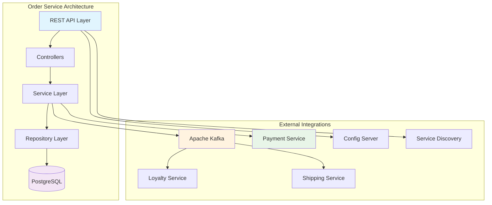
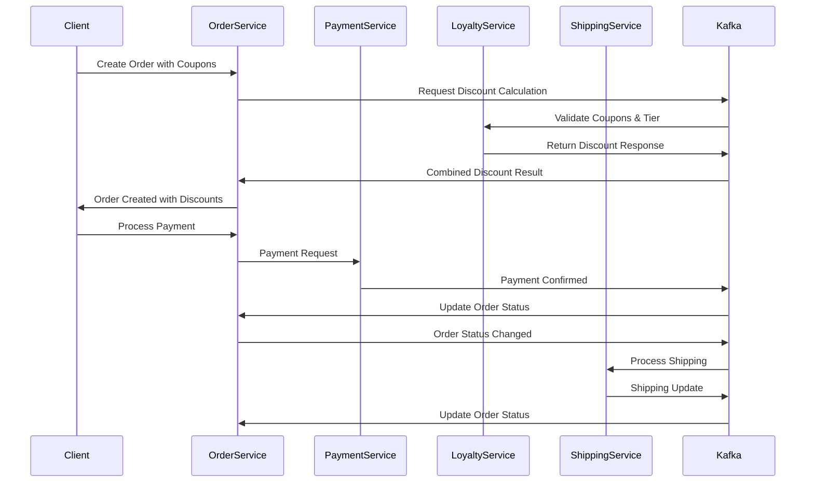
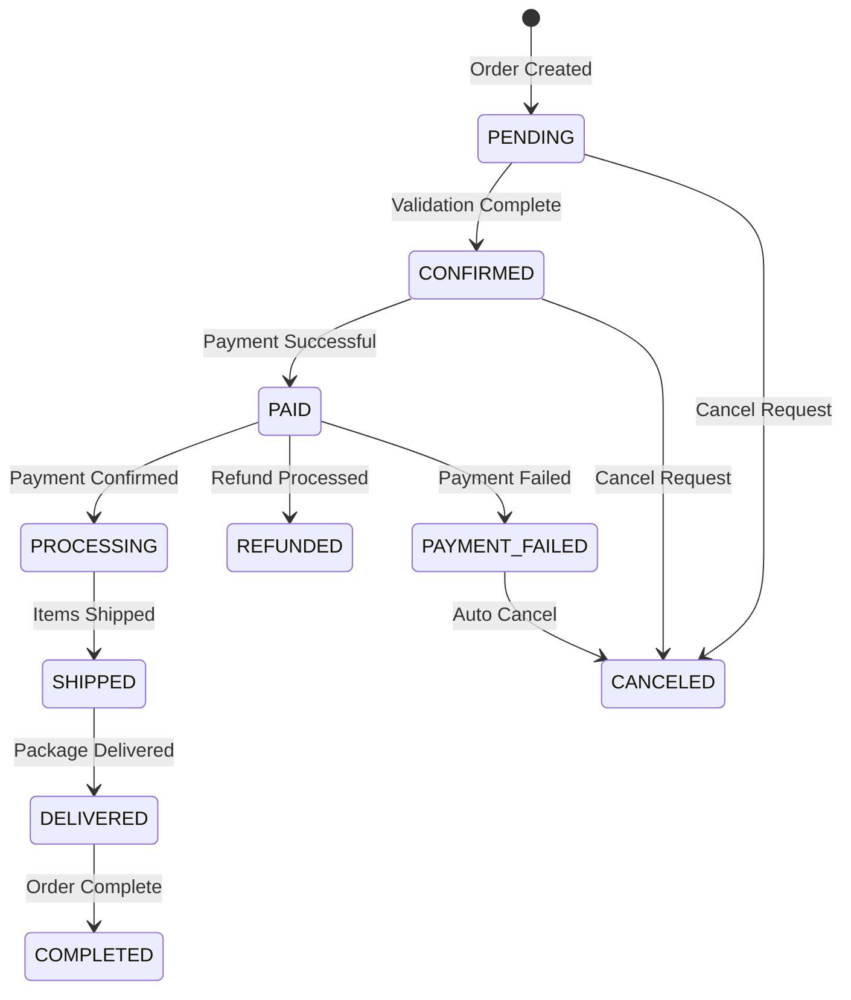

# 🛒 Order Service

<div align="center">


*A robust microservice for managing orders in an e-commerce platform*

[](https://openjdk.java.net/projects/jdk/21/)
[](https://spring.io/projects/spring-boot)
[](LICENSE)

</div>

## 🌟 Overview

The Order Service is a core microservice in our e-commerce ecosystem, responsible for comprehensive order management including creation, status tracking, payment processing, and discount calculations. Built with Spring Boot and designed for high scalability and reliability.

## 🏗️ Architecture



## 🚀 Features

### 📦 Order Management
- ✅ **Order Creation**: Create orders with multiple items
- ✅ **Status Tracking**: Real-time order status updates
- ✅ **Order Cancellation**: Cancel orders with proper validation
- ✅ **Invoice Generation**: Automatic invoice creation

### 💰 Discount System
- ✅ **Product-level Discounts**: Individual item discounts
- ✅ **Order-level Discounts**: Bulk purchase discounts
- ✅ **Coupon Integration**: Loyalty coupon validation
- ✅ **Tier Benefits**: Membership tier-based discounts

### 💳 Payment Integration
- ✅ **Payment Processing**: Seamless payment integration
- ✅ **Payment Status Tracking**: Real-time payment updates
- ✅ **Refund Processing**: Automated refund handling

### 🔄 Event-Driven Architecture
- ✅ **Kafka Integration**: Asynchronous event processing
- ✅ **Order Events**: Creation, updates, cancellation events
- ✅ **Payment Events**: Payment confirmation/failure handling
- ✅ **Shipping Events**: Delivery status updates

## 🏃‍♂️ Quick Start

### Prerequisites

```bash
☑️ Java 21+
☑️ Maven 3.8+
☑️ PostgreSQL 15+
☑️ Apache Kafka 2.8+
☑️ Docker & Docker Compose
```

### 🐳 Docker Setup

```bash
# Start PostgreSQL and Kafka
docker-compose up -d

# Verify services
docker-compose ps
```

### 🔧 Application Setup

```bash
# Clone the repository
git clone <repository-url>
cd Order-Service

# Build the application
./mvnw clean install

# Run the application
./mvnw spring-boot:run
```

## 📊 Event Flow



## 🛠️ API Endpoints

### 📋 Orders

```http
GET    /api/orders              # Get all orders
POST   /api/orders              # Create order
GET    /api/orders/{id}         # Get order by ID
PATCH  /api/orders/{id}/status  # Update order status
POST   /api/orders/{id}/cancel  # Cancel order
```

### 🎯 Order Items

```http
GET    /api/orders/{id}/items              # Get order items
POST   /api/orders/{id}/items              # Add item to order
PATCH  /api/orders/{id}/items/{itemId}     # Update item quantity
DELETE /api/orders/{id}/items/{itemId}     # Remove item
```

### 💳 Payments

```http
POST   /api/orders/{id}/pay                # Process payment
GET    /api/orders/{id}/payment/status     # Get payment status
POST   /api/orders/{id}/refund             # Process refund
```

### 🎁 Advanced Features

```http
POST   /api/orders/with-discounts         # Create order with coupons
POST   /api/orders/with-payment           # Create order and pay
GET    /api/orders/{id}/invoice           # Generate invoice
GET    /api/orders/{id}/total             # Calculate total
```

## 📋 Order Status Flow



## ⚙️ Configuration

### 🗄️ Database Configuration

```yaml
spring:
  datasource:
    url: jdbc:postgresql://localhost:5432/Order-service
    username: postgres
    password: ${DB_PASSWORD}
  jpa:
    hibernate:
      ddl-auto: update
    show-sql: true
```

### 🔄 Kafka Configuration

```yaml
spring:
  kafka:
    bootstrap-servers: localhost:9092
    producer:
      key-serializer: org.apache.kafka.common.serialization.StringSerializer
      value-serializer: org.springframework.kafka.support.serializer.JsonSerializer
    consumer:
      group-id: order-service-group
      auto-offset-reset: earliest
```

### 🌐 Service Discovery

```yaml
eureka:
  instance:
    preferIpAddress: true
    instanceId: ${spring.application.name}:${server.port}
```

## 📋 Event Topics

### 📤 Published Events

| Topic | Description | Event Type |
|-------|-------------|------------|
| `order-created` | New order created | OrderCreatedEvent |
| `order-status-changed` | Order status updated | OrderStatusChangedEvent |
| `order-canceled` | Order cancelled | OrderCanceledEvent |
| `order-item-added` | Item added to order | OrderItemAddedEvent |
| `order-completed` | Order completed | OrderCompletedEvent |

### 📥 Consumed Events

| Topic | Description | Source Service |
|-------|-------------|----------------|
| `payment-confirmed` | Payment successful | Payment Service |
| `payment-failed` | Payment failed | Payment Service |
| `shipping-update` | Shipping status change | Shipping Service |
| `combined-discount-response` | Discount calculation result | Loyalty Service |

## 🧪 Testing

```bash
# Run unit tests
./mvnw test

# Run integration tests
./mvnw test -Dtest="*IntegrationTest"

# Generate test coverage report
./mvnw jacoco:report
```

## 📊 Monitoring & Observability

### 🔍 Health Checks

```http
GET /actuator/health     # Application health
GET /actuator/info       # Application info
GET /actuator/metrics    # Application metrics
```

### 📈 Swagger Documentation

```http
GET /swagger-ui.html     # Interactive API documentation
GET /api-docs           # OpenAPI specification
```

## 🔧 Development

### 🏗️ Project Structure

```
Order-Service/
├── src/main/java/
│   ├── Controllers/          # REST controllers
│   ├── Services/            # Business logic
│   ├── Entities/            # JPA entities
│   ├── Repositories/        # Data access layer
│   ├── Config/              # Configuration classes
│   ├── Listeners/           # Event listeners
│   └── Payload/             # DTOs and mappers
├── src/main/resources/
│   ├── application.yaml     # Application configuration
│   └── logback-spring.xml   # Logging configuration
└── docker-compose.yaml     # Development environment
```

### 🎯 Key Design Patterns

- **Repository Pattern**: Data access abstraction
- **Service Layer Pattern**: Business logic separation
- **Event-Driven Architecture**: Loose coupling via Kafka
- **DTO Pattern**: Data transfer optimization
- **Builder Pattern**: Complex object creation

## 🚀 Deployment

### 🐳 Docker Build

```bash
# Build Docker image
docker build -t order-service:latest .

# Run container
docker run -p 8083:8083 order-service:latest
```

### ☸️ Kubernetes Deployment

```yaml
apiVersion: apps/v1
kind: Deployment
metadata:
  name: order-service
spec:
  replicas: 3
  selector:
    matchLabels:
      app: order-service
  template:
    metadata:
      labels:
        app: order-service
    spec:
      containers:
      - name: order-service
        image: order-service:latest
        ports:
        - containerPort: 8083
```

## 🤝 Contributing

We welcome contributions! Please follow these steps:

1. **Fork** the repository
2. **Create** a feature branch (`git checkout -b feature/amazing-feature`)
3. **Commit** your changes (`git commit -m 'Add amazing feature'`)
4. **Push** to the branch (`git push origin feature/amazing-feature`)
5. **Open** a Pull Request

## 📄 License

This project is licensed under the Apache License 2.0 - see the [LICENSE](LICENSE) file for details.

## 🆘 Support

- 📧 **Email**: support@yourcompany.com
- 📚 **Documentation**: [Wiki](https://github.com/yourrepo/wiki)
- 🐛 **Issues**: [GitHub Issues](https://github.com/yourrepo/issues)
- 💬 **Discord**: [Community Server](https://discord.gg/yourserver)

---

<div align="center">

**Built with ❤️ for scalable e-commerce**


</div>