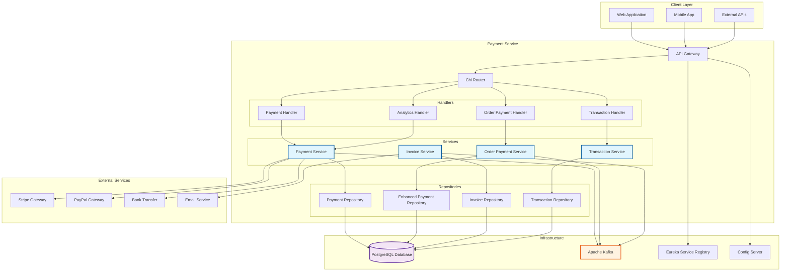
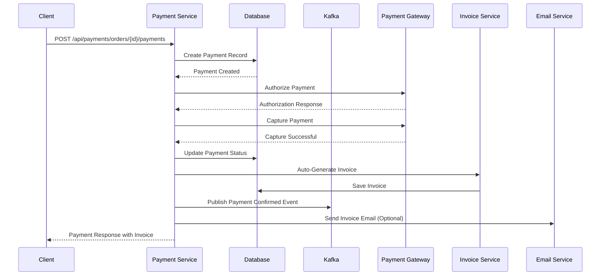
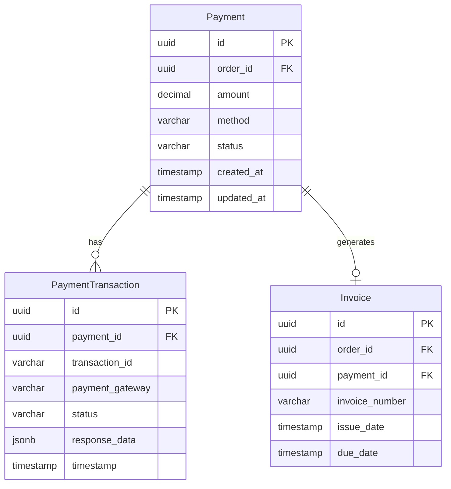
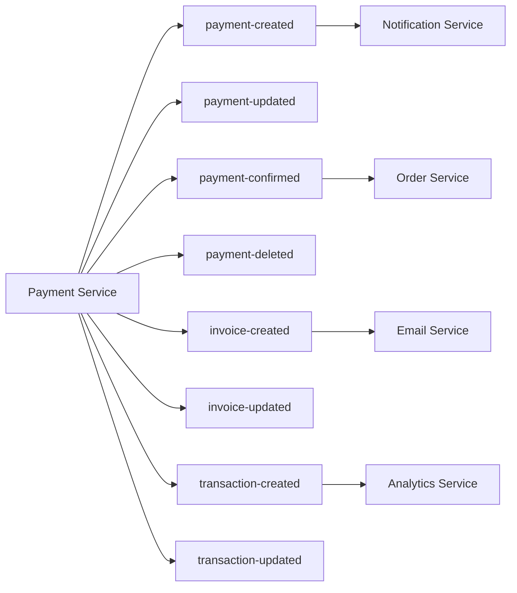

# 💳 Payment Service

<div align="center">
  
  
  
  
  
  
</div>

<div align="center">
  <h3>🚀 Advanced Payment Processing Microservice</h3>
  <p>A comprehensive payment processing service with auto-invoice generation, analytics, and event streaming</p>
</div>

---

## 📋 Table of Contents

- [Overview](#-overview)
- [Architecture](#-architecture)
- [Features](#-features)
- [Technology Stack](#-technology-stack)
- [Getting Started](#-getting-started)
- [API Documentation](#-api-documentation)
- [Configuration](#-configuration)
- [Database Schema](#-database-schema)
- [Event Streaming](#-event-streaming)
- [Examples](#-examples)
- [Monitoring](#-monitoring)
- [Contributing](#-contributing)

## 🔍 Overview

The Payment Service is a robust microservice designed to handle all payment-related operations in an e-commerce ecosystem. It provides comprehensive payment processing, automatic invoice generation, transaction management, and real-time analytics.

### Key Capabilities

- **Payment Processing**: Support for multiple payment methods (Credit Card, PayPal, Bank Transfer, Crypto, etc.)
- **Auto-Invoice Generation**: Automatic invoice creation with PDF generation
- **Advanced Analytics**: Real-time payment analytics and reporting
- **Event Streaming**: Kafka-based event publishing for microservice communication
- **Service Discovery**: Eureka integration for service registration
- **Advanced Filtering**: Comprehensive filtering and pagination for payments
- **Transaction Management**: Detailed transaction tracking and retry mechanisms

## 🏗️ Architecture



### Service Flow



## ✨ Features

### 💳 Payment Processing
- **Multi-Method Support**: Credit Card, Debit Card, PayPal, Bank Transfer, Cryptocurrency, Points, Gift Cards
- **Payment States**: Pending, Completed, Failed, Refunded, Partially Refunded
- **Authorization & Capture**: Two-step payment processing
- **Refund Management**: Full and partial refunds with credit notes

### 📋 Invoice Management
- **Auto-Generation**: Automatic invoice creation on payment completion
- **PDF Generation**: Professional invoice PDF with company branding
- **Email Integration**: Send invoices via email
- **Credit Notes**: Automatic credit note generation for refunds
- **Unique Numbering**: Smart invoice numbering system

### 📊 Analytics & Reporting
- **Real-time Analytics**: Payment success rates, revenue tracking
- **Gateway Performance**: Monitor payment gateway performance
- **Customer Analytics**: Top spenders, transaction patterns
- **Exportable Reports**: CSV export for payments and revenue data
- **Dashboard Metrics**: Comprehensive admin dashboard data

### 🔍 Advanced Filtering
- **Pagination**: Efficient pagination with configurable page sizes
- **Status Filtering**: Filter by payment status
- **Method Filtering**: Filter by payment method
- **Date Range**: Filter by date ranges
- **Amount Range**: Filter by amount ranges
- **Order Filtering**: Filter by specific orders

### 🎯 Event Streaming
- **Kafka Integration**: Real-time event publishing
- **Event Types**: Payment created, updated, status changed, deleted
- **Auto-Retry**: Failed message retry mechanism
- **Multiple Topics**: Separate topics for different event types

## 🛠️ Technology Stack

<div align="center">

| Category | Technology | Version | Purpose |
|----------|------------|---------|---------|
| **Language** |  | 1.24+ | Core development language |
| **Framework** |  | v5.2.1 | HTTP router and middleware |
| **Database** |  | Latest | Primary data storage |
| **ORM** |  | v1.25.12 | Database ORM |
| **Message Queue** |  | Latest | Event streaming |
| **Service Discovery** |  | Latest | Service registry |
| **Containerization** |  | Latest | Container deployment |
| **Configuration** |  | Latest | External configuration |

</div>

## 🚀 Getting Started

### Prerequisites

- **Go 1.24+**
- **PostgreSQL 12+**
- **Apache Kafka 2.8+**
- **Docker & Docker Compose**

### Installation

1. **Clone the repository**
```bash
git clone https://github.com/ZakariaRek/Ecommerce-App.git
cd Ecommerce-App/Payment-Service
```

2. **Set up environment variables**
```bash
cp .env.example .env
# Edit .env with your configuration
```

3. **Install dependencies**
```bash
go mod download
```

4. **Set up the database**
```bash
# Create PostgreSQL database
createdb payment_system

# Run migrations (automatic on startup)
go run main.go
```

5. **Run with Docker Compose**
```bash
docker-compose up -d
```

6. **Start the service**
```bash
go run main.go
```

The service will be available at `http://localhost:8089`

### Quick Test

```bash
# Health check
curl http://localhost:8089/health

# Test endpoint
curl http://localhost:8089/test

# View filtering examples
curl http://localhost:8089/examples
```

## 📚 API Documentation

### Base URL
```
http://localhost:8089/api/payments
```

### Payment Endpoints

#### Get All Payments (with Advanced Filtering)
```http
GET /api/payments?page=2&limit=20&status=COMPLETED&method=CREDIT_CARD&dateFrom=2024-06-01&dateTo=2024-06-30
```

**Query Parameters:**
- `page` (int): Page number (default: 1)
- `limit` (int): Items per page (default: 50, max: 100)
- `status`: PENDING, COMPLETED, FAILED, REFUNDED, PARTIALLY_REFUNDED
- `method`: CREDIT_CARD, DEBIT_CARD, PAYPAL, BANK_TRANSFER, CRYPTO, POINTS, GIFT_CARD
- `dateFrom/dateTo`: YYYY-MM-DD format
- `amountMin/amountMax`: Decimal numbers
- `orderID`: UUID format

**Response:**
```json
{
  "payments": [...],
  "pagination": {
    "page": 2,
    "limit": 20,
    "total": 150,
    "totalPages": 8
  },
  "filters": {...}
}
```

#### Process Order Payment
```http
POST /api/payments/orders/{orderID}/payments
```

**Request Body:**
```json
{
  "orderId": "uuid",
  "userId": "uuid", 
  "amount": 99.99,
  "paymentMethod": "CREDIT_CARD",
  "currency": "USD"
}
```

**Response:**
```json
{
  "paymentId": "uuid",
  "orderId": "uuid",
  "amount": 99.99,
  "status": "COMPLETED",
  "paymentMethod": "CREDIT_CARD",
  "invoiceNumber": "INV-20240601-12345678-87654321",
  "createdAt": "2024-06-01T10:30:00Z",
  "message": "Payment processed successfully"
}
```

### Invoice Endpoints

#### Get Order Invoices
```http
GET /api/payments/orders/{orderID}/invoices
```

#### Download Invoice PDF
```http
GET /api/payments/orders/{orderID}/invoices/{invoiceID}/pdf
```

#### Email Invoice
```http
POST /api/payments/orders/{orderID}/invoices/{invoiceID}/email
```

```json
{
  "email": "customer@example.com"
}
```

### Analytics Endpoints

#### Dashboard Metrics
```http
GET /api/payments/analytics/dashboard
```

#### Revenue Analytics
```http
GET /api/payments/analytics/revenue?period=month&groupBy=day
```

#### Export Data
```http
GET /api/payments/analytics/export/payments?format=csv&dateFrom=2024-01-01&dateTo=2024-12-31
```

### Transaction Endpoints

#### Get Transaction Analytics
```http
GET /api/payments/transactions/analytics
```

#### Retry Failed Transaction
```http
POST /api/payments/transactions/{id}/retry
```

## ⚙️ Configuration

### Environment Variables

```bash
# Server Configuration
SERVER_PORT=8089
ENVIRONMENT=development

# Database Configuration
DB_HOST=localhost
DB_PORT=5432
DB_USER=postgres
DB_PASSWORD=your_password
DB_NAME=payment_system

# Eureka Configuration
EUREKA_URL=http://localhost:8761/eureka
EUREKA_PREFER_IP_ADDRESS=true
APP_NAME=PAYMENT-SERVICE

# Kafka Configuration
KAFKA_BROKERS=localhost:9092
KAFKA_CONSUMER_GROUP=payment-service-group
KAFKA_PAYMENT_CREATED_TOPIC=payment-created
KAFKA_PAYMENT_UPDATED_TOPIC=payment-updated
KAFKA_PAYMENT_STATUS_CHANGED_TOPIC=payment-confirmed
KAFKA_PAYMENT_DELETED_TOPIC=payment-deleted

# Config Server (Optional)
CONFIG_SERVER_URL=http://localhost:8888
CONFIG_PROFILE=development
CONFIG_LABEL=main
```

### Docker Configuration

```dockerfile
FROM golang:1.24-alpine AS builder
WORKDIR /app
COPY go.mod go.sum ./
RUN go mod download
COPY . .
RUN CGO_ENABLED=0 GOOS=linux go build -a -o payment-service main.go

FROM alpine:latest
RUN apk --no-cache add ca-certificates
WORKDIR /root/
COPY --from=builder /app/payment-service .
COPY .env .
EXPOSE 8089
CMD ["./payment-service"]
```

## 🗄️ Database Schema



### Payment Methods
- `CREDIT_CARD`
- `DEBIT_CARD`
- `PAYPAL`
- `BANK_TRANSFER`
- `CRYPTO`
- `POINTS`
- `GIFT_CARD`

### Payment Statuses
- `PENDING`: Payment initiated but not processed
- `COMPLETED`: Payment successfully processed
- `FAILED`: Payment processing failed
- `REFUNDED`: Payment fully refunded
- `PARTIALLY_REFUNDED`: Payment partially refunded

## 📡 Event Streaming

### Kafka Topics



### Event Schemas

#### Payment Confirmed Event
```json
{
  "orderId": "uuid",
  "paymentId": "uuid", 
  "amount": 99.99,
  "userId": "uuid",
  "paymentMethod": "CREDIT_CARD",
  "status": "COMPLETED",
  "success": true,
  "message": "Payment processed successfully",
  "processedAt": "2024-06-01T10:30:00Z",
  "oldStatus": "PENDING"
}
```

## 💡 Examples

### Advanced Filtering Examples

```bash
# Basic pagination
curl "http://localhost:8089/api/payments?page=1&limit=10"

# Filter by status
curl "http://localhost:8089/api/payments?status=COMPLETED"

# Filter by payment method
curl "http://localhost:8089/api/payments?method=CREDIT_CARD"

# Date range filtering
curl "http://localhost:8089/api/payments?dateFrom=2024-06-01&dateTo=2024-06-30"

# Amount range filtering  
curl "http://localhost:8089/api/payments?amountMin=100&amountMax=1000"

# Combined filters
curl "http://localhost:8089/api/payments?page=2&limit=20&status=COMPLETED&method=CREDIT_CARD&dateFrom=2024-06-01&dateTo=2024-06-30"
```

### Payment Processing Example

```bash
# Process a payment for an order
curl -X POST http://localhost:8089/api/payments/orders/550e8400-e29b-41d4-a716-446655440000/payments \
  -H "Content-Type: application/json" \
  -d '{
    "orderId": "550e8400-e29b-41d4-a716-446655440000",
    "userId": "550e8400-e29b-41d4-a716-446655440001", 
    "amount": 299.99,
    "paymentMethod": "CREDIT_CARD",
    "currency": "USD"
  }'
```

### Invoice Management Example

```bash
# Get invoices for an order
curl http://localhost:8089/api/payments/orders/550e8400-e29b-41d4-a716-446655440000/invoices

# Download invoice PDF
curl -O http://localhost:8089/api/payments/orders/550e8400-e29b-41d4-a716-446655440000/invoices/550e8400-e29b-41d4-a716-446655440002/pdf

# Email an invoice
curl -X POST http://localhost:8089/api/payments/orders/550e8400-e29b-41d4-a716-446655440000/invoices/550e8400-e29b-41d4-a716-446655440002/email \
  -H "Content-Type: application/json" \
  -d '{"email": "customer@example.com"}'
```

## 📊 Monitoring

### Health Checks

The service provides comprehensive health check endpoints:

```bash
# Basic health check
curl http://localhost:8089/health

# Detailed service info
curl http://localhost:8089/test

# API examples and documentation
curl http://localhost:8089/examples
```

### Logging

The service uses structured logging with different log levels:

- **Payment Processing**: `💳 PAYMENT SERVICE:`
- **Invoice Generation**: `📋 INVOICE:`
- **Kafka Events**: `💳 PAYMENT SERVICE: Kafka`
- **Database Operations**: `🗄️ DATABASE:`

### Metrics and Analytics

Built-in analytics endpoints provide:
- Payment success rates
- Revenue tracking
- Gateway performance metrics
- Customer analytics
- Transaction patterns

## 🤝 Contributing

1. Fork the repository
2. Create a feature branch (`git checkout -b feature/amazing-feature`)
3. Commit your changes (`git commit -m 'Add amazing feature'`)
4. Push to the branch (`git push origin feature/amazing-feature`)
5. Open a Pull Request

### Development Guidelines

- Follow Go best practices and conventions
- Write tests for new features
- Update documentation for API changes
- Use meaningful commit messages
- Ensure all tests pass before submitting PR

## 📄 License

This project is licensed under the MIT License - see the [LICENSE](LICENSE) file for details.

## 📞 Support

For support and questions:

- 📧 Email: support@ecommerce-solutions.com
- 🐛 Issues: [GitHub Issues](https://github.com/ZakariaRek/Ecommerce-App/issues)
- 📖 Documentation: [API Docs](https://docs.ecommerce-solutions.com)

---

<div align="center">
  <p>Made with ❤️ by the E-Commerce Solutions Team</p>
  <p>
    
    
    
  </p>
</div>