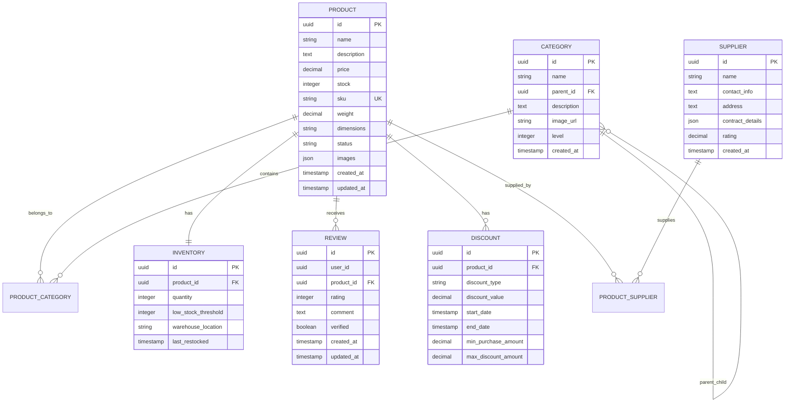

# 🛍️ NexusCommerce Product Service

<div align="center">


**A robust, scalable microservice for comprehensive product management in e-commerce systems**

[Features](#-features) • [Architecture](#-architecture) • [Quick Start](#-quick-start) • [CI/CD Pipeline](#-cicd-pipeline) • [API Documentation](#-api-documentation) • [Testing](#-testing)

</div>

## 📋 Overview

The **Product Service** is a core component of the NexusCommerce platform, providing comprehensive product catalog management capabilities. Built with modern microservice architecture patterns, it handles product lifecycle management, inventory tracking, category hierarchies, supplier relationships, and customer reviews.

### 🎯 Key Capabilities

- **Product Management**: Complete CRUD operations with rich metadata support
- **Hierarchical Categories**: Multi-level category structure with path resolution
- **Inventory Control**: Real-time stock tracking with low-stock alerts
- **Supplier Management**: Vendor relationships and contract handling
- **Review System**: Customer feedback and rating aggregation
- **Discount Engine**: Flexible pricing and promotion management
- **File Storage**: Image upload and management for products
- **Event-Driven**: Kafka-based messaging for system integration

## 🏗️ Architecture

### System Architecture


### Entity Relationship Diagram



### Event Flow Architecture


## 🚀 Features

### 📦 Product Management
- ✅ Complete product lifecycle management
- ✅ Rich metadata support (dimensions, weight, SKU)
- ✅ Multiple image upload and management
- ✅ Product status tracking
- ✅ Batch operations support

### 🗂️ Category Management
- ✅ Hierarchical category structure
- ✅ Dynamic level calculation
- ✅ Category path resolution
- ✅ Product-category associations
- ✅ Category tree visualization

### 📊 Inventory Control
- ✅ Real-time stock tracking
- ✅ Multi-warehouse support
- ✅ Low stock alerts
- ✅ Stock reservation system
- ✅ Restock notifications

### 🤝 Supplier Management
- ✅ Vendor information management
- ✅ Contract details storage (JSON)
- ✅ Supplier rating system
- ✅ Product-supplier relationships

### ⭐ Review System
- ✅ Customer review management
- ✅ Rating aggregation
- ✅ Review verification
- ✅ Bulk operations
- ✅ Statistical analysis

### 💰 Discount Engine
- ✅ Multiple discount types (percentage, fixed, BOGO)
- ✅ Time-based promotions
- ✅ Minimum purchase requirements
- ✅ Maximum discount caps
- ✅ Pricing calculation engine

## 🛠️ Technology Stack

| Component | Technology | Version |
|-----------|------------|---------|
| **Runtime** |  | 17+ |
| **Framework** |  | 3.x |
| **Database** |  | 14+ |
| **Messaging** |  | 3.x |
| **Caching** |  | 6+ |
| **Documentation** |  | 3.x |
| **Testing** |  | 5.x |
| **Build Tool** |  | 3.8+ |
| **Containerization** |  | 20+ |

## 🚀 Quick Start

### Prerequisites

Ensure you have the following installed:

- **Java 17+** ☕
- **Maven 3.8+** 📦
- **PostgreSQL 14+** 🐘
- **Apache Kafka 3.x** 📨
- **Redis 6+** 🔴
- **Docker** (optional) 🐳

### 1. Clone the Repository

```bash
git clone https://github.com/your-org/nexuscommerce-product-service.git
cd nexuscommerce-product-service
```

### 2. Configure Database

```sql
-- Create database
CREATE DATABASE "Product-service";

-- Create user (optional)
CREATE USER product_user WITH PASSWORD 'your_password';
GRANT ALL PRIVILEGES ON DATABASE "Product-service" TO product_user;
```

### 3. Environment Configuration

Create `application-local.yml`:

```yaml
spring:
  datasource:
    url: jdbc:postgresql://localhost:5432/Product-service
    username: postgres
    password: your_password
  kafka:
    bootstrap-servers: localhost:9092
  data:
    redis:
      host: localhost
      port: 6379

file:
  upload-dir: ./uploads/images
  max-size: 10485760  # 10MB

server:
  port: 8082
  servlet:
    context-path: /api/products
```

### 4. Start Dependencies

Using Docker Compose:

```bash
# Start PostgreSQL, Kafka, and Redis
docker-compose up -d postgres kafka redis
```

Or start them individually:

```bash
# PostgreSQL
docker run --name postgres -e POSTGRES_DB=Product-service -e POSTGRES_PASSWORD=your_password -p 5432:5432 -d postgres:14

# Kafka (with Zookeeper)
docker run --name zookeeper -p 2181:2181 -d confluentinc/cp-zookeeper:latest
docker run --name kafka -p 9092:9092 -e KAFKA_ZOOKEEPER_CONNECT=localhost:2181 -e KAFKA_ADVERTISED_LISTENERS=PLAINTEXT://localhost:9092 -d confluentinc/cp-kafka:latest

# Redis
docker run --name redis -p 6379:6379 -d redis:alpine
```

### 5. Build and Run

```bash
# Build the application
mvn clean compile

# Run the application
mvn spring-boot:run

# Or run with specific profile
mvn spring-boot:run -Dspring-boot.run.arguments=--spring.profiles.active=local
```

### 6. Verify Installation

```bash
# Health check
curl http://localhost:8082/api/products/actuator/health

# API documentation
open http://localhost:8082/api/products/swagger-ui.html
```

## 🔄 CI/CD Pipeline

<div align="center">


**Automated CI/CD pipeline ensuring code quality, security, and reliable deployments**

</div>

The Product Service utilizes a comprehensive Jenkins-based CI/CD pipeline that automates the entire software delivery process from code commit to production deployment. Our pipeline emphasizes code quality, security scanning, and automated testing to ensure reliable and secure deployments.

### 🏗️ Pipeline Architecture

```mermaid
graph LR
    subgraph "Source Control"
        GIT[GitHub Repository]
    end
    
    subgraph "CI/CD Pipeline"
        CHECKOUT[📥 Checkout]
        BUILD[🏗️ Build]
        TEST[🧪 Test]
        SONAR[📊 SonarQube]
        QUALITY[✅ Quality Gate]
        PACKAGE[📦 Package]
        DOCKER_BUILD[🐳 Docker Build]
        SECURITY[🔒 Security Scan]
        DEPLOY[🚀 Deploy]
        PUSH[📤 Push to Registry]
    end
    
    subgraph "External Services"
        SONARQUBE[SonarQube Server]
        DOCKERHUB[Docker Hub]
        TRIVY[Trivy Scanner]
    end
    
    GIT --> CHECKOUT
    CHECKOUT --> BUILD
    BUILD --> TEST
    TEST --> SONAR
    SONAR --> SONARQUBE
    SONAR --> QUALITY
    QUALITY --> PACKAGE
    PACKAGE --> DOCKER_BUILD
    DOCKER_BUILD --> SECURITY
    SECURITY --> TRIVY
    SECURITY --> DEPLOY
    DEPLOY --> PUSH
    PUSH --> DOCKERHUB
    
    classDef sourceStyle fill:#e8f5e8
    classDef pipelineStyle fill:#e1f5fe
    classDef externalStyle fill:#fff3e0
    
    class GIT sourceStyle
    class CHECKOUT,BUILD,TEST,SONAR,QUALITY,PACKAGE,DOCKER_BUILD,SECURITY,DEPLOY,PUSH pipelineStyle
    class SONARQUBE,DOCKERHUB,TRIVY externalStyle
```



### 🔧 Pipeline Stages

Our Jenkins pipeline consists of multiple stages that ensure code quality, security, and reliable deployments:

#### 1. **📥 Checkout Stage**
- **Purpose**: Retrieves source code from GitHub repository
- **Features**:
  - Sparse checkout for Product-Service directory only
  - Git credentials management
  - Branch-specific checkout (main branch)

```groovy
checkout([$class: 'GitSCM',
    branches: [[name: '*/main']],
    userRemoteConfigs: [[
        url: 'https://github.com/ZakariaRek/Ecommerce-App',
        credentialsId: env.GIT_CREDENTIALS_ID
    ]],
    extensions: [
        [$class: 'SparseCheckoutPaths', sparseCheckoutPaths: [[path: 'Product-Service/']]]
    ]
])
```

#### 2. **🏗️ Build Application**
- **Purpose**: Compiles the Java application using Maven
- **Tools**: Maven 3.9.7, JDK 21
- **Command**: `mvn clean compile`

#### 3. **🧪 Run Tests**
- **Purpose**: Executes unit and integration tests
- **Features**:
  - JUnit test execution with Spring Test profile
  - JaCoCo code coverage report generation
  - Test failure tolerance (continues pipeline for analysis)
  - Automatic test result archiving

```bash
mvn test -Dmaven.test.failure.ignore=true -Dspring.profiles.active=test
```

**Test Reporting**:
- JUnit test results archived as XML reports
- JaCoCo coverage reports generated and archived
- Test failure status tracked for final pipeline summary

#### 4. **📊 SonarQube Analysis**
- **Purpose**: Static code analysis for code quality and technical debt
- **Features**:
  - Integration with local SonarQube server (http://localhost:9000)
  - Fallback mechanism for direct token authentication
  - Project versioning with build numbers
  - Comprehensive code quality metrics

```bash
mvn sonar:sonar \
  -Dsonar.projectKey=ecommerce-product-service \
  -Dsonar.projectName="E-commerce Product Service" \
  -Dsonar.host.url=http://localhost:9000 \
  -Dsonar.token=your_sonar_token
```

**Analysis Metrics**:
- Code coverage percentage
- Technical debt assessment
- Code duplication detection
- Security hotspots identification
- Maintainability rating

#### 5. **✅ Quality Gate**
- **Purpose**: Enforces code quality standards before deployment
- **Features**:
  - Automated quality gate evaluation
  - 1-minute timeout for quick feedback
  - Pipeline status adjustment based on results
  - Manual dashboard review option on failure

#### 6. **📦 Package Application**
- **Purpose**: Creates deployable JAR artifact
- **Command**: `mvn package -DskipTests`
- **Output**: Executable Spring Boot JAR file

#### 7. **🐳 Build Docker Images**
- **Purpose**: Containerizes the application for deployment
- **Features**:
  - Multi-stage Docker build process
  - Docker Compose integration for orchestration
  - Image tagging with latest and build-specific tags
  - Dockerfile validation

```bash
docker build -t product-service:latest -f Dockerfile .
docker-compose -f compose.yaml build
```

#### 8. **🔒 Security Scan with Trivy**
- **Purpose**: Comprehensive security vulnerability scanning
- **Features**:
  - Container image vulnerability scanning
  - OS package vulnerability detection
  - Dependency vulnerability analysis
  - HIGH and CRITICAL severity filtering

```bash
# Scan for vulnerabilities
trivy image --cache-dir "${TRIVY_CACHE_DIR}" \
  --format table --output trivy-report.txt product-service:latest

# Generate JSON report for detailed analysis
trivy image --cache-dir "${TRIVY_CACHE_DIR}" \
  --format json --output trivy-report.json product-service:latest
```

**Security Features**:
- Automatic Trivy installation for Windows
- Vulnerability database updates
- Severity-based pipeline control
- Detailed HTML and JSON reports
- Report archiving for compliance

#### 9. **🚀 Run Containers**
- **Purpose**: Deploys and validates containerized application
- **Features**:
  - Docker Compose orchestration
  - Health check validation
  - Container status verification
  - Service readiness confirmation

#### 10. **📤 Push to Docker Hub**
- **Purpose**: Publishes container images to registry
- **Features**:
  - Automated Docker Hub authentication
  - Multi-tag strategy (latest + build number)
  - Secure credential management
  - Push verification

```bash
# Tag and push images
docker tag product-service:latest ${DOCKERHUB_REPO}:${IMAGE_TAG}
docker push ${DOCKERHUB_REPO}:${IMAGE_TAG}
docker tag product-service:latest ${DOCKERHUB_REPO}:build-${BUILD_NUMBER}
docker push ${DOCKERHUB_REPO}:build-${BUILD_NUMBER}
```

### 📊 Pipeline Monitoring & Reporting

#### **Build Status Indicators**
- ✅ **Success**: All stages completed successfully
- ⚠️ **Unstable**: Quality gate issues or test failures detected
- ❌ **Failed**: Critical pipeline stage failure

#### **Automated Reports**
- **Test Coverage Reports**: JaCoCo coverage analysis
- **Security Scan Reports**: Trivy vulnerability assessment
- **Code Quality Reports**: SonarQube analysis dashboard
- **Build Artifacts**: JAR files and Docker images

#### **Pipeline Summary**
```
📋 ===== PIPELINE SUMMARY =====
🏗️ Build Number: ${BUILD_NUMBER}
📊 Tests Status: ${TESTS_FAILED == 'true' ? '⚠️ Some Failed' : '✅ Passed'}
🔍 SonarQube: Analysis completed
🔒 Security: Trivy scan completed
🐳 Docker: Images built and pushed
================================
```

### 🔧 Jenkins Configuration

#### **Prerequisites**
- Jenkins server with necessary plugins
- Docker and Docker Compose installed
- Maven 3.9.7 configured
- JDK 21 configured
- SonarQube server running
- Docker Hub credentials configured

#### **Required Jenkins Plugins**
- Pipeline Plugin
- Git Plugin
- SonarQube Scanner Plugin
- Docker Pipeline Plugin
- JUnit Plugin
- JaCoCo Plugin

#### **Environment Variables**
```groovy
environment {
    COMPOSE_FILE = 'compose.yaml'
    DOCKERHUB_CREDENTIALS = 'yahya.zakaria-dockerhub'
    DOCKERHUB_REPO = 'yahyazakaria123/ecommerce-app-product-service'
    IMAGE_TAG = 'latest'
    GIT_CREDENTIALS_ID = 'git-https-token'
    TRIVY_CACHE_DIR = 'C:\\temp\\trivy-cache'
}
```

#### **Credential Management**
- **Git Access**: GitHub personal access token
- **Docker Hub**: Username/password credentials
- **SonarQube**: Authentication token

### 🛡️ Security & Quality Assurance

#### **Code Quality Gates**
- **Coverage Threshold**: Minimum code coverage requirements
- **Duplication Limit**: Maximum allowed code duplication
- **Maintainability Rating**: Code maintainability standards
- **Security Rating**: Security vulnerability thresholds

#### **Security Scanning**
- **Container Scanning**: Base image vulnerability detection
- **Dependency Scanning**: Third-party library security analysis
- **SAST Integration**: Static application security testing
- **Compliance Reporting**: Security compliance documentation

#### **Best Practices Implemented**
- ✅ Automated testing at every commit
- ✅ Code quality enforcement through quality gates
- ✅ Security scanning before deployment
- ✅ Container image optimization
- ✅ Artifact versioning and traceability
- ✅ Automated rollback capabilities
- ✅ Environment-specific configurations

### 🔗 Integration Points

#### **External Tool Integration**
- **GitHub**: Source code management and webhooks
- **SonarQube**: Code quality and security analysis
- **Docker Hub**: Container registry and image storage
- **Trivy**: Security vulnerability scanning
- **JaCoCo**: Code coverage analysis

#### **Notification & Alerting**
- Build status notifications
- Quality gate failure alerts
- Security vulnerability notifications
- Deployment success confirmations

### 📈 Metrics & KPIs

#### **Pipeline Metrics**
- **Build Success Rate**: Percentage of successful builds
- **Build Duration**: Average pipeline execution time
- **Test Coverage**: Code coverage percentage trends
- **Security Score**: Vulnerability trend analysis
- **Quality Gate Pass Rate**: Code quality compliance

#### **Deployment Metrics**
- **Deployment Frequency**: How often deployments occur
- **Lead Time**: Time from commit to production
- **Mean Time to Recovery**: Recovery time from failures
- **Change Failure Rate**: Percentage of failed deployments

This comprehensive CI/CD pipeline ensures that every code change goes through rigorous testing, quality analysis, and security scanning before reaching production, maintaining the highest standards of software delivery.

## 📚 API Documentation

### Core Endpoints

| Method | Endpoint | Description |
|--------|----------|-------------|
| `GET` | `/products` | Get all products |
| `GET` | `/products/{id}` | Get product by ID |
| `POST` | `/products` | Create new product |
| `PUT` | `/products/{id}` | Update product |
| `DELETE` | `/products/{id}` | Delete product |
| `PATCH` | `/products/{id}/status` | Update product status |

### Category Management

| Method | Endpoint | Description |
|--------|----------|-------------|
| `GET` | `/categories` | Get all categories |
| `GET` | `/categories/tree` | Get category hierarchy |
| `POST` | `/categories` | Create category |
| `GET` | `/categories/{id}/path` | Get category path |

### Inventory Operations

| Method | Endpoint | Description |
|--------|----------|-------------|
| `GET` | `/inventory` | Get all inventory |
| `POST` | `/inventory` | Create inventory |
| `PUT` | `/inventory/{productId}` | Update inventory |
| `POST` | `/inventory/{productId}/restock` | Restock product |
| `GET` | `/inventory/low-stock` | Get low stock items |

### File Management

| Method | Endpoint | Description |
|--------|----------|-------------|
| `POST` | `/images/upload` | Upload single image |
| `POST` | `/images/upload/multiple` | Upload multiple images |
| `GET` | `/images/{filename}` | Get image |
| `DELETE` | `/images/{filename}` | Delete image |

### Batch Operations

| Method | Endpoint | Description |
|--------|----------|-------------|
| `POST` | `/batch/product-info` | Get batch product information |

### Interactive API Documentation

Visit the Swagger UI for interactive API exploration:
```
http://localhost:8082/api/products/swagger-ui.html
```

## 🧪 Testing

The service includes comprehensive test coverage across multiple layers:

### Test Structure

```
src/test/java/
├── Controllers/          # Integration tests for REST endpoints
├── Services/            # Unit tests for business logic
├── Repositories/        # Data access layer tests
├── config/             # Test configuration
└── utils/              # Test utilities
```

### Running Tests

```bash
# Run all tests
mvn test

# Run specific test class
mvn test -Dtest=ProductServiceTest

# Run integration tests
mvn test -Dtest=ProductServiceIntegrationTest

# Generate test coverage report
mvn jacoco:report
```

### Test Categories

- **Unit Tests**: Fast, isolated tests for individual components
- **Integration Tests**: End-to-end testing with real database
- **Controller Tests**: API endpoint testing with MockMvc
- **Repository Tests**: Data access layer validation

### Test Coverage

Current test coverage targets:
- **Line Coverage**: > 80%
- **Branch Coverage**: > 75%
- **Method Coverage**: > 85%

## 🔧 Configuration

### Application Properties

Key configuration properties:

```yaml
# Database Configuration
spring.datasource.url: jdbc:postgresql://localhost:5432/Product-service
spring.datasource.username: postgres
spring.datasource.password: your_password

# Kafka Configuration
spring.kafka.bootstrap-servers: localhost:9092
spring.kafka.producer.acks: all
spring.kafka.producer.retries: 3

# File Storage Configuration
file.upload-dir: ./uploads/images
file.max-size: 10485760  # 10MB
file.allowed-extensions: jpg,jpeg,png,gif,bmp,webp

# Server Configuration
server.port: 8082
server.servlet.context-path: /api/products

# Eureka Configuration
eureka.client.service-url.defaultZone: http://localhost:8761/eureka/
```

### Environment Profiles

- **`dev`**: Development environment
- **`test`**: Test environment with H2 database
- **`prod`**: Production environment
- **`kafka`**: Enables Kafka logging and ELK integration

## 🎯 Event Architecture

### Published Events

The service publishes the following events to Kafka:

#### Product Events
- `product-created`: When a new product is created
- `product-updated`: When product information is modified
- `product-deleted`: When a product is removed
- `product-stock-changed`: When inventory levels change
- `product-price-changed`: When product pricing is updated
- `product-status-changed`: When product status changes

#### Category Events
- `category-created`: New category creation
- `category-updated`: Category information updates
- `category-deleted`: Category removal
- `category-hierarchy-changed`: Parent-child relationship changes

#### Inventory Events
- `inventory-created`: New inventory record
- `inventory-updated`: Inventory modifications
- `inventory-stock-changed`: Stock level changes
- `inventory-low-stock`: Low stock alerts
- `inventory-restocked`: Restocking notifications

#### Supplier Events
- `supplier-created`: New supplier registration
- `supplier-updated`: Supplier information updates
- `supplier-deleted`: Supplier removal

#### Review Events
- `review-created`: New customer review
- `review-updated`: Review modifications
- `review-verified`: Review verification status changes

### Event Payload Example

```json
{
  "productId": "123e4567-e89b-12d3-a456-426614174000",
  "name": "Premium Headphones",
  "price": 199.99,
  "previousPrice": 249.99,
  "status": "ACTIVE",
  "categoryIds": ["cat-123", "cat-456"],
  "timestamp": "2024-01-15T10:30:00Z",
  "eventType": "PRODUCT_PRICE_CHANGED"
}
```

## 🔐 Security & Monitoring

### Security Features

- **Input Validation**: Comprehensive validation using Bean Validation
- **File Upload Security**: MIME type and extension validation
- **SQL Injection Prevention**: Parameterized queries with JPA
- **Authentication Ready**: Integration points for OAuth2/JWT

### Monitoring & Observability

- **Health Checks**: Spring Boot Actuator endpoints
- **Metrics**: Micrometer integration for application metrics
- **Logging**: Structured logging with ELK stack integration
- **Distributed Tracing**: Sleuth integration ready

### Health Endpoints

```bash
# Application health
GET /api/products/actuator/health

# Application info
GET /api/products/actuator/info

# Metrics
GET /api/products/actuator/metrics
```

## 🚀 Deployment

### Docker Deployment

```dockerfile
FROM openjdk:17-jre-slim

WORKDIR /app
COPY target/product-service-*.jar app.jar

EXPOSE 8082

ENTRYPOINT ["java", "-jar", "app.jar"]
```

Build and run:

```bash
# Build image
docker build -t product-service:latest .

# Run container
docker run -p 8082:8082 -e SPRING_PROFILES_ACTIVE=prod product-service:latest
```

### Kubernetes Deployment

```yaml
apiVersion: apps/v1
kind: Deployment
metadata:
  name: product-service
spec:
  replicas: 3
  selector:
    matchLabels:
      app: product-service
  template:
    metadata:
      labels:
        app: product-service
    spec:
      containers:
      - name: product-service
        image: product-service:latest
        ports:
        - containerPort: 8082
        env:
        - name: SPRING_PROFILES_ACTIVE
          value: "prod"
        - name: DATABASE_URL
          valueFrom:
            secretKeyRef:
              name: db-secret
              key: url
```

## 🤝 Contributing

We welcome contributions! Please follow these guidelines:

### Development Workflow

1. **Fork** the repository
2. **Create** a feature branch (`git checkout -b feature/amazing-feature`)
3. **Commit** your changes (`git commit -m 'Add amazing feature'`)
4. **Push** to the branch (`git push origin feature/amazing-feature`)
5. **Open** a Pull Request

### Code Standards

- Follow **Java Code Conventions**
- Maintain **test coverage > 80%**
- Update **documentation** for new features
- Use **conventional commits** format
- Ensure **all tests pass**

### Pull Request Checklist

- [ ] Tests added/updated and passing
- [ ] Documentation updated
- [ ] Code follows project conventions
- [ ] No breaking changes (or properly documented)
- [ ] Commits are squashed and well-formatted

## 📄 License

This project is licensed under the **MIT License** - see the [LICENSE](LICENSE) file for details.

## 🆘 Support

### Getting Help

- 📧 **Email**: support@nexuscommerce.com
- 🐛 **Issues**: [GitHub Issues](https://github.com/your-org/nexuscommerce-product-service/issues)
- 💬 **Discussions**: [GitHub Discussions](https://github.com/your-org/nexuscommerce-product-service/discussions)
- 📖 **Wiki**: [Project Wiki](https://github.com/your-org/nexuscommerce-product-service/wiki)

### Reporting Issues

When reporting issues, please include:

1. **Environment details** (Java version, OS, etc.)
2. **Steps to reproduce** the issue
3. **Expected vs actual behavior**
4. **Logs and stack traces**
5. **Configuration details**

---

<div align="center">

**Made with ❤️ by the NexusCommerce Team**

⭐ **Star this repo if you find it helpful!** ⭐

</div>
