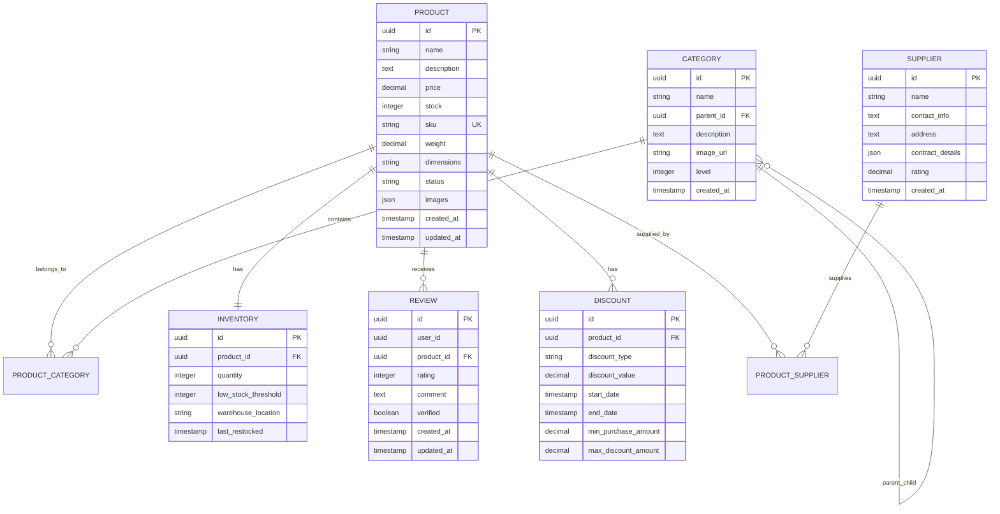

# 🛍️ NexusCommerce Product Service

<div align="center">


**A robust, scalable microservice for comprehensive product management in e-commerce systems**

[Features](#-features) • [Architecture](#-architecture) • [Quick Start](#-quick-start) • [API Documentation](#-api-documentation) • [Testing](#-testing)

</div>

## 📋 Overview

The **Product Service** is a core component of the NexusCommerce platform, providing comprehensive product catalog management capabilities. Built with modern microservice architecture patterns, it handles product lifecycle management, inventory tracking, category hierarchies, supplier relationships, and customer reviews.

### 🎯 Key Capabilities

- **Product Management**: Complete CRUD operations with rich metadata support
- **Hierarchical Categories**: Multi-level category structure with path resolution
- **Inventory Control**: Real-time stock tracking with low-stock alerts
- **Supplier Management**: Vendor relationships and contract handling
- **Review System**: Customer feedback and rating aggregation
- **Discount Engine**: Flexible pricing and promotion management
- **File Storage**: Image upload and management for products
- **Event-Driven**: Kafka-based messaging for system integration

## 🏗️ Architecture

### System Architecture


### Entity Relationship Diagram



### Event Flow Architecture


## 🚀 Features

### 📦 Product Management
- ✅ Complete product lifecycle management
- ✅ Rich metadata support (dimensions, weight, SKU)
- ✅ Multiple image upload and management
- ✅ Product status tracking
- ✅ Batch operations support

### 🗂️ Category Management
- ✅ Hierarchical category structure
- ✅ Dynamic level calculation
- ✅ Category path resolution
- ✅ Product-category associations
- ✅ Category tree visualization

### 📊 Inventory Control
- ✅ Real-time stock tracking
- ✅ Multi-warehouse support
- ✅ Low stock alerts
- ✅ Stock reservation system
- ✅ Restock notifications

### 🤝 Supplier Management
- ✅ Vendor information management
- ✅ Contract details storage (JSON)
- ✅ Supplier rating system
- ✅ Product-supplier relationships

### ⭐ Review System
- ✅ Customer review management
- ✅ Rating aggregation
- ✅ Review verification
- ✅ Bulk operations
- ✅ Statistical analysis

### 💰 Discount Engine
- ✅ Multiple discount types (percentage, fixed, BOGO)
- ✅ Time-based promotions
- ✅ Minimum purchase requirements
- ✅ Maximum discount caps
- ✅ Pricing calculation engine

## 🛠️ Technology Stack

| Component | Technology | Version |
|-----------|------------|---------|
| **Runtime** |  | 17+ |
| **Framework** |  | 3.x |
| **Database** |  | 14+ |
| **Messaging** |  | 3.x |
| **Caching** |  | 6+ |
| **Documentation** |  | 3.x |
| **Testing** |  | 5.x |
| **Build Tool** |  | 3.8+ |
| **Containerization** |  | 20+ |

## 🚀 Quick Start

### Prerequisites

Ensure you have the following installed:

- **Java 17+** ☕
- **Maven 3.8+** 📦
- **PostgreSQL 14+** 🐘
- **Apache Kafka 3.x** 📨
- **Redis 6+** 🔴
- **Docker** (optional) 🐳

### 1. Clone the Repository

```bash
git clone https://github.com/your-org/nexuscommerce-product-service.git
cd nexuscommerce-product-service
```

### 2. Configure Database

```sql
-- Create database
CREATE DATABASE "Product-service";

-- Create user (optional)
CREATE USER product_user WITH PASSWORD 'your_password';
GRANT ALL PRIVILEGES ON DATABASE "Product-service" TO product_user;
```

### 3. Environment Configuration

Create `application-local.yml`:

```yaml
spring:
  datasource:
    url: jdbc:postgresql://localhost:5432/Product-service
    username: postgres
    password: your_password
  kafka:
    bootstrap-servers: localhost:9092
  data:
    redis:
      host: localhost
      port: 6379

file:
  upload-dir: ./uploads/images
  max-size: 10485760  # 10MB

server:
  port: 8082
  servlet:
    context-path: /api/products
```

### 4. Start Dependencies

Using Docker Compose:

```bash
# Start PostgreSQL, Kafka, and Redis
docker-compose up -d postgres kafka redis
```

Or start them individually:

```bash
# PostgreSQL
docker run --name postgres -e POSTGRES_DB=Product-service -e POSTGRES_PASSWORD=your_password -p 5432:5432 -d postgres:14

# Kafka (with Zookeeper)
docker run --name zookeeper -p 2181:2181 -d confluentinc/cp-zookeeper:latest
docker run --name kafka -p 9092:9092 -e KAFKA_ZOOKEEPER_CONNECT=localhost:2181 -e KAFKA_ADVERTISED_LISTENERS=PLAINTEXT://localhost:9092 -d confluentinc/cp-kafka:latest

# Redis
docker run --name redis -p 6379:6379 -d redis:alpine
```

### 5. Build and Run

```bash
# Build the application
mvn clean compile

# Run the application
mvn spring-boot:run

# Or run with specific profile
mvn spring-boot:run -Dspring-boot.run.arguments=--spring.profiles.active=local
```

### 6. Verify Installation

```bash
# Health check
curl http://localhost:8082/api/products/actuator/health

# API documentation
open http://localhost:8082/api/products/swagger-ui.html
```

## 📚 API Documentation

### Core Endpoints

| Method | Endpoint | Description |
|--------|----------|-------------|
| `GET` | `/products` | Get all products |
| `GET` | `/products/{id}` | Get product by ID |
| `POST` | `/products` | Create new product |
| `PUT` | `/products/{id}` | Update product |
| `DELETE` | `/products/{id}` | Delete product |
| `PATCH` | `/products/{id}/status` | Update product status |

### Category Management

| Method | Endpoint | Description |
|--------|----------|-------------|
| `GET` | `/categories` | Get all categories |
| `GET` | `/categories/tree` | Get category hierarchy |
| `POST` | `/categories` | Create category |
| `GET` | `/categories/{id}/path` | Get category path |

### Inventory Operations

| Method | Endpoint | Description |
|--------|----------|-------------|
| `GET` | `/inventory` | Get all inventory |
| `POST` | `/inventory` | Create inventory |
| `PUT` | `/inventory/{productId}` | Update inventory |
| `POST` | `/inventory/{productId}/restock` | Restock product |
| `GET` | `/inventory/low-stock` | Get low stock items |

### File Management

| Method | Endpoint | Description |
|--------|----------|-------------|
| `POST` | `/images/upload` | Upload single image |
| `POST` | `/images/upload/multiple` | Upload multiple images |
| `GET` | `/images/{filename}` | Get image |
| `DELETE` | `/images/{filename}` | Delete image |

### Batch Operations

| Method | Endpoint | Description |
|--------|----------|-------------|
| `POST` | `/batch/product-info` | Get batch product information |

### Interactive API Documentation

Visit the Swagger UI for interactive API exploration:
```
http://localhost:8082/api/products/swagger-ui.html
```

## 🧪 Testing

The service includes comprehensive test coverage across multiple layers:

### Test Structure

```
src/test/java/
├── Controllers/          # Integration tests for REST endpoints
├── Services/            # Unit tests for business logic
├── Repositories/        # Data access layer tests
├── config/             # Test configuration
└── utils/              # Test utilities
```

### Running Tests

```bash
# Run all tests
mvn test

# Run specific test class
mvn test -Dtest=ProductServiceTest

# Run integration tests
mvn test -Dtest=ProductServiceIntegrationTest

# Generate test coverage report
mvn jacoco:report
```

### Test Categories

- **Unit Tests**: Fast, isolated tests for individual components
- **Integration Tests**: End-to-end testing with real database
- **Controller Tests**: API endpoint testing with MockMvc
- **Repository Tests**: Data access layer validation

### Test Coverage

Current test coverage targets:
- **Line Coverage**: > 80%
- **Branch Coverage**: > 75%
- **Method Coverage**: > 85%

## 🔧 Configuration

### Application Properties

Key configuration properties:

```yaml
# Database Configuration
spring.datasource.url: jdbc:postgresql://localhost:5432/Product-service
spring.datasource.username: postgres
spring.datasource.password: your_password

# Kafka Configuration
spring.kafka.bootstrap-servers: localhost:9092
spring.kafka.producer.acks: all
spring.kafka.producer.retries: 3

# File Storage Configuration
file.upload-dir: ./uploads/images
file.max-size: 10485760  # 10MB
file.allowed-extensions: jpg,jpeg,png,gif,bmp,webp

# Server Configuration
server.port: 8082
server.servlet.context-path: /api/products

# Eureka Configuration
eureka.client.service-url.defaultZone: http://localhost:8761/eureka/
```

### Environment Profiles

- **`dev`**: Development environment
- **`test`**: Test environment with H2 database
- **`prod`**: Production environment
- **`kafka`**: Enables Kafka logging and ELK integration

## 🎯 Event Architecture

### Published Events

The service publishes the following events to Kafka:

#### Product Events
- `product-created`: When a new product is created
- `product-updated`: When product information is modified
- `product-deleted`: When a product is removed
- `product-stock-changed`: When inventory levels change
- `product-price-changed`: When product pricing is updated
- `product-status-changed`: When product status changes

#### Category Events
- `category-created`: New category creation
- `category-updated`: Category information updates
- `category-deleted`: Category removal
- `category-hierarchy-changed`: Parent-child relationship changes

#### Inventory Events
- `inventory-created`: New inventory record
- `inventory-updated`: Inventory modifications
- `inventory-stock-changed`: Stock level changes
- `inventory-low-stock`: Low stock alerts
- `inventory-restocked`: Restocking notifications

#### Supplier Events
- `supplier-created`: New supplier registration
- `supplier-updated`: Supplier information updates
- `supplier-deleted`: Supplier removal

#### Review Events
- `review-created`: New customer review
- `review-updated`: Review modifications
- `review-verified`: Review verification status changes

### Event Payload Example

```json
{
  "productId": "123e4567-e89b-12d3-a456-426614174000",
  "name": "Premium Headphones",
  "price": 199.99,
  "previousPrice": 249.99,
  "status": "ACTIVE",
  "categoryIds": ["cat-123", "cat-456"],
  "timestamp": "2024-01-15T10:30:00Z",
  "eventType": "PRODUCT_PRICE_CHANGED"
}
```

## 🔐 Security & Monitoring

### Security Features

- **Input Validation**: Comprehensive validation using Bean Validation
- **File Upload Security**: MIME type and extension validation
- **SQL Injection Prevention**: Parameterized queries with JPA
- **Authentication Ready**: Integration points for OAuth2/JWT

### Monitoring & Observability

- **Health Checks**: Spring Boot Actuator endpoints
- **Metrics**: Micrometer integration for application metrics
- **Logging**: Structured logging with ELK stack integration
- **Distributed Tracing**: Sleuth integration ready

### Health Endpoints

```bash
# Application health
GET /api/products/actuator/health

# Application info
GET /api/products/actuator/info

# Metrics
GET /api/products/actuator/metrics
```

## 🚀 Deployment

### Docker Deployment

```dockerfile
FROM openjdk:17-jre-slim

WORKDIR /app
COPY target/product-service-*.jar app.jar

EXPOSE 8082

ENTRYPOINT ["java", "-jar", "app.jar"]
```

Build and run:

```bash
# Build image
docker build -t product-service:latest .

# Run container
docker run -p 8082:8082 -e SPRING_PROFILES_ACTIVE=prod product-service:latest
```

### Kubernetes Deployment

```yaml
apiVersion: apps/v1
kind: Deployment
metadata:
  name: product-service
spec:
  replicas: 3
  selector:
    matchLabels:
      app: product-service
  template:
    metadata:
      labels:
        app: product-service
    spec:
      containers:
      - name: product-service
        image: product-service:latest
        ports:
        - containerPort: 8082
        env:
        - name: SPRING_PROFILES_ACTIVE
          value: "prod"
        - name: DATABASE_URL
          valueFrom:
            secretKeyRef:
              name: db-secret
              key: url
```

## 🤝 Contributing

We welcome contributions! Please follow these guidelines:

### Development Workflow

1. **Fork** the repository
2. **Create** a feature branch (`git checkout -b feature/amazing-feature`)
3. **Commit** your changes (`git commit -m 'Add amazing feature'`)
4. **Push** to the branch (`git push origin feature/amazing-feature`)
5. **Open** a Pull Request

### Code Standards

- Follow **Java Code Conventions**
- Maintain **test coverage > 80%**
- Update **documentation** for new features
- Use **conventional commits** format
- Ensure **all tests pass**

### Pull Request Checklist

- [ ] Tests added/updated and passing
- [ ] Documentation updated
- [ ] Code follows project conventions
- [ ] No breaking changes (or properly documented)
- [ ] Commits are squashed and well-formatted

## 📄 License

This project is licensed under the **MIT License** - see the [LICENSE](LICENSE) file for details.

## 🆘 Support

### Getting Help

- 📧 **Email**: support@nexuscommerce.com
- 🐛 **Issues**: [GitHub Issues](https://github.com/your-org/nexuscommerce-product-service/issues)
- 💬 **Discussions**: [GitHub Discussions](https://github.com/your-org/nexuscommerce-product-service/discussions)
- 📖 **Wiki**: [Project Wiki](https://github.com/your-org/nexuscommerce-product-service/wiki)

### Reporting Issues

When reporting issues, please include:

1. **Environment details** (Java version, OS, etc.)
2. **Steps to reproduce** the issue
3. **Expected vs actual behavior**
4. **Logs and stack traces**
5. **Configuration details**

---

<div align="center">

**Made with ❤️ by the NexusCommerce Team**

⭐ **Star this repo if you find it helpful!** ⭐

</div>