# 🚀 NexusCommerce Microservices Platform


## 🌟 Welcome to the Future of E-Commerce

**NexusCommerce** isn't just another e-commerce platform—it's a resilient, scalable ecosystem where microservices dance in perfect harmony to deliver exceptional shopping experiences. Born from the vision of making online retail more responsive, reliable, and revolutionary, our architecture stands as a testament to modern software engineering principles.

## 🏗️ Detailed Architecture Overview

Our platform implements a sophisticated cloud-native microservices architecture with advanced patterns including Backend for Frontend (BFF), event-driven communication, and comprehensive resilience mechanisms:


### 🔧 **Architecture Components Breakdown**

#### **Gateway Layer (Port 8099)**
- **Spring Cloud Gateway** with WebFlux for reactive processing
- **JWT Authentication Filter** with role-based access control
- **Redis-backed Rate Limiting** with IP/User/API-key strategies  
- **Resilience4j Circuit Breakers** for fault tolerance
- **CORS Configuration** for cross-origin support
- **BFF Services** for data aggregation and enrichment

#### **Service Discovery & Configuration**
- **Eureka Server** (:8761) for dynamic service registration
- **Config Server** (:8888) for centralized configuration management
- **Redis** for caching, rate limiting, and session storage

#### **Event-Driven Architecture**
- **Apache Kafka** (:9092) as the central message bus
- **Dedicated Topics** for each service domain
- **Async Request-Response** patterns with correlation IDs
- **Error Handling Topics** for failure scenarios

#### **Data Storage Strategy**
- **PostgreSQL** for transactional data (Orders, Products, Payments)
- **MongoDB** for document-based data (Users, Cart, Notifications)  
- **Redis** for high-speed caching and session management

## 🎯 Backend for Frontend (BFF) Pattern with Async Communication

Our API Gateway implements sophisticated BFF patterns using asynchronous Kafka-based communication to provide enriched, aggregated data from multiple microservices. This approach delivers superior performance and resilience compared to traditional synchronous API calls.

### 🛒 Enriched Cart Flow

This diagram shows how a client request for enriched cart data triggers coordinated async communication between services:


### 📋 Optimized Batch Order Processing

This advanced pattern demonstrates how we efficiently process multiple orders with minimal service calls:


### 💾 Saved Items with Availability Check

This flow shows how saved items are enriched with real-time product availability:

```mermaid
sequenceDiagram
    participant Client
    participant Gateway as API Gateway<br/>(BFF Layer)
    participant SavedKafka as Kafka<br/>(saved4later.request)
    participant CartService as Cart Service<br/>(Saved4Later Module)
    participant ProductKafka as Kafka<br/>(product.batch.request)
    participant ProductService as Product Service
    participant AsyncMgr as AsyncResponseManager
    
    Client->>+Gateway: GET /api/saved4later/{userId}/enriched
    Note over Gateway: Generate correlationId<br/>Start saved items flow
    
    Gateway->>+AsyncMgr: Register pending request
    Gateway->>+SavedKafka: Send saved4later request<br/>{correlationId, userId}
    
    CartService->>SavedKafka: Consume request
    CartService->>CartService: Fetch user's<br/>saved items
    CartService->>SavedKafka: Publish response<br/>(saved4later.response)
    
    Gateway->>SavedKafka: Consume saved response
    Note over Gateway: Extract productIds<br/>from saved items
    
    Gateway->>+ProductKafka: Send product batch request<br/>{correlationId, [productIds]}
    
    ProductService->>ProductKafka: Consume batch request
    ProductService->>ProductService: Check availability<br/>& fetch details
    ProductService->>ProductKafka: Publish availability response<br/>(product.batch.response)
    
    Gateway->>ProductKafka: Consume product response
    Gateway->>Gateway: Merge saved items<br/>with availability data
    Gateway->>Gateway: Calculate statistics<br/>(available vs unavailable)
    
    Gateway->>+AsyncMgr: Complete request
    Gateway->>-Client: Return EnrichedSavedItemsResponse<br/>{items + availability + stats}
    
    Note over Client,ProductService: Response includes:<br/>• Items with availability status<br/>• Available items count<br/>• Unavailable items count<br/>• Availability percentage
```



### ⚡ Error Handling & Circuit Breaker Flow

This diagram illustrates how our system gracefully handles failures and implements circuit breaker patterns:

```mermaid
sequenceDiagram
    participant Client
    participant Gateway as API Gateway<br/>(BFF + Circuit Breaker)
    participant CircuitBreaker as Circuit Breaker
    participant Kafka as Kafka Bus
    participant Service as Downstream Service
    participant AsyncMgr as AsyncResponseManager
    participant Redis as Redis<br/>(Circuit Breaker State)
    
    Client->>+Gateway: Request enriched data
    Gateway->>+CircuitBreaker: Check circuit state
    CircuitBreaker->>+Redis: Get circuit status
    Redis-->>-CircuitBreaker: State: CLOSED
    CircuitBreaker-->>-Gateway: Allow request
    
    Gateway->>+AsyncMgr: Register request<br/>(30s timeout)
    Gateway->>+Kafka: Send service request
    
    alt Service Healthy
        Service->>Kafka: Process & respond
        Kafka-->>Gateway: Success response
        Gateway->>+AsyncMgr: Complete request
        Gateway-->>-Client: Success response
        Gateway->>CircuitBreaker: Record success
        
    else Service Timeout
        Note over AsyncMgr: 30s timeout exceeded
        AsyncMgr->>Gateway: Timeout exception
        Gateway->>CircuitBreaker: Record failure
        CircuitBreaker->>Redis: Update failure count
        
        alt Failure Threshold Reached
            CircuitBreaker->>Redis: Set state: OPEN
            Note over CircuitBreaker: Circuit opens for 30s
        end
        
        Gateway-->>Client: Fallback response<br/>(empty/cached data)
        
    else Circuit OPEN
        CircuitBreaker->>Redis: Check open duration
        alt Still in open state
            Gateway-->>Client: Fast fail<br/>(fallback response)
        else Half-open trial
            CircuitBreaker->>Redis: Set state: HALF_OPEN
            Gateway->>Kafka: Allow limited requests
        end
    end
    
    Note over Gateway,Redis: Circuit Breaker States:<br/>• CLOSED: Normal operation<br/>• OPEN: Fast fail (30s)<br/>• HALF_OPEN: Testing recovery
```



### 🧩 BFF Architecture Benefits

Our async BFF implementation provides several key advantages:


## 🧩 Key Components

- **Client Applications**: The gateway to our digital marketplace
- **API Gateway**: Our intelligent traffic controller with advanced features (see below)
- **Service Registry (Eureka)**: The compass that guides service discovery
- **Configuration Server**: The central brain for distributed configuration
- **Microservices Fleet**:
    - 🧑‍💼 **User Service** - Managing customer identities and profiles (Spring Boot + MongoDB)
    - 🛍️ **Product Service** - Our digital catalog (Spring Boot + PostgreSQL)
    - 🛒 **Cart Service** - The virtual shopping cart (Go + MongoDB + Redis)
    - 📋 **Order Service** - Order processing and history (Spring Boot + PostgreSQL)
    - 💳 **Payment Service** - Secure transaction processing (Go + PostgreSQL)
    - 🚚 **Shipping Service** - Delivery tracking and management (Go + PostgreSQL)
    - 🎁 **Loyalty Service** - Rewards and customer retention (Spring Boot + PostgreSQL)
    - 📱 **Notification Service** - Customer communications (Spring Boot + MongoDB)
- **Kafka Message Bus**: The neural network enabling event-driven communication
- **Observability Stack**:
    - **Zipkin**: Tracing requests through our service mesh
    - **ELK Stack**: Illuminating our system through logs and analytics
- **SonarQube**: Our quality guardian, ensuring code excellence

## 🌐 API Gateway Features

Our API Gateway (Port 8099) is the intelligent edge of our platform, providing:

### 🔐 Authentication & Authorization
- **JWT-based authentication** with role-based access control (RBAC)
- Support for multiple roles: `ROLE_USER`, `ROLE_ADMIN`, `ROLE_MODERATOR`
- **OAuth2 integration** for social login providers
- Cookie and header-based token extraction
- Automatic user context propagation to downstream services

### 🚦 Rate Limiting
- **Flexible rate limiting** based on IP address, authenticated user, or API key
- **Token bucket algorithm** for fair resource allocation
- Redis-backed distributed rate limiting
- Endpoint-specific configurations:
  - Authentication endpoints: 5 requests/60s (brute-force protection)
  - Payment operations: 3 requests/300s (security)
  - Public product browsing: 300 requests/60s
  - Cart operations: 50 requests/60s
- Real-time rate limit monitoring and management APIs

### 🔄 Circuit Breakers
- **Resilience4j circuit breakers** for all service endpoints
- Automatic failure detection and recovery
- Configurable thresholds:
  - Failure rate threshold: 30-60%
  - Sliding window size: 5-20 calls
  - Wait duration in open state: 30-60s
- Circuit breaker monitoring dashboard
- Manual circuit breaker reset capabilities

### 🎯 Backend for Frontend (BFF) Pattern
- **Enriched endpoints** that aggregate data from multiple services:
  - `/api/cart/{userId}/enriched` - Cart with full product details
  - `/api/order/{orderId}/enriched` - Orders with product information
  - `/api/saved4later/{userId}/enriched` - Saved items with availability
- **Async Kafka-based orchestration** for efficient data aggregation
- Correlation ID tracking for distributed transactions
- Optimized batch processing for multiple orders

### 📊 API Documentation
- **Centralized Swagger/OpenAPI** documentation
- Service-specific API documentation endpoints
- Interactive API testing through Swagger UI
- Available at `/swagger-ui.html`

### 🔍 Service Discovery & Load Balancing
- **Netflix Eureka** integration for dynamic service discovery
- Client-side load balancing with health checks
- Automatic service instance registration/deregistration

### 🌍 CORS Configuration
- Configurable cross-origin resource sharing
- Support for credentials and custom headers
- Environment-specific allowed origins

### 📈 Monitoring & Management
- **Gateway health endpoints** at `/api/gateway/health`
- **Circuit breaker status** at `/api/gateway/circuit-breakers`
- **Rate limiting statistics** at `/api/gateway/rate-limiting/stats`
- Service listing and availability monitoring
- Actuator endpoints for detailed metrics

### 📬 Event-Driven Features
- **Kafka integration** for asynchronous communication
- Request-response pattern with correlation IDs
- Multiple topic consumers for different service responses
- Timeout handling and error recovery

### 🛡️ Security Features
- Public endpoint configuration (no auth required)
- Admin-only endpoint protection
- Automatic security header injection
- Request validation and sanitization

## 🛠️ Technology Stack

- **Languages**: Java, Go
- **Frameworks**: Spring Boot, Spring Cloud Gateway, Go standard library
- **Data Stores**: PostgreSQL, MongoDB, Redis
- **Service Mesh**: Spring Cloud Netflix (Eureka)
- **Message Broker**: Apache Kafka
- **API Gateway**: Spring Cloud Gateway with WebFlux
- **Rate Limiting**: Redis with custom filters
- **Circuit Breaker**: Resilience4j
- **Authentication**: JWT (JSON Web Tokens)
- **Monitoring**: Zipkin, ELK Stack (Elasticsearch, Logstash, Kibana)
- **Quality Assurance**: SonarQube
- **Containerization**: Docker
- **Orchestration**: Kubernetes

## 🚀 Getting Started

### Prerequisites

- Docker and Docker Compose
- Kubernetes cluster (for production deployment)
- Java 17+
- Go 1.18+
- Maven/Gradle
- Redis (caching & rate limiting)

### Quick Start

1. Clone the repository:
   ```bash
   https://github.com/ZakariaRek/Ecommerce-App.git
   cd Ecommerce-App
   ```

2. Start the infrastructure services:
   ```bash
   docker-compose up -d config-server eureka-server kafka zipkin elasticsearch logstash kibana sonarqube redis
   ```

3. Start the API Gateway:
   ```bash
   cd Gateway-Service
   mvn spring-boot:run
   ```

4. Start the core services:
   ```bash
   docker-compose up -d user-service product-service cart-service order-service
   ```

5. Start the supporting services:
   ```bash
   docker-compose up -d payment-service shipping-service loyalty-service notification-service
   ```

6. Access the services:
    - API Gateway: http://localhost:8099
    - Gateway Swagger UI: http://localhost:8099/swagger-ui.html
    - Eureka Dashboard: http://localhost:8761
    - Zipkin: http://localhost:9411
    - Kibana: http://localhost:5601
    - SonarQube: http://localhost:9000

## 🌟 API Gateway Endpoints

### Gateway Management
- `GET /api/gateway/health` - Gateway health status
- `GET /api/gateway/circuit-breakers` - List all circuit breakers
- `POST /api/gateway/circuit-breakers/{name}/reset` - Reset a circuit breaker
- `GET /api/gateway/rate-limiting/config` - Rate limiting configuration
- `GET /api/gateway/rate-limiting/stats` - Rate limiting statistics
- `GET /api/gateway/services` - List all registered services

### BFF Endpoints
- `GET /api/cart/{userId}/enriched` - Get cart with product details
- `GET /api/order/{orderId}/enriched` - Get order with product details
- `GET /api/order/user/{userId}/all` - Get all user orders (batch)
- `GET /api/saved4later/{userId}/enriched` - Get saved items with availability

## 🧪 Development Workflow

1. **Fork & Clone**: Start with your own copy of the repository
2. **Branch**: Create a feature branch `feature/your-feature-name`
3. **Develop**: Write your code and tests
4. **Quality Check**: Run SonarQube analysis
5. **Test**: Ensure all tests pass
6. **PR**: Submit a pull request for review

## 📊 Monitoring and Observability

Our platform provides comprehensive visibility:

- **Distributed Tracing**: Follow requests across services with Zipkin
- **Centralized Logging**: Analyze logs through the ELK Stack
- **Circuit Breaker Metrics**: Monitor service resilience
- **Rate Limit Analytics**: Track API usage patterns
- **Service Health**: Real-time service availability monitoring
- **Alerts**: Proactive issue detection and notification

## 🔒 Security

Security is foundational to our architecture:

- **API Gateway Authentication**: JWT-based with refresh tokens
- **OAuth2 Support**: Social login integration
- **Rate Limiting**: DDoS protection and fair usage
- **Circuit Breakers**: Cascading failure prevention
- **Service-to-Service Communication**: Mutual TLS
- **Data Encryption**: At rest and in transit
- **Security Scanning**: Regular vulnerability assessments with SonarQube

## 🌐 Scaling and Resilience

Our architecture is designed for growth and reliability:

- **Horizontal Scaling**: Each service scales independently
- **Circuit Breakers**: Prevent cascading failures
- **Rate Limiting**: Protect services from traffic spikes
- **Auto-Healing**: Self-recovering services in Kubernetes
- **Async Processing**: Kafka-based event handling
- **Caching**: Redis for performance optimization

## 🤝 Contributing

We welcome contributions! See our [Contribution Guidelines](CONTRIBUTING.md) for more details.

## 📜 License

This project is licensed under the MIT License - see the [LICENSE](LICENSE) file for details.

## 📞 Support

For questions and support, please open an issue or contact our team at support@nexuscommerce.io.

---

> "In the world of e-commerce, it's not just about transactions—it's about transformations. NexusCommerce transforms shopping into an experience, monoliths into microservices, and challenges into opportunities."
