# 🚀 NexusCommerce Microservices Platform


## 🌟 Welcome to the Future of E-Commerce

**NexusCommerce** isn't just another e-commerce platform—it's a resilient, scalable ecosystem where microservices dance in perfect harmony to deliver exceptional shopping experiences. Born from the vision of making online retail more responsive, reliable, and revolutionary, our architecture stands as a testament to modern software engineering principles.

## 🛠️ Technology Stack

<div align="center">

### Core Technologies


### Databases & Storage


### Message Streaming & Communication


### Observability & Monitoring


### DevOps & Infrastructure


### Security & Authentication


</div>

## 🧩 Key Components

- **Client Applications**: The gateway to our digital marketplace
- **API Gateway**: Our intelligent traffic controller with advanced features (see below)
- **Service Registry (Eureka)**: The compass that guides service discovery
- **Configuration Server**: The central brain for distributed configuration
- **Microservices Fleet**:
    - 🧑‍💼 **User Service** - Managing customer identities and profiles (Spring Boot + MongoDB)
    - 🛍️ **Product Service** - Our digital catalog (Spring Boot + PostgreSQL)
    - 🛒 **Cart Service** - The virtual shopping cart (Go + MongoDB + Redis)
    - 📋 **Order Service** - Order processing and history (Spring Boot + PostgreSQL)
    - 💳 **Payment Service** - Secure transaction processing (Go + PostgreSQL)
    - 🚚 **Shipping Service** - Delivery tracking and management (Go + PostgreSQL)
    - 🎁 **Loyalty Service** - Rewards and customer retention (Spring Boot + PostgreSQL)
    - 📱 **Notification Service** - Customer communications (Spring Boot + MongoDB)
- **Kafka Message Bus**: The neural network enabling event-driven communication
- **Centralized Logging Pipeline**: Real-time log aggregation and analysis (ELK + Kafka)
- **Observability Stack**:
    - **Zipkin**: Tracing requests through our service mesh
    - **ELK Stack**: Illuminating our system through logs and analytics
    - **Prometheus & Grafana**: Metrics collection and visualization
- **SonarQube**: Our quality guardian, ensuring code excellence


## 🏗️ Detailed Architecture Overview

Our platform implements a sophisticated cloud-native microservices architecture with advanced patterns including Backend for Frontend (BFF), event-driven communication, and comprehensive resilience mechanisms:


## 📊 Centralized Logging Pipeline Architecture

### 🔄 **Real-Time Logging Pipeline Overview**

Our platform implements a sophisticated **centralized logging pipeline** that provides real-time observability across all microservices. This enterprise-grade logging architecture enables comprehensive monitoring, debugging, and analytics for the entire NexusCommerce ecosystem.

```mermaid
graph TB
    subgraph "Microservices Layer"
        subgraph "Spring Boot Services"
            ORDER[Order Service<br/>🛒 Order Processing]
            USER[User Service<br/>👤 Authentication]
            PRODUCT[Product Service<br/>📦 Catalog Management]
            LOYALTY[Loyalty Service<br/>🎁 Rewards Program]
            NOTIFICATION[Notification Service<br/>📱 Messaging]
        end
        
        subgraph "Go Services"
            CART[Cart Service<br/>🛒 Shopping Cart]
            PAYMENT[Payment Service<br/>💳 Transactions]
            SHIPPING[Shipping Service<br/>🚚 Delivery]
        end
        
        subgraph "API Gateway"
            GATEWAY[Gateway Service<br/>🌐 Traffic Controller]
        end
    end

    subgraph "Log Processing Pipeline"
        subgraph "Message Streaming"
            KAFKA_LOGS[Apache Kafka<br/>📡 Topic: app-logs<br/>High-throughput streaming]
        end
        
        subgraph "Log Processing Engine"
            LOGSTASH[Logstash<br/>🔄 Log Parser & Enricher<br/>• JSON Processing<br/>• Field Mapping<br/>• Timestamp Parsing<br/>• Error Handling]
        end
        
        subgraph "Search & Storage"
            ELASTICSEARCH[Elasticsearch<br/>💾 Distributed Search Engine<br/>• Daily Indices<br/>• Full-text Search<br/>• Aggregations<br/>• High Performance]
        end
        
        subgraph "Visualization & Analytics"
            KIBANA[Kibana<br/>📈 Interactive Dashboards<br/>• Real-time Search<br/>• Service Monitoring<br/>• Error Analysis<br/>• Custom Dashboards]
        end
    end

    subgraph "Log Configuration"
        LOGBACK[Logback Configuration<br/>📝 JSON Structured Logging<br/>• Service Metadata<br/>• Correlation IDs<br/>• Error Stack Traces<br/>• Performance Metrics]
    end

    %% Logging Flow
    ORDER --> LOGBACK
    USER --> LOGBACK
    PRODUCT --> LOGBACK
    LOYALTY --> LOGBACK
    NOTIFICATION --> LOGBACK
    CART --> LOGBACK
    PAYMENT --> LOGBACK
    SHIPPING --> LOGBACK
    GATEWAY --> LOGBACK

    LOGBACK --> KAFKA_LOGS
    KAFKA_LOGS --> LOGSTASH
    LOGSTASH --> ELASTICSEARCH
    ELASTICSEARCH --> KIBANA

    %% Styling
    classDef serviceStyle fill:#e3f2fd,stroke:#1976d2,stroke-width:2px
    classDef kafkaStyle fill:#f3e5f5,stroke:#7b1fa2,stroke-width:2px
    classDef elkStyle fill:#e8f5e8,stroke:#388e3c,stroke-width:2px
    classDef configStyle fill:#fff3e0,stroke:#f57c00,stroke-width:2px

    class ORDER,USER,PRODUCT,LOYALTY,NOTIFICATION,CART,PAYMENT,SHIPPING,GATEWAY serviceStyle
    class KAFKA_LOGS kafkaStyle
    class LOGSTASH,ELASTICSEARCH,KIBANA elkStyle
    class LOGBACK configStyle
```



### ⚡ **Real-Time Data Flow Example**

This sequence diagram shows how a single API request generates structured logs that flow through our pipeline in real-time:

```mermaid
sequenceDiagram
    participant Client
    participant Gateway as API Gateway
    participant OrderSvc as Order Service
    participant Kafka as Kafka Bus<br/>(app-logs topic)
    participant Logstash as Logstash<br/>(Log Processor)
    participant Elasticsearch as Elasticsearch<br/>(Search Engine)
    participant Kibana as Kibana<br/>(Dashboard)

    Client->>+Gateway: POST /api/orders (Create Order)
    Note over Gateway: 📝 Gateway generates logs:<br/>• Request received<br/>• JWT validation<br/>• Rate limit check
    Gateway->>Kafka: Structured JSON logs
    
    Gateway->>+OrderSvc: Route to Order Service
    Note over OrderSvc: 📝 Order Service logs:<br/>• Order validation<br/>• Database operations<br/>• Business logic events
    OrderSvc->>Kafka: Structured JSON logs
    
    OrderSvc-->>-Gateway: Order Response
    Note over Gateway: 📝 Gateway logs:<br/>• Response processing<br/>• Performance metrics<br/>• Success/Error status
    Gateway->>Kafka: Final logs
    Gateway-->>-Client: Order Created Response

    Note over Kafka: 🚀 Real-time log streaming<br/>High-throughput message processing

    Kafka->>+Logstash: Consume log messages
    Note over Logstash: 🔄 Log processing:<br/>• Parse JSON structure<br/>• Enrich with metadata<br/>• Handle timestamps<br/>• Error validation
    
    Logstash->>+Elasticsearch: Index processed logs
    Note over Elasticsearch: 💾 Storage & indexing:<br/>• Daily indices creation<br/>• Full-text search setup<br/>• Field mapping<br/>• Performance optimization

    Elasticsearch->>+Kibana: Real-time data refresh
    Note over Kibana: 📊 Visualization update:<br/>• Dashboard refresh<br/>• Search results<br/>• Metrics calculation<br/>• Alert processing

    Note over Client,Kibana: ⚡ Total pipeline latency: < 2 seconds<br/>From API call to Kibana visualization
```



### 🛠️ **Log Structure & Schema**

Our logging pipeline generates highly structured JSON logs with consistent schema across all services:

```json
{
  "@timestamp": "2025-07-23T21:45:00.123Z",
  "level": "INFO",
  "service_name": "order-service",
  "logger_name": "com.Ecommerce.Order_Service.Controllers.OrderController",
  "message": "Order created successfully for user 12345",
  "thread": "http-nio-8083-exec-1",
  "correlation_id": "req-abc123",
  "user_id": "12345",
  "order_id": "ord-789",
  "request_duration_ms": 245,
  "environment": "production",
  "version": "1.0.0"
}
```

**Key Fields:**
- **Timestamp**: ISO 8601 format for precise time tracking
- **Service Name**: Identifies the source microservice
- **Log Level**: ERROR, WARN, INFO, DEBUG for filtering
- **Correlation ID**: Tracks requests across service boundaries
- **Business Context**: User IDs, order IDs, transaction data
- **Performance Metrics**: Response times, resource usage

### 📈 **Kibana Dashboards & Visualizations**

Our Kibana setup provides comprehensive observability dashboards:

#### 🎯 **Service Overview Dashboard**
- **Service Health Map**: Real-time status of all microservices
- **Request Volume**: API calls per service over time
- **Response Time Trends**: Performance metrics and SLA tracking
- **Error Rate Monitoring**: Service-specific error tracking


#### **Logstash Processing Configuration**
```ruby
input {
  kafka {
    bootstrap_servers => "kafka:29092"
    topics => ["app-logs"]
    codec => "json"
    group_id => "logstash-microservices-group"
    auto_offset_reset => "earliest"
  }
}

filter {
  # Add processing metadata
  mutate {
    add_field => { "logstash_processed_at" => "%{+yyyy-MM-dd HH:mm:ss}" }
  }

  # Parse timestamp
  date {
    match => [ "@timestamp", "ISO8601" ]
    target => "@timestamp"
  }

  # Ensure required fields
  if ![service_name] {
    mutate { add_field => { "service_name" => "unknown" } }
  }
  
  if ![level] {
    mutate { add_field => { "level" => "INFO" } }
  }
}

output {
  elasticsearch {
    hosts => ["elasticsearch:9200"]
    index => "microservices-logs-%{+yyyy.MM.dd}"
    document_type => "_doc"
  }
  
  # Debug output (remove in production)
  stdout { codec => rubydebug }
}
```


### 🌐 **Monitoring & Management Endpoints**

Access comprehensive logging pipeline management through these endpoints:

- **Kafka Management**: `http://localhost:8091` - Kafka UI for topic management
- **Elasticsearch Health**: `http://localhost:9200/_cluster/health` - Cluster status
- **Kibana Dashboards**: `http://localhost:5601` - Log visualization and analytics
- **Logstash Monitoring**: `http://localhost:9600/_node/stats` - Processing statistics

---


## 🌐 Service Communication Matrix

This diagram shows the actual communication patterns, ports, and protocols used in your implementation:


### 🛡️ **Security & Resilience Features**


## 🎯 Backend for Frontend (BFF) Pattern with Async Communication

Our API Gateway implements sophisticated BFF patterns using asynchronous Kafka-based communication to provide enriched, aggregated data from multiple microservices. This approach delivers superior performance and resilience compared to traditional synchronous API calls.

### 🛒 Enriched Cart Flow

This diagram shows how a client request for enriched cart data triggers coordinated async communication between services:


### 📋 Optimized Batch Order Processing

This advanced pattern demonstrates how we efficiently process multiple orders with minimal service calls:


### 💾 Saved Items with Availability Check

This flow shows how saved items are enriched with real-time product availability:

```mermaid
sequenceDiagram
    participant Client
    participant Gateway as API Gateway<br/>(BFF Layer)
    participant SavedKafka as Kafka<br/>(saved4later.request)
    participant CartService as Cart Service<br/>(Saved4Later Module)
    participant ProductKafka as Kafka<br/>(product.batch.request)
    participant ProductService as Product Service
    participant AsyncMgr as AsyncResponseManager
    
    Client->>+Gateway: GET /api/saved4later/{userId}/enriched
    Note over Gateway: Generate correlationId<br/>Start saved items flow
    
    Gateway->>+AsyncMgr: Register pending request
    Gateway->>+SavedKafka: Send saved4later request<br/>{correlationId, userId}
    
    CartService->>SavedKafka: Consume request
    CartService->>CartService: Fetch user's<br/>saved items
    CartService->>SavedKafka: Publish response<br/>(saved4later.response)
    
    Gateway->>SavedKafka: Consume saved response
    Note over Gateway: Extract productIds<br/>from saved items
    
    Gateway->>+ProductKafka: Send product batch request<br/>{correlationId, [productIds]}
    
    ProductService->>ProductKafka: Consume batch request
    ProductService->>ProductService: Check availability<br/>& fetch details
    ProductService->>ProductKafka: Publish availability response<br/>(product.batch.response)
    
    Gateway->>ProductKafka: Consume product response
    Gateway->>Gateway: Merge saved items<br/>with availability data
    Gateway->>Gateway: Calculate statistics<br/>(available vs unavailable)
    
    Gateway->>+AsyncMgr: Complete request
    Gateway->>-Client: Return EnrichedSavedItemsResponse<br/>{items + availability + stats}
    
    Note over Client,ProductService: Response includes:<br/>• Items with availability status<br/>• Available items count<br/>• Unavailable items count<br/>• Availability percentage
```


# 🔄 SSE Notification Flow with Asynchronous Kafka Communication

## Overview
This sequence diagram illustrates how the Notification Service handles real-time notifications using Server-Sent Events (SSE) combined with asynchronous Kafka messaging for cross-service communication.

## 📊 Complete SSE + Kafka Flow Sequence Diagram

```mermaid
sequenceDiagram
    participant Frontend as 🖥️ Frontend Client
    participant Gateway as 🌐 API Gateway
    participant NotifController as 📱 SSE Controller
    participant SSEService as 🔌 SSE Service
    participant KafkaConsumer as 📨 Kafka Consumer
    participant NotifService as 🔔 Notification Service
    participant MongoDB as 🗄️ MongoDB
    participant KafkaProducer as 📤 Kafka Producer
    participant KafkaBus as 🚌 Kafka Message Bus
    participant PaymentService as 💳 Payment Service
    participant UserService as 👤 User Service
    participant EmailService as 📧 Email Service

    Note over Frontend,EmailService: 🚀 Phase 1: SSE Connection Establishment

    Frontend->>+NotifController: GET /sse/connect/{userId}
    Note right of Frontend: User establishes SSE connection<br/>MongoDB ObjectId: 64a7b8c9e1234567890abcde

    NotifController->>NotifController: validateUserId(mongoObjectId)
    NotifController->>NotifController: parseToUUID(mongoObjectId)
    Note right of NotifController: Convert MongoDB ObjectId to UUID<br/>for internal service communication

    NotifController->>+SSEService: createConnection(userUUID)
    SSEService->>SSEService: Create SseEmitter(timeout: ∞)
    SSEService->>SSEService: Store in userConnections[userUUID]

    SSEService->>Frontend: SSE Connection Established
    Note right of SSEService: Send initial connection message:<br/>{"type": "CONNECTION_ESTABLISHED"}

    SSEService-->>-NotifController: Return SseEmitter
    NotifController-->>-Frontend: SSE Stream Ready

    Note over Frontend,EmailService: 🎯 Phase 2: Business Event Triggers Notification

    PaymentService->>+KafkaBus: Publish Event
    Note right of PaymentService: Topic: "payment-confirmed"<br/>Payload: {userId, orderId, amount, paymentMethod}

    KafkaBus->>+KafkaConsumer: @KafkaListener("payment-confirmed")
    Note right of KafkaConsumer: EmailKafkaConsumer.handlePaymentConfirmed()

    KafkaConsumer->>KafkaConsumer: parseOrConvertToUUID(userId)
    Note right of KafkaConsumer: Convert ObjectId to UUID if needed

    KafkaConsumer->>+UserService: Request user info via Kafka
    Note right of KafkaConsumer: Topic: "user-info-request"<br/>Enhanced email with user details

    UserService->>KafkaBus: User info response
    KafkaBus->>KafkaConsumer: User details received

    KafkaConsumer->>+NotifService: createNotification()
    Note right of KafkaConsumer: UUID userId, PAYMENT_CONFIRMATION,<br/>content, expiresAt

    NotifService->>+MongoDB: Save notification
    MongoDB-->>-NotifService: Notification saved

    NotifService->>+SSEService: sendNotificationToUser(userId, notification)
    Note right of NotifService: Real-time delivery via SSE

    SSEService->>SSEService: Find userConnections[userId]
    SSEService->>SSEService: convertToSSEDTO(notification)

    SSEService->>Frontend: SSE Event: "notification"
    Note right of SSEService: JSON payload with notification details

    SSEService-->>-NotifService: SSE sent successfully
    NotifService-->>-KafkaConsumer: Notification created

    Note over Frontend,EmailService: 📧 Phase 3: Enhanced Email Notification

    KafkaConsumer->>+EmailService: sendPaymentConfirmationEmailWithUserInfo()
    Note right of KafkaConsumer: Enhanced email with user address,<br/>order details, and branding

    EmailService->>EmailService: generateEnhancedPaymentConfirmationTemplate()
    EmailService->>EmailService: Send SMTP email

    EmailService-->>-KafkaConsumer: Email sent successfully
    KafkaConsumer-->>-KafkaBus: Event processing complete

    Note over Frontend,EmailService: 🔄 Phase 4: Frontend Handles Real-time Notification

    Frontend->>Frontend: SSE Event Received
    Note right of Frontend: Update UI with notification:<br/>• Show toast/banner<br/>• Update notification count<br/>• Play notification sound

    Frontend->>+NotifController: PUT /notifications/{id}/read
    Note right of Frontend: Mark notification as read

    NotifController->>+NotifService: markAsRead(notificationId)
    NotifService->>NotifService: Store state before save
    NotifService->>+MongoDB: Update notification.isRead = true
    MongoDB-->>-NotifService: Updated successfully

    NotifService->>+SSEService: sendNotificationToUser(userId, updatedNotification)
    Note right of NotifService: Send read status update via SSE

    SSEService->>Frontend: SSE Event: "notification-updated"
    Note right of SSEService: Update UI to show read status

    SSEService-->>-NotifService: Update sent
    NotifService-->>-NotifController: Notification marked as read
    NotifController-->>-Frontend: 200 OK

    Note over Frontend,EmailService: 🎬 Phase 5: Kafka Event Publishing (MongoDB Listener)

    MongoDB->>+NotifService: MongoDB Change Event (via listener)
    NotifService->>+KafkaProducer: publishNotificationRead(notification)
    KafkaProducer->>KafkaBus: Publish to "notification-read" topic
    Note right of KafkaProducer: Other services can react to<br/>notification read events

    KafkaProducer-->>-NotifService: Event published
    NotifService-->>-MongoDB: Event handling complete

    Note over Frontend,EmailService: 🔧 Phase 6: Error Handling & Fallbacks

    rect rgb(255, 240, 240)
        Note over SSEService,Frontend: Connection Error Handling
        SSEService->>SSEService: onError() → removeConnection()
        SSEService->>SSEService: onTimeout() → removeConnection()
        SSEService->>SSEService: onCompletion() → cleanup()
    end

    rect rgb(240, 255, 240)
        Note over KafkaConsumer,EmailService: Fallback Mechanisms
        Note right of KafkaConsumer: If user info not available:<br/>• Use basic email fallback<br/>• Generate demo email for testing
        Note right of EmailService: Email retry with backoff:<br/>• 3 attempts with 1s delay<br/>• Circuit breaker protection
    end

    Note over Frontend,EmailService: 📊 Phase 7: Monitoring & Analytics

    SSEService->>SSEService: Track connection stats
    Note right of SSEService: • Connected users count<br/>• Total connections<br/>• User-specific connection count

    KafkaConsumer->>KafkaConsumer: Log processing metrics
    Note right of KafkaConsumer: • Event processing time<br/>• Success/failure rates<br/>• Email delivery status

    NotifService->>NotifService: Generate notification stats
    Note right of NotifService: • Total notifications<br/>• Unread count<br/>• SSE delivery metrics
```


### ⚡ Error Handling & Circuit Breaker Flow

This diagram illustrates how our system gracefully handles failures and implements circuit breaker patterns:

```mermaid
sequenceDiagram
    participant Client
    participant Gateway as API Gateway<br/>(BFF + Circuit Breaker)
    participant CircuitBreaker as Circuit Breaker
    participant Kafka as Kafka Bus
    participant Service as Downstream Service
    participant AsyncMgr as AsyncResponseManager
    participant Redis as Redis<br/>(Circuit Breaker State)
    
    Client->>+Gateway: Request enriched data
    Gateway->>+CircuitBreaker: Check circuit state
    CircuitBreaker->>+Redis: Get circuit status
    Redis-->>-CircuitBreaker: State: CLOSED
    CircuitBreaker-->>-Gateway: Allow request
    
    Gateway->>+AsyncMgr: Register request<br/>(30s timeout)
    Gateway->>+Kafka: Send service request
    
    alt Service Healthy
        Service->>Kafka: Process & respond
        Kafka-->>Gateway: Success response
        Gateway->>+AsyncMgr: Complete request
        Gateway-->>-Client: Success response
        Gateway->>CircuitBreaker: Record success
        
    else Service Timeout
        Note over AsyncMgr: 30s timeout exceeded
        AsyncMgr->>Gateway: Timeout exception
        Gateway->>CircuitBreaker: Record failure
        CircuitBreaker->>Redis: Update failure count
        
        alt Failure Threshold Reached
            CircuitBreaker->>Redis: Set state: OPEN
            Note over CircuitBreaker: Circuit opens for 30s
        end
        
        Gateway-->>Client: Fallback response<br/>(empty/cached data)
        
    else Circuit OPEN
        CircuitBreaker->>Redis: Check open duration
        alt Still in open state
            Gateway-->>Client: Fast fail<br/>(fallback response)
        else Half-open trial
            CircuitBreaker->>Redis: Set state: HALF_OPEN
            Gateway->>Kafka: Allow limited requests
        end
    end
    
    Note over Gateway,Redis: Circuit Breaker States:<br/>• CLOSED: Normal operation<br/>• OPEN: Fast fail (30s)<br/>• HALF_OPEN: Testing recovery
```



### 🧩 BFF Architecture Benefits

Our async BFF implementation provides several key advantages:


## 🚀 CI/CD Pipeline Architecture

NexusCommerce implements a sophisticated **CI/CD pipeline** for each microservice, ensuring code quality, security, and automated deployments. Every service includes a dedicated `Jenkinsfile` that orchestrates a comprehensive build, test, and deployment process.


### 🎯 **Pipeline Overview**

Each microservice follows a standardized **10-stage CI/CD pipeline** that ensures quality, security, and consistency across all services:

```mermaid
graph LR
    A[📥 Checkout] --> B[🔨 Build]
    B --> C[🧪 Test]
    C --> D[🔍 SonarQube Analysis]
    D --> E[🚦 Quality Gate]
    E --> F[📦 Package]
    F --> G[🐳 Docker Build]
    G --> H[🔒 Security Scan]
    H --> I[🏃 Deploy]
    I --> J[📤 Push to Registry]
    
    style A fill:#e3f2fd
    style D fill:#f3e5f5
    style H fill:#ffebee
    style J fill:#e8f5e8
```



### 🛠️ **Pipeline Stages Breakdown**

#### **Stage 1: 📥 Checkout**
```groovy
stage('Checkout') {
    steps {
        checkout([$class: 'GitSCM',
            branches: [[name: '*/main']],
            userRemoteConfigs: [[url: 'https://github.com/ZakariaRek/Ecommerce-App']],
            extensions: [[$class: 'SparseCheckoutPaths']]
        ])
    }
}
```
- **Smart Git Integration**: Sparse checkout for service-specific code
- **Branch Strategy**: Main branch deployment with feature branch support
- **Credential Management**: Secure GitHub integration

#### **Stage 2: 🔨 Build Application**
```groovy
stage('Build Application') {
    steps {
        bat '''
            mvn clean compile
                -Dmaven.compiler.source=17
                -Dmaven.compiler.target=17
        '''
    }
}
```
- **Multi-Language Support**: Maven for Java services, Go build for Go services
- **Standardized JDK**: Java 17 across all Spring Boot services
- **Clean Builds**: Ensures consistent build environment

#### **Stage 3: 🧪 Run Tests**
```groovy
stage('Run Tests') {
    steps {
        bat '''
            mvn test
                -Dmaven.test.failure.ignore=true
                -Dspring.profiles.active=test
        '''
    }
    post {
        always {
            junit testResults: 'target/surefire-reports/*.xml'
            archiveArtifacts artifacts: 'target/site/jacoco/**/*'
        }
    }
}
```
- **Comprehensive Testing**: Unit tests, integration tests, coverage reports
- **JaCoCo Integration**: Code coverage analysis and reporting
- **Flexible Execution**: Continue pipeline even with test failures for analysis

#### **Stage 4: 🔍 SonarQube Analysis**
```groovy
stage('SonarQube Analysis') {
    steps {
        withSonarQubeEnv('sonarqube') {
            bat '''
                mvn sonar:sonar
                    -Dsonar.projectKey=E-commerce-User-Service
                    -Dsonar.host.url=%SONAR_HOST_URL%
                    -Dsonar.token=%SONAR_AUTH_TOKEN%
            '''
        }
    }
}
```
- **Code Quality Metrics**: Bugs, vulnerabilities, code smells, technical debt
- **Quality Standards**: Enforced coding standards and best practices
- **Trend Analysis**: Historical quality metrics tracking

#### **Stage 5: 🚦 Quality Gate**
```groovy
stage('Quality Gate') {
    steps {
        timeout(time: 2, unit: 'MINUTES') {
            def qg = waitForQualityGate()
            if (qg.status != 'OK') {
                currentBuild.result = 'UNSTABLE'
            }
        }
    }
}
```
- **Automated Quality Control**: Fail-fast on quality issues
- **Configurable Thresholds**: Coverage, duplication, security ratings
- **Pipeline Control**: Quality gate failures mark build as unstable

#### **Stage 6: 📦 Package Application**
```groovy
stage('Package Application') {
    steps {
        bat '''
            mvn package -DskipTests
                -Dmaven.compiler.source=17
        '''
    }
}
```
- **Artifact Generation**: JAR files for Java services, binaries for Go services
- **Optimization**: Skip tests during packaging (already executed)
- **Standardization**: Consistent naming conventions

#### **Stage 7: 🐳 Build Docker Images**
```groovy
stage('Build Docker Images') {
    steps {
        bat "docker build -t user-service:latest ."
        bat "docker-compose build"
    }
}
```
- **Multi-Stage Builds**: Optimized Docker images
- **Layer Caching**: Efficient build times
- **Compose Integration**: Service orchestration support

#### **Stage 8: 🔒 Security Scan with Trivy**
```groovy
stage('Security Scan with Trivy') {
    steps {
        bat """
            trivy image --severity HIGH,CRITICAL 
                --exit-code 1 user-service:latest
        """
        archiveArtifacts artifacts: 'trivy-report.*'
    }
}
```
- **Vulnerability Scanning**: Container image security analysis
- **Severity Filtering**: Focus on HIGH and CRITICAL vulnerabilities
- **Comprehensive Reporting**: JSON and table format reports
- **Pipeline Integration**: Fail builds on critical security issues

#### **Stage 9: 🏃 Deploy & Test**
```groovy
stage('Run Containers') {
    steps {
        bat "docker-compose up -d"
        // Health checks and integration tests
    }
}
```
- **Container Orchestration**: Docker Compose for local testing
- **Health Verification**: Application startup and readiness checks
- **Integration Testing**: Service-to-service communication validation

#### **Stage 10: 📤 Push to Docker Hub**
```groovy
stage('Push to Docker Hub') {
    steps {
        withCredentials([usernamePassword(credentialsId: 'dockerhub-creds')]) {
            bat "docker push yahyazakaria123/ecommerce-app-user-service:latest"
        }
    }
}
```
- **Registry Integration**: Automated Docker Hub publishing
- **Secure Credentials**: Jenkins credential management
- **Tagging Strategy**: Latest, version-specific, and branch-based tags

### 🎭 **Service-Specific Pipeline Configurations**

Each service has tailored pipeline configurations based on technology stack:

#### **🟢 Spring Boot Services** (User, Product, Order, Loyalty, Notification)
- **Maven Build System**: `mvn clean compile test package`
- **Spring Profiles**: Test-specific configurations
- **JaCoCo Coverage**: Minimum 70% coverage requirement
- **Spring Boot Testing**: `@SpringBootTest`, `@TestContainers`

#### **🔵 Go Services** (Cart, Payment, Shipping)
- **Go Build Tools**: `go build`, `go test`, `go mod tidy`
- **Coverage Analysis**: `go test -coverprofile=coverage.out`
- **Static Analysis**: `golangci-lint` integration
- **Performance Testing**: Benchmark tests with `go test -bench`


### 🔐 **Security & Quality Assurance**

#### **🛡️ Security Scanning Pipeline**


#### **📊 Quality Metrics Dashboard**

Our SonarQube integration provides comprehensive quality insights:

- **Code Coverage**:  across all services
- **Security Rating**: A rating required for production deployment
- **Maintainability**: Technical debt ratio < 5%
- **Reliability**: Bug-free code deployment
- **Duplication**: Less than 3% code duplication

### 🚢 **Deployment Strategies**

#### **🌱 Environment Promotion**

## 🚀 Getting Started

### Prerequisites


- Docker and Docker Compose
- Kubernetes cluster (for production deployment)
- Java 17+
- Go 1.18+
- Maven/Gradle
- Redis (caching & rate limiting)

### Quick Start

1. Clone the repository:
   ```bash
   git clone https://github.com/ZakariaRek/Ecommerce-App.git
   cd Ecommerce-App
   ```

2. Start the infrastructure services:
   ```bash
   docker-compose up -d config-server eureka-server kafka zookeeper redis
   ```

3. Start the observability stack:
   ```bash
   docker-compose up -d elasticsearch logstash kibana zipkin sonarqube
   ```

4. Start the API Gateway:
   ```bash
   cd Gateway-Service
   mvn spring-boot:run
   ```

5. Start the core services:
   ```bash
   docker-compose up -d user-service product-service cart-service order-service
   ```

6. Start the supporting services:
   ```bash
   docker-compose up -d payment-service shipping-service loyalty-service notification-service
   ```

7. Access the services:
    - **API Gateway**: http://localhost:8099
    - **Gateway Swagger UI**: http://localhost:8099/swagger-ui.html
    - **Eureka Dashboard**: http://localhost:8761
    - **Zipkin Tracing**: http://localhost:9411
    - **Kibana Dashboards**: http://localhost:5601
    - **Kafka UI**: http://localhost:8091
    - **SonarQube**: http://localhost:9000
    - **Elasticsearch**: http://localhost:9200

## 🌟 API Gateway Endpoints

### Gateway Management
- `GET /api/gateway/health` - Gateway health status
- `GET /api/gateway/circuit-breakers` - List all circuit breakers
- `POST /api/gateway/circuit-breakers/{name}/reset` - Reset a circuit breaker
- `GET /api/gateway/rate-limiting/config` - Rate limiting configuration
- `GET /api/gateway/rate-limiting/stats` - Rate limiting statistics
- `GET /api/gateway/services` - List all registered services

### BFF Endpoints
- `GET /api/cart/{userId}/enriched` - Get cart with product details
- `GET /api/order/{orderId}/enriched` - Get order with product details
- `GET /api/order/user/{userId}/all` - Get all user orders (batch)
- `GET /api/saved4later/{userId}/enriched` - Get saved items with availability

### Logging & Monitoring
- `GET /api/logs/health` - Logging pipeline health
- `GET /api/logs/stats` - Real-time logging statistics
- `POST /api/logs/test` - Generate test logs for verification

## 🧪 Development Workflow

1. **Fork & Clone**: Start with your own copy of the repository
2. **Branch**: Create a feature branch `feature/your-feature-name`
3. **Develop**: Write your code and tests
4. **Quality Check**: Run SonarQube analysis
5. **Logging**: Test log generation and Kibana visualization
6. **Test**: Ensure all tests pass
7. **PR**: Submit a pull request for review

## 📊 Monitoring and Observability

Our platform provides comprehensive visibility through multiple layers:

### 🔍 **Distributed Tracing**

- Follow requests across services with Zipkin
- Correlation ID tracking through the entire request lifecycle
- Performance bottleneck identification
- Service dependency mapping

### 📋 **Centralized Logging**

- **Real-time log aggregation** from all microservices
- **Structured JSON logging** with business context
- **Advanced search capabilities** across all service logs
- **Custom dashboards** for different stakeholder needs
- **Alert management** for proactive issue detection

### 📈 **Metrics & Performance**


- Circuit breaker metrics and health status
- Rate limit analytics and usage patterns
- Service health monitoring with Spring Actuator
- Resource utilization tracking (CPU, memory, network)
- Business metrics (orders, payments, user activity)

### 🚨 **Alerting & Notifications**
- **Automated error detection** through log analysis
- **Performance degradation alerts** via metrics monitoring
- **Service availability notifications** from health checks
- **Business metric alerts** (payment failures, order drops)
- **Multi-channel notifications** (email, Slack, SMS)

## 🔒 Security

Security is foundational to our architecture:


- **API Gateway Authentication**: JWT-based with refresh tokens
- **OAuth2 Support**: Social login integration
- **Rate Limiting**: DDoS protection and fair usage
- **Circuit Breakers**: Cascading failure prevention
- **Service-to-Service Communication**: Mutual TLS
- **Data Encryption**: At rest and in transit
- **Security Scanning**: Regular vulnerability assessments with SonarQube
- **Audit Logging**: Complete audit trail through centralized logging

## 🌐 Scaling and Resilience

Our architecture is designed for growth and reliability:

- **Horizontal Scaling**: Each service scales independently
- **Circuit Breakers**: Prevent cascading failures
- **Rate Limiting**: Protect services from traffic spikes
- **Auto-Healing**: Self-recovering services in Kubernetes
- **Async Processing**: Kafka-based event handling
- **Caching**: Redis for performance optimization
- **Load Balancing**: Client-side load balancing with Eureka
- **Graceful Degradation**: Fallback responses when services are unavailable

## 🤝 Contributing

We welcome contributions! See our [Contribution Guidelines](CONTRIBUTING.md) for more details.

### Technology-Specific Contributions


- User Service, Order Service, Product Service, Loyalty Service, Notification Service


- Cart Service, Payment Service, Shipping Service


- API Gateway, Config Server, Service Registry, Observability Stack

## 📜 License

This project is licensed under the MIT License - see the [LICENSE](LICENSE) file for details.

## 📞 Support

For questions and support, please open an issue or contact our team at support@nexuscommerce.io.

### 🔗 **Useful Links**

- **Documentation**: [Architecture Guide](docs/architecture.md)
- **API Documentation**: [Swagger UI](http://localhost:8099/swagger-ui.html)
- **Monitoring Dashboards**: [Kibana](http://localhost:5601) | [Grafana](http://localhost:3000)
- **Service Health**: [Eureka](http://localhost:8761) | [Actuator](http://localhost:8099/actuator)
- **Message Streaming**: [Kafka UI](http://localhost:8091)
- **Code Quality**: [SonarQube](http://localhost:9000)

---

> "In the world of e-commerce, it's not just about transactions—it's about transformations. NexusCommerce transforms shopping into an experience, monoliths into microservices, and challenges into opportunities. With comprehensive observability, we transform data into insights, and insights into innovation."
