# 📦 Shipping Service

> **Enhanced E-commerce Shipping & Tracking Microservice**  
> A comprehensive shipping management system with real-time tracking, GPS support, and event-driven architecture.


## 🌟 Overview

The Shipping Service is a robust microservice designed for modern e-commerce platforms, providing comprehensive shipping management, real-time tracking, and location services. Built with Go and featuring event-driven architecture, it seamlessly integrates with other microservices through Kafka messaging and Eureka service discovery.

## 🏗️ Architecture

```mermaid
graph TB
    subgraph "🌐 External Services"
        Eureka[🔍 Eureka Server<br/>Service Discovery]
        ConfigServer[⚙️ Config Server<br/>Configuration Management]
        Kafka[📨 Apache Kafka<br/>Message Broker]
    end

    subgraph "📦 Shipping Service"
        API[🔌 REST API<br/>Gorilla Mux]
        
        subgraph "🏛️ Controllers"
            ShipCtrl[📦 Shipping Controller]
            TrackCtrl[📍 Tracking Controller]
        end
        
        subgraph "⚙️ Services"
            ShipSvc[📦 Shipping Service]
            TrackSvc[📍 Tracking Service]
            AddrSvc[🏠 Address Service]
        end
        
        subgraph "🗄️ Repositories"
            ShipRepo[📦 Shipping Repository]
            TrackRepo[📍 Tracking Repository]
            AddrRepo[🏠 Address Repository]
            LocRepo[📍 Location Repository]
        end
        
        subgraph "🔄 Event System"
            KafkaProd[📤 Kafka Producer]
            KafkaCons[📥 Kafka Consumer]
            GormHooks[🎣 GORM Hooks]
        end
    end

    subgraph "💾 Data Layer"
        PostgreSQL[🐘 PostgreSQL<br/>Primary Database]
    end

    subgraph "📱 Client Applications"
        WebApp[🌐 Web Application]
        MobileApp[📱 Mobile App]
        OrderService[🛒 Order Service]
    end

    %% API Connections
    WebApp --> API
    MobileApp --> API
    OrderService --> API

    %% Internal Connections
    API --> ShipCtrl
    API --> TrackCtrl
    
    ShipCtrl --> ShipSvc
    ShipCtrl --> AddrSvc
    TrackCtrl --> TrackSvc
    
    ShipSvc --> ShipRepo
    ShipSvc --> TrackRepo
    ShipSvc --> AddrRepo
    ShipSvc --> LocRepo
    
    TrackSvc --> TrackRepo
    TrackSvc --> ShipRepo
    TrackSvc --> LocRepo
    
    AddrSvc --> AddrRepo

    %% Database Connections
    ShipRepo --> PostgreSQL
    TrackRepo --> PostgreSQL
    AddrRepo --> PostgreSQL
    LocRepo --> PostgreSQL

    %% Event System
    GormHooks --> KafkaProd
    KafkaProd --> Kafka
    Kafka --> KafkaCons
    Kafka --> OrderService

    %% External Services
    API --> Eureka
    API --> ConfigServer

    %% Styling
    classDef external fill:#e1f5fe,stroke:#01579b,stroke-width:2px
    classDef controller fill:#f3e5f5,stroke:#4a148c,stroke-width:2px
    classDef service fill:#e8f5e8,stroke:#1b5e20,stroke-width:2px
    classDef repository fill:#fff3e0,stroke:#e65100,stroke-width:2px
    classDef database fill:#fce4ec,stroke:#880e4f,stroke-width:2px
    classDef client fill:#f1f8e9,stroke:#33691e,stroke-width:2px
    classDef event fill:#fff8e1,stroke:#f57f17,stroke-width:2px

    class Eureka,ConfigServer,Kafka external
    class ShipCtrl,TrackCtrl controller
    class ShipSvc,TrackSvc,AddrSvc service
    class ShipRepo,TrackRepo,AddrRepo,LocRepo repository
    class PostgreSQL database
    class WebApp,MobileApp,OrderService client
    class KafkaProd,KafkaCons,GormHooks event
```



## 🚀 Features

### 📦 **Shipping Management**
- ✅ Create, read, update shipping orders
- 🎯 User-specific shipping operations
- 📊 Shipping statistics and analytics
- 💰 Dynamic shipping cost calculation
- 📅 Estimated delivery dates
- 🚚 Multi-carrier support

### 📍 **Real-Time Tracking**
- 🌐 GPS coordinate tracking
- 📱 Mobile app integration
- 📍 Real-time location updates
- 📈 Location history tracking
- 🗺️ Route optimization ready

### 🏠 **Address Management**
- 🏢 Origin and destination addresses
- 🔍 Address search and validation
- 🌍 Geographic coordinate support
- 📝 Comprehensive address fields

### 🔄 **Event-Driven Architecture**
- 📨 Kafka message publishing
- 🎣 GORM hooks for automatic events
- 🔔 Real-time status notifications
- 🔄 Event sourcing capabilities

### 🛡️ **Enterprise Features**
- 🔍 Eureka service discovery
- ⚙️ Spring Cloud Config integration
- 🏥 Health checks and monitoring
- 📊 Comprehensive logging
- 🌐 CORS support

## 📋 API Documentation

### 📦 Shipping Endpoints

```mermaid
graph LR
    subgraph "📦 Shipping API"
        A[POST /api/shipping] --> B[Create Shipping]
        C[POST /api/shipping/with-address] --> D[Create with Address]
        E[GET /api/shipping] --> F[List All]
        G[GET /api/shipping/{id}] --> H[Get by ID]
        I[PUT /api/shipping/{id}] --> J[Update Shipping]
        K[PATCH /api/shipping/{id}/status] --> L[Update Status]
        M[GET /api/shipping/{id}/track] --> N[Track Order]
    end

    subgraph "👤 User-Specific"
        O[GET /api/shipping/user/{user_id}] --> P[User's Shippings]
        Q[GET /api/shipping/user/{user_id}/stats] --> R[User Statistics]
        S[GET /api/shipping/user/{user_id}/in-transit] --> T[In-Transit Orders]
    end

    subgraph "📍 Location & Tracking"
        U[PATCH /api/shipping/{id}/location] --> V[Update Location]
        W[POST /api/shipping/{id}/location-update] --> X[Add Location Update]
        Y[GET /api/shipping/{id}/location-history] --> Z[Location History]
    end
```

#### Core Shipping Operations

| Method | Endpoint | Description |
|--------|----------|-------------|
| `POST` | `/api/shipping` | Create new shipping |
| `POST` | `/api/shipping/with-address` | Create shipping with complete address |
| `GET` | `/api/shipping` | Get all shippings (paginated) |
| `GET` | `/api/shipping/{id}` | Get shipping by ID |
| `PUT` | `/api/shipping/{id}` | Update shipping details |
| `PATCH` | `/api/shipping/{id}/status` | Update shipping status |
| `PATCH` | `/api/shipping/{id}/status/gps` | Update status with GPS |
| `GET` | `/api/shipping/{id}/track` | Track shipment |
| `GET` | `/api/shipping/{id}/cost` | Calculate shipping cost |

#### User-Specific Operations

| Method | Endpoint | Description |
|--------|----------|-------------|
| `GET` | `/api/shipping/user/{user_id}` | Get user's shippings |
| `GET` | `/api/shipping/user/{user_id}/stats` | Get user shipping statistics |
| `GET` | `/api/shipping/user/{user_id}/in-transit` | Get user's in-transit orders |
| `GET` | `/api/shipping/user/{user_id}/status/{status}` | Get user's orders by status |

#### Location & Tracking

| Method | Endpoint | Description |
|--------|----------|-------------|
| `PATCH` | `/api/shipping/{id}/location` | Update current GPS location |
| `POST` | `/api/shipping/{id}/location-update` | Add real-time location update |
| `GET` | `/api/shipping/{id}/location-history` | Get location update history |

### 🏠 Address Endpoints

| Method | Endpoint | Description |
|--------|----------|-------------|
| `POST` | `/api/addresses` | Create new address |
| `GET` | `/api/addresses` | Get all addresses |
| `GET` | `/api/addresses/{id}` | Get address by ID |
| `PUT` | `/api/addresses/{id}` | Update address |
| `DELETE` | `/api/addresses/{id}` | Delete address |
| `GET` | `/api/addresses/search` | Search addresses |
| `GET` | `/api/addresses/default-origin` | Get default origin address |

### 📍 Tracking Endpoints

| Method | Endpoint | Description |
|--------|----------|-------------|
| `POST` | `/api/shipping/tracking` | Create tracking record |
| `GET` | `/api/shipping/tracking/{id}` | Get tracking by ID |
| `PUT` | `/api/shipping/tracking/{id}` | Update tracking record |
| `DELETE` | `/api/shipping/tracking/{id}` | Delete tracking record |
| `GET` | `/api/shipping/tracking/shipping/{shipping_id}` | Get tracking history |
| `POST` | `/api/shipping/tracking/shipping/{shipping_id}` | Add tracking update |

## 🛠️ Technology Stack

### 🔧 **Backend Technologies**

| Technology | Version | Purpose |
|------------|---------|---------|
|  | 1.24 | Core language |
|  | Latest | Primary database |
|  | Latest | ORM framework |
|  | Latest | HTTP router |

### 📨 **Message & Discovery**

| Technology | Purpose |
|------------|---------|
|  | Event streaming |
|  | Service discovery |
|  | Configuration management |

## 📁 Project Structure

```
Shipping-Service/
├── 📄 .env                           # Environment configuration
├── 📄 go.mod                         # Go module definition
├── 📄 go.sum                         # Go dependencies
├── 📄 main.go                        # Application entry point
│
├── 📁 internal/
│   ├── 📁 Controllers/               # HTTP request handlers
│   │   ├── 📄 shipping_controller.go
│   │   └── 📄 tracking_controller.go
│   │
│   ├── 📁 config/                    # Configuration management
│   │   ├── 📄 config.go
│   │   ├── 📄 config_client.go
│   │   ├── 📄 kafka_producer_config.go
│   │   └── 📄 kafka_topics.go
│   │
│   ├── 📁 database/                  # Database initialization
│   │   └── 📄 postgres.go
│   │
│   ├── 📁 events/                    # Event definitions
│   │   ├── 📄 shipping_events.go
│   │   └── 📄 tracking_events.go
│   │
│   ├── 📁 listeners/                 # Event listeners
│   │   ├── 📄 shipping_listener.go
│   │   └── 📄 tracking_listener.go
│   │
│   ├── 📁 models/                    # Data models
│   │   └── 📄 shipping.go
│   │
│   ├── 📁 repository/                # Data access layer
│   │   ├── 📄 Address_repository.go
│   │   ├── 📄 LocationUpdate_repository.go
│   │   ├── 📄 shipping_repository.go
│   │   └── 📄 tracking_repository.go
│   │
│   └── 📁 service/                   # Business logic layer
│       ├── 📄 Address_service.go
│       ├── 📄 shipping_service.go
│       ├── 📄 tracking_service.go
│       └── 📁 kafka/                 # Kafka services
│           ├── 📄 kafka_consumer.go
│           ├── 📄 kafka_utils.go
│           ├── 📄 shipping_kafka_service.go
│           └── 📄 tracking_kafka_service.go
```

## ⚙️ Configuration

### 🔧 Environment Variables

```bash
# Server Configuration
SERVER_PORT=8085
ENVIRONMENT=development

# Database Configuration
DB_HOST=localhost
DB_PORT=5432
DB_USER=postgres
DB_PASSWORD=your_password
DB_NAME=shipping_service

# Eureka Configuration
EUREKA_URL=http://localhost:8761/eureka
EUREKA_PREFER_IP_ADDRESS=true
EUREKA_INSTANCE_HOSTNAME=localhost

# Config Server
CONFIG_SERVER_URL=http://localhost:8888
CONFIG_PROFILE=development
CONFIG_LABEL=main

# Kafka Configuration
KAFKA_BROKERS=localhost:9092
KAFKA_CONSUMER_GROUP=shipping-service-group
KAFKA_ENABLE_CONSUMER=true

# Kafka Topics
KAFKA_SHIPPING_CREATED_TOPIC=shipping-created
KAFKA_SHIPPING_UPDATED_TOPIC=shipping-updated
KAFKA_SHIPPING_STATUS_CHANGED_TOPIC=shipping-status-changed
KAFKA_SHIPPING_DELETED_TOPIC=shipping-deleted
KAFKA_TRACKING_CREATED_TOPIC=tracking-created
KAFKA_TRACKING_UPDATED_TOPIC=tracking-updated
KAFKA_TRACKING_DELETED_TOPIC=tracking-deleted

# Enhanced Features
ENABLE_GPS_TRACKING=true
ENABLE_REAL_TIME_LOCATION=true
DEFAULT_ORIGIN_COMPANY=Shipping Company
DEFAULT_ORIGIN_ADDRESS=123 Warehouse St
DEFAULT_ORIGIN_CITY=Distribution City
DEFAULT_ORIGIN_STATE=DC
DEFAULT_ORIGIN_POSTAL=12345
DEFAULT_ORIGIN_COUNTRY=USA
```

## 🚀 Getting Started

### 📋 Prerequisites

- 
- 
-  (Optional)
-  (Optional)

### 🔧 Installation

1. **Clone the repository**
   ```bash
   git clone <repository-url>
   cd Shipping-Service
   ```

2. **Install dependencies**
   ```bash
   go mod download
   ```

3. **Set up environment variables**
   ```bash
   cp .env.example .env
   # Edit .env with your configuration
   ```

4. **Set up PostgreSQL database**
   ```sql
   CREATE DATABASE shipping_service;
   CREATE USER postgres WITH ENCRYPTED PASSWORD 'your_password';
   GRANT ALL PRIVILEGES ON DATABASE shipping_service TO postgres;
   ```

5. **Run the service**
   ```bash
   go run main.go
   ```

### 🐳 Docker Setup

```yaml
# docker-compose.yml
version: '3.8'
services:
  shipping-service:
    build: .
    ports:
      - "8085:8085"
    environment:
      - DB_HOST=postgres
      - KAFKA_BROKERS=kafka:9092
    depends_on:
      - postgres
      - kafka

  postgres:
    image: postgres:15
    environment:
      POSTGRES_DB: shipping_service
      POSTGRES_USER: postgres
      POSTGRES_PASSWORD: password
    ports:
      - "5432:5432"
    volumes:
      - postgres_data:/var/lib/postgresql/data

  kafka:
    image: confluentinc/cp-kafka:latest
    environment:
      KAFKA_ZOOKEEPER_CONNECT: zookeeper:2181
      KAFKA_ADVERTISED_LISTENERS: PLAINTEXT://kafka:9092
      KAFKA_OFFSETS_TOPIC_REPLICATION_FACTOR: 1
    ports:
      - "9092:9092"
    depends_on:
      - zookeeper

  zookeeper:
    image: confluentinc/cp-zookeeper:latest
    environment:
      ZOOKEEPER_CLIENT_PORT: 2181
      ZOOKEEPER_TICK_TIME: 2000
    ports:
      - "2181:2181"

volumes:
  postgres_data:
```

```bash
# Run with Docker Compose
docker-compose up -d
```

## 📡 Event System

### 📨 Kafka Topics & Events

```mermaid
graph TD
    subgraph "📦 Shipping Events"
        A[shipping-created] --> A1[Shipping Created]
        B[shipping-updated] --> B1[Shipping Updated]
        C[shipping-status-changed] --> C1[Status Changed]
        D[shipping-deleted] --> D1[Shipping Deleted]
        E[shipping-update] --> E1[Order Service Update]
    end

    subgraph "📍 Tracking Events"
        F[tracking-created] --> F1[Tracking Created]
        G[tracking-updated] --> G1[Tracking Updated]
        H[tracking-deleted] --> H1[Tracking Deleted]
    end

    subgraph "🎣 GORM Hooks"
        I[AfterCreate] --> A
        J[AfterUpdate] --> B
        K[AfterUpdate] --> C
        L[AfterDelete] --> D
    end

    subgraph "📱 Consumers"
        M[Order Service]
        N[Notification Service]
        O[Analytics Service]
    end

    A --> M
    B --> M
    C --> M
    C --> N
    E --> M
    F --> O
    G --> O
```



### 🔄 Automatic Event Publishing

The service automatically publishes events using GORM hooks:

- **Shipping Created**: When a new shipping is created
- **Shipping Updated**: When shipping details are modified
- **Status Changed**: When shipping status changes
- **Tracking Added**: When new tracking information is added
- **Location Updated**: When GPS coordinates are updated

## 🏥 Health Checks & Monitoring

### 🔍 Health Endpoints

| Endpoint | Description |
|----------|-------------|
| `GET /health` | Overall service health |
| `GET /health/live` | Liveness probe |
| `GET /health/ready` | Readiness probe |
| `GET /info` | Service information |

### 📊 Health Check Response

```json
{
  "status": "UP",
  "service": "enhanced-shipping-tracking-service",
  "checks": {
    "database": "UP",
    "kafka": "UP",
    "shipping": "UP",
    "tracking": "UP",
    "addresses": "UP",
    "location_updates": "UP",
    "gorm_hooks": "UP"
  }
}
```

## 📖 Usage Examples

### 🚚 Create Shipping with Address

```bash
curl -X POST http://localhost:8085/api/shipping/with-address \
  -H "Content-Type: application/json" \
  -d '{
    "order_id": "123e4567-e89b-12d3-a456-426614174000",
    "user_id": "user123",
    "carrier": "FedEx",
    "shipping_address": {
      "first_name": "John",
      "last_name": "Doe",
      "address_line1": "123 Main St",
      "city": "New York",
      "state": "NY",
      "postal_code": "10001",
      "country": "USA",
      "phone": "+1-555-0123",
      "email": "john.doe@example.com"
    },
    "weight": 2.5,
    "dimensions": "12x8x6"
  }'
```

### 📍 Update Status with GPS

```bash
curl -X PATCH http://localhost:8085/api/shipping/{id}/status/gps \
  -H "Content-Type: application/json" \
  -d '{
    "status": "IN_TRANSIT",
    "location": "Distribution Center - Chicago",
    "notes": "Package sorted and loaded for delivery",
    "latitude": 41.8781,
    "longitude": -87.6298,
    "device_id": "GPS_DEVICE_001",
    "driver_id": "DRIVER_123"
  }'
```

### 📱 Add Real-time Location Update

```bash
curl -X POST http://localhost:8085/api/shipping/{id}/location-update \
  -H "Content-Type: application/json" \
  -d '{
    "device_id": "GPS_DEVICE_001",
    "latitude": 41.8781,
    "longitude": -87.6298,
    "speed": 55.5,
    "heading": 270.0,
    "accuracy": 5.0
  }'
```

### 📊 Get User Statistics

```bash
curl -X GET http://localhost:8085/api/shipping/user/{user_id}/stats
```

Response:
```json
{
  "success": true,
  "data": {
    "total": 25,
    "in_transit": 3,
    "delivered": 20,
    "delayed": 1,
    "by_status": {
      "PENDING": 1,
      "IN_TRANSIT": 2,
      "OUT_FOR_DELIVERY": 1,
      "DELIVERED": 20,
      "FAILED": 1
    }
  }
}
```

## 🔧 Development

### 🏃‍♂️ Running Modes

The service supports different running modes:

```bash
# Combined service (default)
go run main.go

# Shipping-only service
USE_SHIPPING_ONLY=true go run main.go

# Tracking-only service
USE_TRACKING_ONLY=true go run main.go
```

### 🧪 Testing

```bash
# Run unit tests
go test ./...

# Run with coverage
go test -cover ./...

# Run integration tests
go test -tags=integration ./...
```

### 📝 Logging

The service provides comprehensive logging for:
- 🔄 GORM hooks execution
- 📨 Kafka message publishing
- 🌐 HTTP requests and responses
- 💾 Database operations
- 🚨 Error tracking

## 🤝 Contributing

1. Fork the repository
2. Create a feature branch (`git checkout -b feature/amazing-feature`)
3. Commit your changes (`git commit -m 'Add amazing feature'`)
4. Push to the branch (`git push origin feature/amazing-feature`)
5. Open a Pull Request

## 📄 License

This project is licensed under the MIT License - see the [LICENSE](LICENSE) file for details.

## 🆘 Support

For support and questions:

- 📧 **Email**: support@example.com
- 📖 **Documentation**: [Wiki](wiki-url)
- 🐛 **Issues**: [GitHub Issues](issues-url)
- 💬 **Discussions**: [GitHub Discussions](discussions-url)

---

<div align="center">

**Built with ❤️ using Go and modern microservices architecture**


</div>