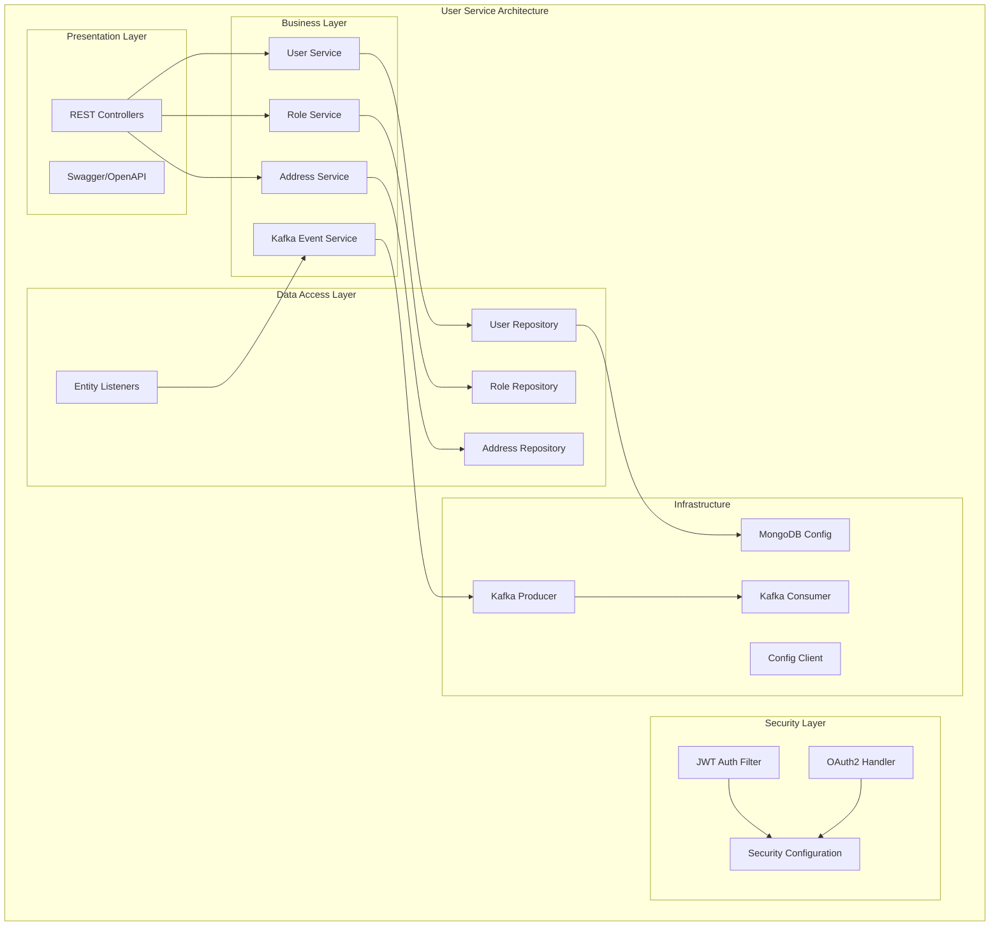
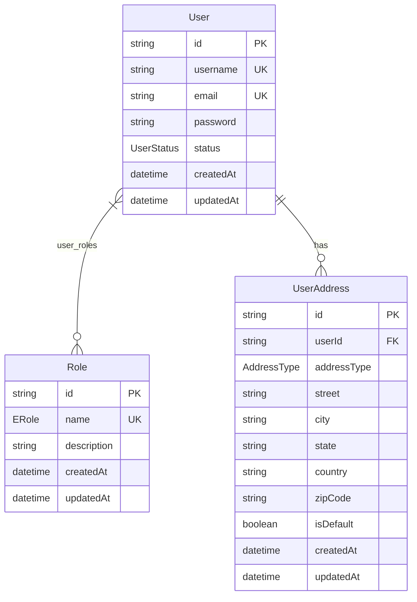
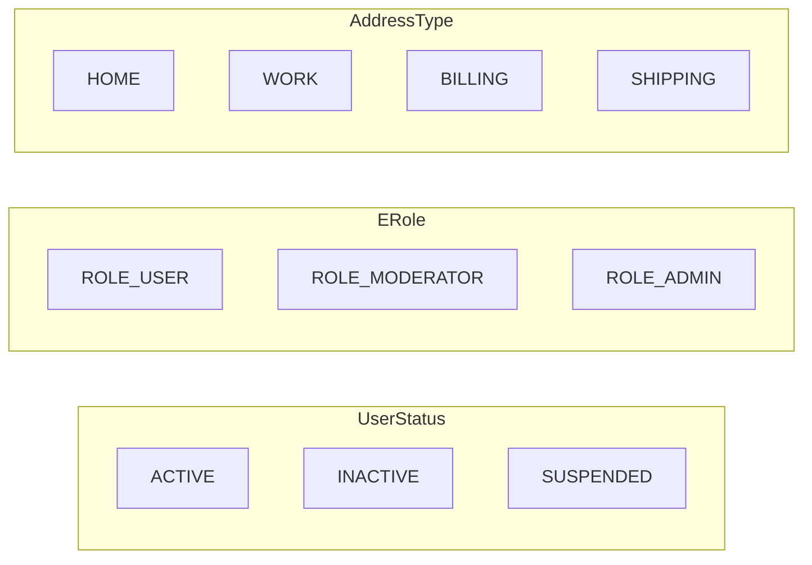
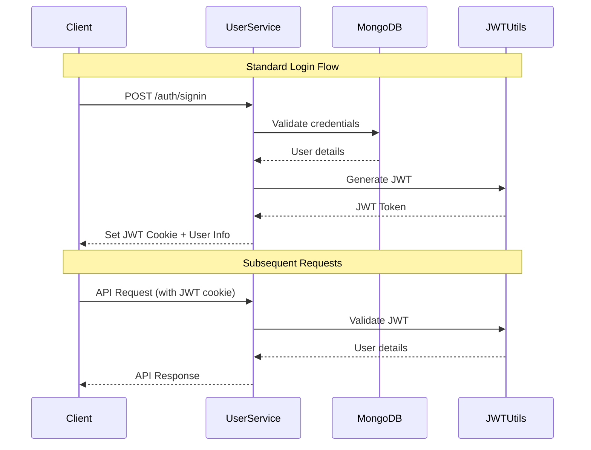
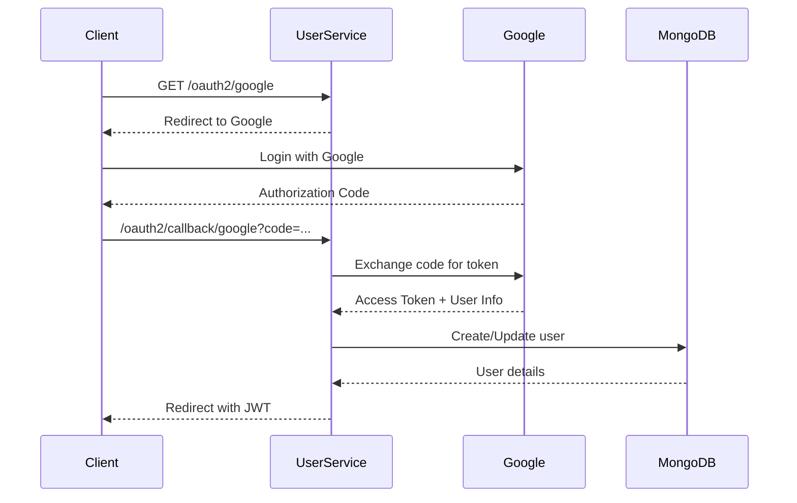
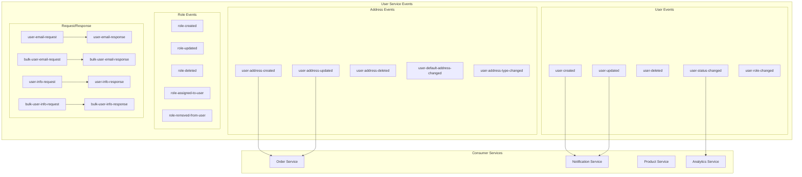
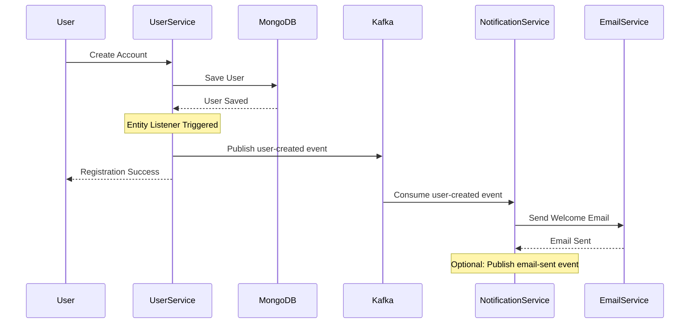

# 🛍️ E-commerce User Service

<div align="center">


**A comprehensive microservice for user management in an e-commerce platform**

</div>

## 📋 Table of Contents

- [🌟 Features](#-features)
- [🏗️ Architecture](#️-architecture)
- [🛠️ Technology Stack](#️-technology-stack)
- [🚀 Quick Start](#-quick-start)
- [📊 Database Schema](#-database-schema)
- [🔒 Security](#-security)
- [📡 API Documentation](#-api-documentation)
- [🔄 Event-Driven Architecture](#-event-driven-architecture)
- [🐳 Docker Deployment](#-docker-deployment)
- [📈 Monitoring](#-monitoring)

## 🌟 Features

### Core Functionality
- ✅ **User Registration & Authentication** (JWT + OAuth2)
- ✅ **Role-Based Access Control** (RBAC)
- ✅ **User Profile Management**
- ✅ **Multi-Address Support** per user
- ✅ **OAuth2 Integration** (Google)
- ✅ **Event-Driven Communication** via Kafka
- ✅ **RESTful API** with comprehensive documentation
- ✅ **Distributed Logging** (ELK Stack)
- ✅ **Service Discovery** (Eureka)
- ✅ **Configuration Management** (Spring Cloud Config)

### Advanced Features
- 🔄 **Real-time Event Publishing** for user lifecycle
- 🛡️ **JWT Cookie-based Authentication**
- 📧 **Cross-service User Information Sharing**
- 🏠 **Address Management** with default address support
- 📊 **Comprehensive Monitoring** and Health Checks
- 🔧 **Hot Configuration Reload**

## 🏗️ Architecture

### System Architecture

```mermaid
graph TB
    subgraph "Client Layer"
        Web[Web Application]
        Mobile[Mobile App]
        Admin[Admin Panel]
    end

    subgraph "API Gateway"
        Gateway[Spring Cloud Gateway<br/>Port: 8080]
    end

    subgraph "Service Discovery"
        Eureka[Eureka Server<br/>Port: 8761]
    end

    subgraph "Configuration Management"
        ConfigServer[Config Server<br/>Port: 8888]
    end

    subgraph "User Service"
        UserApp[User Service<br/>Port: 8081]
        
        subgraph "Controllers"
            AuthCtrl[Auth Controller]
            UserCtrl[User Controller]
            RoleCtrl[Role Controller]
            AddressCtrl[Address Controller]
            OAuth2Ctrl[OAuth2 Controller]
        end
        
        subgraph "Services"
            UserSvc[User Service]
            RoleSvc[Role Service]
            AddressSvc[Address Service]
            EventSvc[Event Services]
        end
        
        subgraph "Security"
            JWT[JWT Utils]
            OAuth2[OAuth2 Config]
            Security[Security Config]
        end
    end

    subgraph "Data Layer"
        MongoDB[(MongoDB<br/>Port: 27017)]
    end

    subgraph "Message Broker"
        Kafka[Apache Kafka<br/>Port: 9092]
        
        subgraph "Topics"
            UserEvents[User Events]
            AddressEvents[Address Events]
            RoleEvents[Role Events]
            RequestResponse[Request/Response]
        end
    end

    subgraph "External Services"
        Google[Google OAuth2]
        ELK[ELK Stack<br/>Logging]
    end

    subgraph "Other Microservices"
        NotificationSvc[Notification Service]
        OrderSvc[Order Service]
        ProductSvc[Product Service]
    end

    %% Connections
    Web --> Gateway
    Mobile --> Gateway
    Admin --> Gateway
    
    Gateway --> UserApp
    UserApp --> Eureka
    UserApp --> ConfigServer
    UserApp --> MongoDB
    UserApp --> Kafka
    UserApp --> Google
    UserApp --> ELK
    
    Kafka --> NotificationSvc
    Kafka --> OrderSvc
    Kafka --> ProductSvc

    %% Styling
    classDef primary fill:#e1f5fe
    classDef secondary fill:#f3e5f5
    classDef database fill:#e8f5e8
    classDef external fill:#fff3e0
    
    class UserApp,Gateway,Eureka,ConfigServer primary
    class MongoDB,Kafka database
    class Google,ELK external
```

### Service Internal Architecture



## 🛠️ Technology Stack

<div align="center">

| Category | Technology | Version | Purpose |
|----------|------------|---------|---------|
| **Framework** |  | 3.4.4 | Main Framework |
| **Language** |  | 21 | Programming Language |
| **Database** |  | 4.4+ | Primary Database |
| **Message Broker** |  | Latest | Event Streaming |
| **Security** |  | 6.x | Authentication & Authorization |
| **Documentation** |  | 3.x | API Documentation |
| **Service Discovery** |  | Latest | Service Registry |
| **Configuration** |  | 2024.0.1 | Configuration Management |
| **Logging** |  | Latest | Centralized Logging |
| **OAuth2** |  | 2.0 | Social Authentication |

</div>

## 🚀 Quick Start

### Prerequisites

```bash
# Required Software
☑️ Java 21
☑️ Maven 3.8+
☑️ MongoDB 4.4+
☑️ Apache Kafka 2.8+
☑️ Docker & Docker Compose (optional)
```

### Installation Steps

1. **Clone the Repository**
```bash
git clone <repository-url>
cd User-Service
```

2. **Start Infrastructure Services**
```bash
# Start MongoDB
docker run -d --name mongodb -p 27017:27017 mongo:latest

# Start Kafka & Zookeeper
docker-compose up -d kafka zookeeper

# Start Eureka Server (if not running)
# Start Config Server (if not running)
```

3. **Configure Application**
```yaml
# application.yaml
spring:
  data:
    mongodb:
      host: localhost
      port: 27017
      database: User-service
  kafka:
    bootstrap-servers: localhost:9092
```

4. **Run the Application**
```bash
# Using Maven
./mvnw spring-boot:run

# Or using Java
./mvnw clean package
java -jar target/User-Service-0.0.1-SNAPSHOT.jar
```

5. **Initialize Roles** (One-time setup)
```bash
curl -X POST http://localhost:8081/api/users/roles/init
```

### Verification

- **Health Check**: http://localhost:8081/api/users/actuator/health
- **API Documentation**: http://localhost:8081/api/users/swagger-ui.html
- **Eureka Dashboard**: http://localhost:8761

## 📊 Database Schema



### Enums



## 🔒 Security

### Authentication Flow



### OAuth2 Flow



### Security Features

- 🔐 **JWT Token Authentication** with HTTP-only cookies
- 🛡️ **Role-Based Access Control** (RBAC)
- 🔑 **OAuth2 Integration** (Google)
- 🚫 **CORS Protection** with configurable origins
- 🔒 **Password Encryption** using BCrypt
- ⏰ **Token Expiration** and refresh handling
- 🛠️ **Method-level Security** with `@PreAuthorize`

## 📡 API Documentation

### Authentication Endpoints

| Method | Endpoint | Description | Auth Required |
|--------|----------|-------------|---------------|
| `POST` | `/auth/signin` | User login | ❌ |
| `POST` | `/auth/signup` | User registration | ❌ |
| `POST` | `/auth/signout` | User logout | ✅ |

### User Management

| Method | Endpoint | Description | Auth Required |
|--------|----------|-------------|---------------|
| `GET` | `/users` | Get all users | ✅ |
| `GET` | `/users/{id}` | Get user by ID | ✅ |
| `GET` | `/users/username/{username}` | Get user by username | ✅ |
| `GET` | `/users/email/{email}` | Get user by email | ✅ |
| `PUT` | `/users/{id}` | Update user | ✅ |
| `PATCH` | `/users/{id}/status/{status}` | Update user status | ✅ |
| `DELETE` | `/users/{id}` | Delete user | ✅ (Admin) |

### Role Management

| Method | Endpoint | Description | Auth Required |
|--------|----------|-------------|---------------|
| `GET` | `/roles` | Get all roles | ✅ |
| `GET` | `/roles/{id}` | Get role by ID | ✅ |
| `POST` | `/roles` | Create role | ✅ |
| `PUT` | `/roles/{id}` | Update role | ✅ |
| `DELETE` | `/roles/{id}` | Delete role | ✅ |
| `POST` | `/roles/init` | Initialize default roles | ❌ |

### Address Management

| Method | Endpoint | Description | Auth Required |
|--------|----------|-------------|---------------|
| `GET` | `/addresses` | Get all addresses | ✅ |
| `GET` | `/addresses/user/{userId}` | Get user addresses | ✅ |
| `GET` | `/addresses/user/{userId}/default` | Get default address | ✅ |
| `POST` | `/addresses` | Create address | ✅ |
| `PUT` | `/addresses/{id}` | Update address | ✅ |
| `PATCH` | `/addresses/{id}/default` | Set as default | ✅ |
| `DELETE` | `/addresses/{id}` | Delete address | ✅ |

### OAuth2 Endpoints

| Method | Endpoint | Description |
|--------|----------|-------------|
| `GET` | `/oauth2/google` | Initiate Google OAuth2 |
| `GET` | `/oauth2/providers` | Get available providers |

## 🔄 Event-Driven Architecture

### Kafka Topics



### Event Flow Example



### Event Schema Examples

```json
// User Created Event
{
  "userId": "64f5a1b2c3d4e5f6a7b8c9d0",
  "username": "john_doe",
  "email": "john@example.com",
  "status": "ACTIVE",
  "roles": ["ROLE_USER"],
  "createdAt": "2024-01-15T10:30:00Z"
}

// Address Updated Event
{
  "addressId": "64f5a1b2c3d4e5f6a7b8c9d1",
  "userId": "64f5a1b2c3d4e5f6a7b8c9d0",
  "addressType": "HOME",
  "street": "123 Main St",
  "city": "New York",
  "state": "NY",
  "country": "USA",
  "zipCode": "10001",
  "isDefault": true,
  "updatedAt": "2024-01-15T10:35:00Z"
}
```

## 🐳 Docker Deployment

### Dockerfile
```dockerfile
FROM openjdk:21-jdk-slim

WORKDIR /app

COPY target/User-Service-0.0.1-SNAPSHOT.jar app.jar

EXPOSE 8081

ENTRYPOINT ["java", "-jar", "app.jar"]
```

### Docker Compose
```yaml
version: '3.8'
services:
  user-service:
    build: .
    ports:
      - "8081:8081"
    environment:
      - SPRING_DATA_MONGODB_HOST=mongodb
      - SPRING_KAFKA_BOOTSTRAP_SERVERS=kafka:9092
      - EUREKA_CLIENT_SERVICE_URL_DEFAULTZONE=http://eureka:8761/eureka/
    depends_on:
      - mongodb
      - kafka
      - eureka
    networks:
      - ecommerce-network

  mongodb:
    image: mongo:latest
    ports:
      - "27017:27017"
    volumes:
      - mongodb-data:/data/db
    networks:
      - ecommerce-network

  kafka:
    image: confluentinc/cp-kafka:latest
    ports:
      - "9092:9092"
    environment:
      KAFKA_ZOOKEEPER_CONNECT: zookeeper:2181
      KAFKA_ADVERTISED_LISTENERS: PLAINTEXT://kafka:9092
    depends_on:
      - zookeeper
    networks:
      - ecommerce-network

  zookeeper:
    image: confluentinc/cp-zookeeper:latest
    ports:
      - "2181:2181"
    environment:
      ZOOKEEPER_CLIENT_PORT: 2181
    networks:
      - ecommerce-network

volumes:
  mongodb-data:

networks:
  ecommerce-network:
    driver: bridge
```

## 📈 Monitoring

### Health Checks

```mermaid
graph TB
    subgraph "Monitoring Stack"
        App[User Service]
        Actuator[Spring Actuator]
        
        subgraph "Metrics"
            Health[Health Check]
            Info[App Info]
            Metrics[JVM Metrics]
            Env[Environment]
        end
        
        subgraph "Logging"
            Logback[Logback]
            Kafka[Kafka Appender]
            ELK[ELK Stack]
        end
        
        subgraph "External Monitoring"
            Prometheus[Prometheus]
            Grafana[Grafana]
            AlertManager[Alert Manager]
        end
    end
    
    App --> Actuator
    Actuator --> Health
    Actuator --> Info
    Actuator --> Metrics
    Actuator --> Env
    
    App --> Logback
    Logback --> Kafka
    Kafka --> ELK
    
    Actuator --> Prometheus
    Prometheus --> Grafana
    Prometheus --> AlertManager
```

### Available Endpoints

| Endpoint | Description |
|----------|-------------|
| `/actuator/health` | Application health status |
| `/actuator/info` | Application information |
| `/actuator/metrics` | Application metrics |
| `/actuator/env` | Environment properties |
| `/actuator/loggers` | Logging configuration |

### Key Metrics to Monitor

- 📊 **API Response Times**
- 🔄 **Request Throughput**
- ❌ **Error Rates**
- 🗄️ **Database Connection Pool**
- 📨 **Kafka Producer/Consumer Metrics**
- 💾 **JVM Memory Usage**
- 🔒 **Authentication Success/Failure Rates**

---

## 🤝 Contributing

1. Fork the repository
2. Create a feature branch (`git checkout -b feature/AmazingFeature`)
3. Commit your changes (`git commit -m 'Add some AmazingFeature'`)
4. Push to the branch (`git push origin feature/AmazingFeature`)
5. Open a Pull Request

## 📄 License

This project is licensed under the MIT License - see the [LICENSE](LICENSE) file for details.

## 📞 Support

- 📧 Email: support@ecommerce.com
- 📖 Documentation: [Wiki](./wiki)
- 🐛 Issues: [GitHub Issues](./issues)
- 💬 Discussions: [GitHub Discussions](./discussions)

---

<div align="center">

**Built with ❤️ for the E-commerce Platform**


</div>