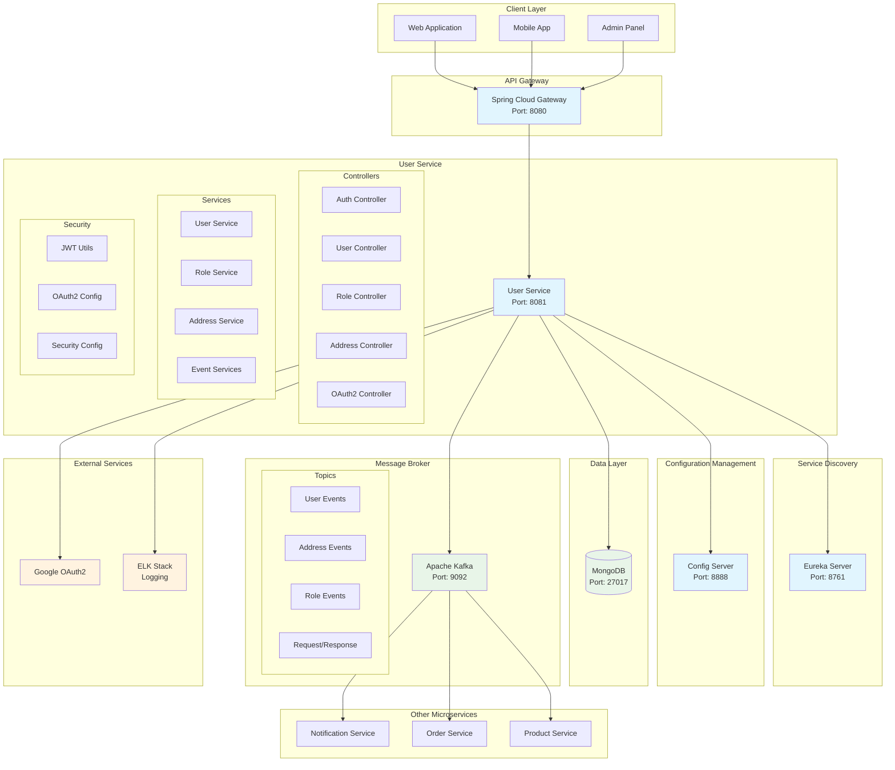
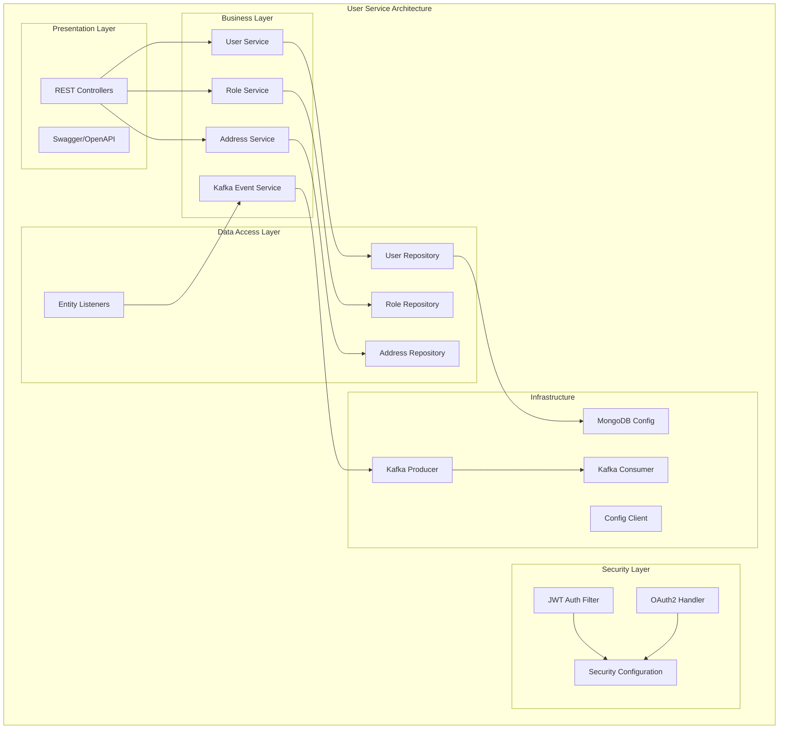
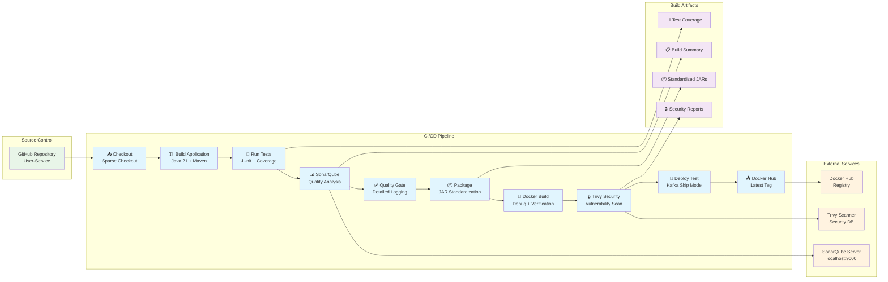
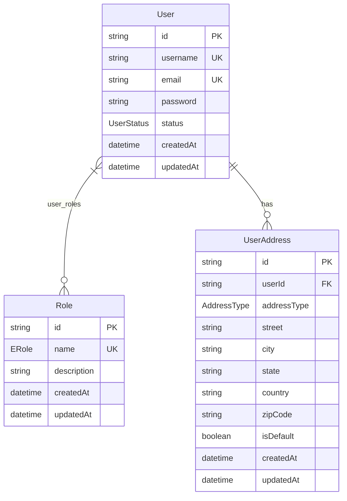
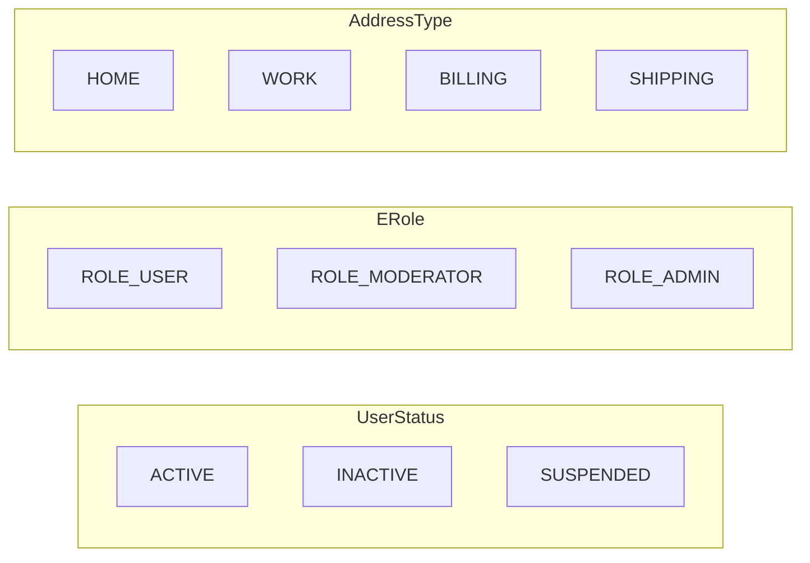
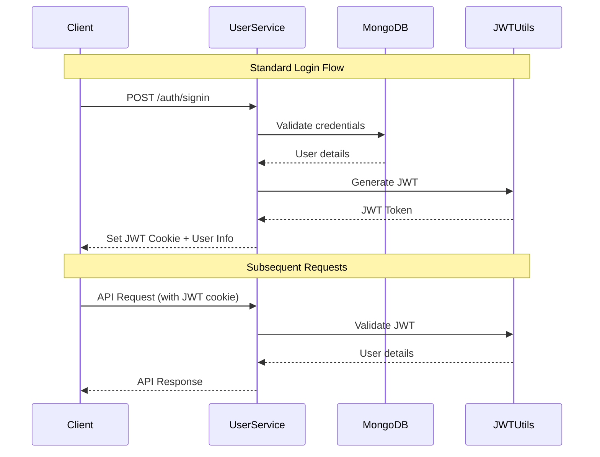
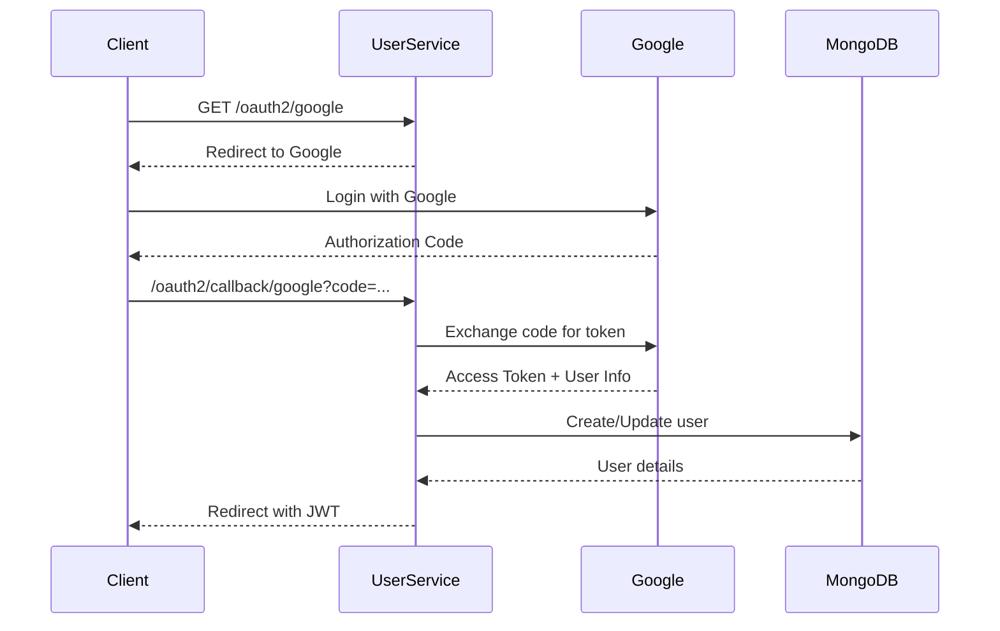
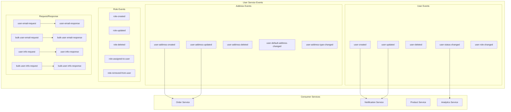
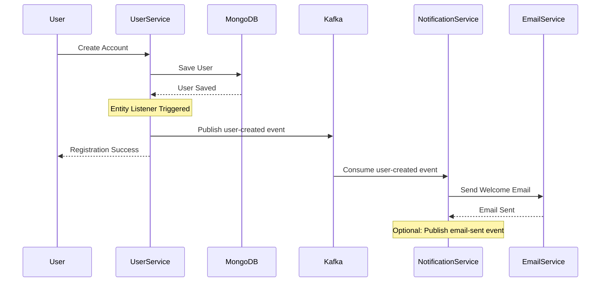

# 🛍️ E-commerce User Service

<div align="center">


**A comprehensive microservice for user management in an e-commerce platform**

[Features](#-features) • [Architecture](#️-architecture) • [Quick Start](#-quick-start) • [CI/CD Pipeline](#-cicd-pipeline) • [API Documentation](#-api-documentation) • [Event-Driven Architecture](#-event-driven-architecture)

</div>

## 📋 Table of Contents

- [🌟 Features](#-features)
- [🏗️ Architecture](#️-architecture)
- [🛠️ Technology Stack](#️-technology-stack)
- [🚀 Quick Start](#-quick-start)
- [🔄 CI/CD Pipeline](#-cicd-pipeline)
- [📊 Database Schema](#-database-schema)
- [🔒 Security](#-security)
- [📡 API Documentation](#-api-documentation)
- [🔄 Event-Driven Architecture](#-event-driven-architecture)
- [🐳 Docker Deployment](#-docker-deployment)
- [📈 Monitoring](#-monitoring)

## 🌟 Features

### Core Functionality
- ✅ **User Registration & Authentication** (JWT + OAuth2)
- ✅ **Role-Based Access Control** (RBAC)
- ✅ **User Profile Management**
- ✅ **Multi-Address Support** per user
- ✅ **OAuth2 Integration** (Google)
- ✅ **Event-Driven Communication** via Kafka
- ✅ **RESTful API** with comprehensive documentation
- ✅ **Distributed Logging** (ELK Stack)
- ✅ **Service Discovery** (Eureka)
- ✅ **Configuration Management** (Spring Cloud Config)

### Advanced Features
- 🔄 **Real-time Event Publishing** for user lifecycle
- 🛡️ **JWT Cookie-based Authentication**
- 📧 **Cross-service User Information Sharing**
- 🏠 **Address Management** with default address support
- 📊 **Comprehensive Monitoring** and Health Checks
- 🔧 **Hot Configuration Reload**

## 🏗️ Architecture

### System Architecture



### Service Internal Architecture



## 🛠️ Technology Stack

<div align="center">

| Category | Technology | Version | Purpose |
|----------|------------|---------|---------|
| **Framework** |  | 3.4.4 | Main Framework |
| **Language** |  | 21 | Programming Language |
| **Database** |  | 4.4+ | Primary Database |
| **Message Broker** |  | Latest | Event Streaming |
| **Security** |  | 6.x | Authentication & Authorization |
| **Documentation** |  | 3.x | API Documentation |
| **Service Discovery** |  | Latest | Service Registry |
| **Configuration** |  | 2024.0.1 | Configuration Management |
| **Logging** |  | Latest | Centralized Logging |
| **OAuth2** |  | 2.0 | Social Authentication |

</div>

## 🚀 Quick Start

### Prerequisites

```bash
# Required Software
☑️ Java 21
☑️ Maven 3.8+
☑️ MongoDB 4.4+
☑️ Apache Kafka 2.8+
☑️ Docker & Docker Compose (optional)
```

### Installation Steps

1. **Clone the Repository**
```bash
git clone <repository-url>
cd User-Service
```

2. **Start Infrastructure Services**
```bash
# Start MongoDB
docker run -d --name mongodb -p 27017:27017 mongo:latest

# Start Kafka & Zookeeper
docker-compose up -d kafka zookeeper

# Start Eureka Server (if not running)
# Start Config Server (if not running)
```

3. **Configure Application**
```yaml
# application.yaml
spring:
  data:
    mongodb:
      host: localhost
      port: 27017
      database: User-service
  kafka:
    bootstrap-servers: localhost:9092
```

4. **Run the Application**
```bash
# Using Maven
./mvnw spring-boot:run

# Or using Java
./mvnw clean package
java -jar target/User-Service-0.0.1-SNAPSHOT.jar
```

5. **Initialize Roles** (One-time setup)
```bash
curl -X POST http://localhost:8081/api/users/roles/init
```

### Verification

- **Health Check**: http://localhost:8081/api/users/actuator/health
- **API Documentation**: http://localhost:8081/api/users/swagger-ui.html
- **Eureka Dashboard**: http://localhost:8761

## 🔄 CI/CD Pipeline

<div align="center">


**Enterprise-grade CI/CD pipeline with advanced debugging and comprehensive quality assurance**

</div>

The User Service features a sophisticated Jenkins-based CI/CD pipeline that emphasizes robust error handling, detailed debugging, and comprehensive quality assurance. Our pipeline is specifically optimized for Spring Boot microservices with MongoDB and Kafka integration, ensuring reliable deployments while handling complex dependency challenges.

### 🏗️ Pipeline Architecture



### 🔧 Advanced Pipeline Stages

Our Jenkins pipeline includes 10 sophisticated stages with comprehensive error handling and debugging capabilities:

#### 1. **📥 Sparse Checkout**
- **Purpose**: Efficient repository checkout targeting only User-Service directory
- **Features**:
  - Selective directory checkout for faster builds
  - Git credentials management with dedicated token
  - Main branch targeting with automatic updates

```groovy
checkout([$class: 'GitSCM',
    branches: [[name: '*/main']],
    userRemoteConfigs: [[
        url: 'https://github.com/ZakariaRek/Ecommerce-App',
        credentialsId: env.GIT_CREDENTIALS_ID
    ]],
    extensions: [
        [$class: 'SparseCheckoutPaths', sparseCheckoutPaths: [[path: 'User-Service/']]]
    ]
])
```

#### 2. **🏗️ Java 21 Optimized Build**
- **Purpose**: Compiles application with specific Java 21 configurations
- **Features**:
  - Explicit Java 21 compiler settings
  - Comprehensive clean and compile process
  - Build environment verification

```bash
mvn clean compile \
  -Dmaven.compiler.source=17 \
  -Dmaven.compiler.target=17 \
  -Dmaven.compiler.release=17
```

**Advanced Configuration**:
- Source compatibility with Java 17+ features
- Target bytecode optimization
- Release flag for cross-platform compatibility

#### 3. **🧪 Comprehensive Testing**
- **Purpose**: Executes full test suite with advanced error handling
- **Features**:
  - Test failure tolerance for continuous analysis
  - Spring Test profile activation
  - JaCoCo coverage report generation
  - Automatic test result archiving

```bash
mvn test \
  -Dmaven.test.failure.ignore=true \
  -Dspring.profiles.active=test \
  -Dmaven.compiler.source=17 \
  -Dmaven.compiler.target=17 \
  -Dmaven.compiler.release=17
```

**Test Reporting Features**:
- JUnit XML report archiving with empty result tolerance
- JaCoCo coverage report detection and archiving
- Test failure status tracking for pipeline summary
- Detailed test execution logging

#### 4. **📊 Enhanced SonarQube Analysis**
- **Purpose**: Comprehensive code quality analysis with fallback mechanisms
- **Features**:
  - Dual connection strategy (Jenkins config + direct)
  - Project-specific configuration for User Service
  - Build number versioning
  - Comprehensive error handling with fallback

```bash
# Primary Jenkins-configured connection
mvn sonar:sonar \
  -Dsonar.projectKey=E-commerce-User-Service \
  -Dsonar.projectName="E-commerce User Service" \
  -Dsonar.projectVersion=%BUILD_NUMBER% \
  -Dsonar.host.url=%SONAR_HOST_URL% \
  -Dsonar.token=%SONAR_AUTH_TOKEN%

# Fallback direct connection
mvn clean verify sonar:sonar \
  -Dsonar.projectKey=E-commerce-User-Service \
  -Dsonar.host.url=http://localhost:9000 \
  -Dsonar.token=sqa_4b9038ee4ac53217da5fb0466f3dc9886bfafd96
```

**Quality Metrics Analyzed**:
- Code coverage percentage and trends
- Technical debt assessment and ratios
- Code duplication detection
- Security hotspots identification
- Maintainability and reliability ratings
- Code smell detection and classification

#### 5. **✅ Intelligent Quality Gate**
- **Purpose**: Enforces code quality standards with detailed feedback
- **Features**:
  - 2-minute timeout for quality gate evaluation
  - Comprehensive error logging and diagnosis
  - Pipeline status adjustment based on quality metrics
  - Detailed failure analysis and recommendations

```groovy
timeout(time: 2, unit: 'MINUTES') {
    def qg = waitForQualityGate()
    if (qg.status != 'OK') {
        echo "⚠️ Quality Gate failed: ${qg.status}"
        echo "📊 Quality Gate Details:"
        echo "   - Project: ${qg.projectStatus?.projectName ?: 'Ecommerce-app'}"
        echo "   - Status: ${qg.status}"
        currentBuild.result = 'UNSTABLE'
    }
}
```

**Failure Diagnosis**:
- SonarQube server reachability checks
- Quality gate configuration validation
- Webhook configuration verification
- Manual dashboard review instructions

#### 6. **📦 Advanced Package Management**
- **Purpose**: Creates standardized JAR artifacts with verification
- **Features**:
  - JAR file creation with skipped tests
  - Comprehensive JAR verification process
  - Automatic JAR standardization for consistent naming
  - Build artifact validation

```bash
mvn package -DskipTests \
  -Dmaven.compiler.source=17 \
  -Dmaven.compiler.target=17 \
  -Dmaven.compiler.release=17
```

**JAR Standardization Process**:
- Verification of expected JAR file patterns
- Automatic detection of available JAR files
- Creation of standardized naming convention (`User-Service-app.jar`)
- Build artifact consistency validation

#### 7. **🐳 Sophisticated Docker Build**
- **Purpose**: Containerizes application with comprehensive debugging
- **Features**:
  - Detailed build environment inspection
  - Pre-build validation of required files
  - Docker image verification and testing
  - Docker Compose integration with error handling

```bash
# Environment debugging
echo "=== Current Directory Structure ==="
dir
echo "=== Target Directory ==="
if exist target (dir target) else (echo Target directory not found)
echo "=== Checking for required files ==="
if exist pom.xml (echo "✅ pom.xml found") else (echo "❌ pom.xml missing")
if exist Dockerfile (echo "✅ Dockerfile found") else (echo "❌ Dockerfile missing")

# Docker build with verification
docker build -t user-service:latest .
docker images user-service:latest
```

**Advanced Features**:
- Dockerfile content inspection for debugging
- JAR file existence verification before Docker build
- Image creation verification without connectivity testing
- Kafka connection avoidance for build stability

#### 8. **🔒 Enhanced Security Scanning**
- **Purpose**: Comprehensive vulnerability analysis with Trivy
- **Features**:
  - Automatic Trivy installation for Windows environment
  - Vulnerability database updates and caching
  - Multi-format reporting (table + JSON)
  - Severity-based pipeline control

```bash
# Trivy installation check
where trivy >nul 2>&1
if errorlevel 1 (
    echo 📥 Installing Trivy for Windows...
    powershell -Command "Invoke-WebRequest -Uri https://github.com/aquasecurity/trivy/releases/download/v0.48.3/trivy_0.48.3_Windows-64bit.zip -OutFile trivy.zip"
    powershell -Command "Expand-Archive -Path trivy.zip -DestinationPath . -Force"
    move trivy.exe C:\Windows\System32\
)

# Comprehensive scanning
trivy image --cache-dir "${TRIVY_CACHE_DIR}" \
  --format table --output trivy-report.txt user-service:latest
trivy image --cache-dir "${TRIVY_CACHE_DIR}" \
  --format json --output trivy-report.json user-service:latest
trivy image --cache-dir "${TRIVY_CACHE_DIR}" \
  --severity HIGH,CRITICAL --exit-code 1 user-service:latest
```

**Security Features**:
- OS package vulnerability detection
- Application dependency scanning
- Container base image security analysis
- Severity classification (LOW, MEDIUM, HIGH, CRITICAL)
- Automated security report archiving

#### 9. **🚀 Production-Ready Deployment**
- **Purpose**: Tests container deployment with Kafka-aware configuration
- **Features**:
  - Docker Compose orchestration
  - Health check validation (Kafka-skip mode)
  - Container status verification
  - Service readiness confirmation

```bash
# Container deployment
docker-compose -f ${COMPOSE_FILE} up -d
powershell -Command "Start-Sleep -Seconds 10"
docker-compose -f ${COMPOSE_FILE} ps

# Skip Kafka connectivity tests
echo "⏭️ Skipping application health checks to avoid Kafka connection requirements"
```

**Deployment Considerations**:
- Kafka connectivity challenges addressed
- Container orchestration with dependency management
- Service startup sequence optimization
- Health check strategy for microservice environments

#### 10. **📤 Docker Hub Publishing**
- **Purpose**: Publishes container images to Docker registry
- **Features**:
  - Secure Docker Hub authentication
  - Latest tag strategy for production deployment
  - Credential management with Jenkins integration
  - Push verification and logging

```bash
# Secure authentication
echo %DOCKERHUB_PASSWORD% | docker login -u %DOCKERHUB_USERNAME% --password-stdin

# Image tagging and publishing
docker tag user-service:latest ${DOCKERHUB_REPO}:${IMAGE_TAG}
docker push ${DOCKERHUB_REPO}:${IMAGE_TAG}
```

### 📊 Advanced Monitoring & Reporting

#### **Comprehensive Build Summary**
The pipeline generates detailed build summaries with actionable insights:

```
=== USER SERVICE BUILD SUMMARY ===
Build Number: ${BUILD_NUMBER}
Build Status: ${currentBuild.result ?: 'SUCCESS'}
Date: ${new Date()}

📊 Reports Available:
- SonarQube: http://localhost:9000/dashboard?id=Ecommerce-app
- Trivy Security Reports: Build Artifacts
- Test Results: Available in Jenkins

🔗 Quick Links:
- Build Artifacts: ${BUILD_URL}artifact/
- Console Output: ${BUILD_URL}console
- SonarQube Dashboard: http://localhost:9000/dashboard?id=Ecommerce-app

📝 Pipeline Summary:
- Tests Status: ${env.TESTS_FAILED == 'true' ? '⚠️ Some Failed' : '✅ Passed'}
- SonarQube: Analysis completed
- Security: Trivy scan completed
- Docker: Images built and pushed
- Kafka: Connection tests skipped (by design)
```

#### **Build Status Classification**
- ✅ **Success**: All stages completed without issues
- ⚠️ **Unstable**: Quality gate failures or security vulnerabilities detected
- ❌ **Failed**: Critical pipeline stage failure requiring immediate attention

#### **Automated Artifact Management**
- **Test Reports**: JUnit XML reports with coverage analysis
- **Security Reports**: Trivy vulnerability assessments in multiple formats
- **Code Quality**: SonarQube analysis with trend tracking
- **Build Summaries**: Comprehensive build information and metrics

### 🔧 Jenkins Configuration Requirements

#### **Environment Variables**
```groovy
environment {
    COMPOSE_FILE = 'compose.yaml'
    DOCKERHUB_CREDENTIALS = 'yahya.zakaria-dockerhub'
    DOCKERHUB_REPO = 'yahyazakaria123/ecommerce-app-user-service'
    IMAGE_TAG = 'latest'
    GIT_CREDENTIALS_ID = 'GithubCredentials'
    TRIVY_CACHE_DIR = 'C:\\temp\\trivy-cache'
    TRIVY_DB_REPOSITORY = 'ghcr.io/aquasecurity/trivy-db'
    TRIVY_JAVA_DB_REPOSITORY = 'ghcr.io/aquasecurity/trivy-java-db'
}
```

#### **Required Jenkins Plugins**
- Pipeline Plugin (latest)
- Git Plugin for source control management
- SonarQube Scanner Plugin for code quality
- Docker Pipeline Plugin for containerization
- JUnit Plugin for test reporting
- Credentials Plugin for secure credential management

#### **Tool Configuration**
- **Maven**: Version 3.9.7 configured in Jenkins Global Tools
- **Java**: JDK 21 with proper environment variables
- **Docker**: Docker Engine with BuildKit support
- **SonarQube**: Server configuration with authentication tokens

### 🛡️ Security & Quality Assurance

#### **Multi-Layer Security Approach**
- **Static Analysis**: SonarQube security hotspot detection
- **Dependency Scanning**: Trivy vulnerability assessment
- **Container Security**: Base image and runtime security analysis
- **Credential Security**: Jenkins credential management with secure storage

#### **Quality Gate Enforcement**
- **Coverage Thresholds**: Minimum code coverage requirements
- **Duplication Limits**: Maximum allowed code duplication
- **Maintainability Standards**: Technical debt ratio enforcement
- **Security Compliance**: Vulnerability severity thresholds

#### **Best Practices Implementation**
- ✅ **Comprehensive Testing**: Unit, integration, and security testing
- ✅ **Quality Enforcement**: Automated quality gate validation
- ✅ **Security Scanning**: Multi-stage vulnerability assessment
- ✅ **Container Optimization**: Efficient Docker image building
- ✅ **Artifact Management**: Standardized naming and versioning
- ✅ **Error Handling**: Robust error recovery and reporting
- ✅ **Documentation**: Comprehensive build and deployment logs

### 🔗 Integration Ecosystem

#### **External Tool Integration**
- **GitHub**: Source code management with webhook triggers
- **SonarQube**: Code quality and security analysis dashboard
- **Docker Hub**: Container registry with automated publishing
- **Trivy**: Security vulnerability database and scanning
- **MongoDB**: Database connectivity validation
- **Kafka**: Event streaming integration testing

#### **Microservice Communication**
- **Service Discovery**: Eureka integration for service registration
- **Configuration Management**: Spring Cloud Config for dynamic configuration
- **Event Streaming**: Kafka integration for cross-service communication
- **API Gateway**: Spring Cloud Gateway for request routing

### 📈 Performance Metrics & KPIs

#### **Pipeline Performance**
- **Build Duration**: Average pipeline execution time tracking
- **Success Rate**: Percentage of successful builds over time
- **Quality Gate Pass Rate**: Code quality compliance metrics
- **Security Score**: Vulnerability trend analysis and improvement
- **Test Coverage**: Coverage percentage trends and targets

#### **Deployment Metrics**
- **Deployment Frequency**: Release cadence and velocity
- **Lead Time**: Time from commit to production deployment
- **Change Failure Rate**: Percentage of deployments requiring rollback
- **Recovery Time**: Mean time to recovery from deployment issues

This sophisticated CI/CD pipeline ensures that every code change goes through rigorous testing, quality analysis, and security validation, maintaining the highest standards for enterprise-grade microservice deployment while addressing the unique challenges of Spring Boot applications with complex dependencies.

## 📊 Database Schema



### Enums



## 🔒 Security

### Authentication Flow



### OAuth2 Flow



### Security Features

- 🔐 **JWT Token Authentication** with HTTP-only cookies
- 🛡️ **Role-Based Access Control** (RBAC)
- 🔑 **OAuth2 Integration** (Google)
- 🚫 **CORS Protection** with configurable origins
- 🔒 **Password Encryption** using BCrypt
- ⏰ **Token Expiration** and refresh handling
- 🛠️ **Method-level Security** with `@PreAuthorize`

## 📡 API Documentation

### Authentication Endpoints

| Method | Endpoint | Description | Auth Required |
|--------|----------|-------------|---------------|
| `POST` | `/auth/signin` | User login | ❌ |
| `POST` | `/auth/signup` | User registration | ❌ |
| `POST` | `/auth/signout` | User logout | ✅ |

### User Management

| Method | Endpoint | Description | Auth Required |
|--------|----------|-------------|---------------|
| `GET` | `/users` | Get all users | ✅ |
| `GET` | `/users/{id}` | Get user by ID | ✅ |
| `GET` | `/users/username/{username}` | Get user by username | ✅ |
| `GET` | `/users/email/{email}` | Get user by email | ✅ |
| `PUT` | `/users/{id}` | Update user | ✅ |
| `PATCH` | `/users/{id}/status/{status}` | Update user status | ✅ |
| `DELETE` | `/users/{id}` | Delete user | ✅ (Admin) |

### Role Management

| Method | Endpoint | Description | Auth Required |
|--------|----------|-------------|---------------|
| `GET` | `/roles` | Get all roles | ✅ |
| `GET` | `/roles/{id}` | Get role by ID | ✅ |
| `POST` | `/roles` | Create role | ✅ |
| `PUT` | `/roles/{id}` | Update role | ✅ |
| `DELETE` | `/roles/{id}` | Delete role | ✅ |
| `POST` | `/roles/init` | Initialize default roles | ❌ |

### Address Management

| Method | Endpoint | Description | Auth Required |
|--------|----------|-------------|---------------|
| `GET` | `/addresses` | Get all addresses | ✅ |
| `GET` | `/addresses/user/{userId}` | Get user addresses | ✅ |
| `GET` | `/addresses/user/{userId}/default` | Get default address | ✅ |
| `POST` | `/addresses` | Create address | ✅ |
| `PUT` | `/addresses/{id}` | Update address | ✅ |
| `PATCH` | `/addresses/{id}/default` | Set as default | ✅ |
| `DELETE` | `/addresses/{id}` | Delete address | ✅ |

### OAuth2 Endpoints

| Method | Endpoint | Description |
|--------|----------|-------------|
| `GET` | `/oauth2/google` | Initiate Google OAuth2 |
| `GET` | `/oauth2/providers` | Get available providers |

## 🔄 Event-Driven Architecture

### Kafka Topics



### Event Flow Example



### Event Schema Examples

```json
// User Created Event
{
  "userId": "64f5a1b2c3d4e5f6a7b8c9d0",
  "username": "john_doe",
  "email": "john@example.com",
  "status": "ACTIVE",
  "roles": ["ROLE_USER"],
  "createdAt": "2024-01-15T10:30:00Z"
}

// Address Updated Event
{
  "addressId": "64f5a1b2c3d4e5f6a7b8c9d1",
  "userId": "64f5a1b2c3d4e5f6a7b8c9d0",
  "addressType": "HOME",
  "street": "123 Main St",
  "city": "New York",
  "state": "NY",
  "country": "USA",
  "zipCode": "10001",
  "isDefault": true,
  "updatedAt": "2024-01-15T10:35:00Z"
}
```

## 🐳 Docker Deployment

### Dockerfile
```dockerfile
FROM openjdk:21-jdk-slim

WORKDIR /app

COPY target/User-Service-0.0.1-SNAPSHOT.jar app.jar

EXPOSE 8081

ENTRYPOINT ["java", "-jar", "app.jar"]
```

### Docker Compose
```yaml
version: '3.8'
services:
  user-service:
    build: .
    ports:
      - "8081:8081"
    environment:
      - SPRING_DATA_MONGODB_HOST=mongodb
      - SPRING_KAFKA_BOOTSTRAP_SERVERS=kafka:9092
      - EUREKA_CLIENT_SERVICE_URL_DEFAULTZONE=http://eureka:8761/eureka/
    depends_on:
      - mongodb
      - kafka
      - eureka
    networks:
      - ecommerce-network

  mongodb:
    image: mongo:latest
    ports:
      - "27017:27017"
    volumes:
      - mongodb-data:/data/db
    networks:
      - ecommerce-network

  kafka:
    image: confluentinc/cp-kafka:latest
    ports:
      - "9092:9092"
    environment:
      KAFKA_ZOOKEEPER_CONNECT: zookeeper:2181
      KAFKA_ADVERTISED_LISTENERS: PLAINTEXT://kafka:9092
    depends_on:
      - zookeeper
    networks:
      - ecommerce-network

  zookeeper:
    image: confluentinc/cp-zookeeper:latest
    ports:
      - "2181:2181"
    environment:
      ZOOKEEPER_CLIENT_PORT: 2181
    networks:
      - ecommerce-network

volumes:
  mongodb-data:

networks:
  ecommerce-network:
    driver: bridge
```

## 📈 Monitoring

### Health Checks

```mermaid
graph TB
    subgraph "Monitoring Stack"
        App[User Service]
        Actuator[Spring Actuator]
        
        subgraph "Metrics"
            Health[Health Check]
            Info[App Info]
            Metrics[JVM Metrics]
            Env[Environment]
        end
        
        subgraph "Logging"
            Logback[Logback]
            Kafka[Kafka Appender]
            ELK[ELK Stack]
        end
        
        subgraph "External Monitoring"
            Prometheus[Prometheus]
            Grafana[Grafana]
            AlertManager[Alert Manager]
        end
    end
    
    App --> Actuator
    Actuator --> Health
    Actuator --> Info
    Actuator --> Metrics
    Actuator --> Env
    
    App --> Logback
    Logback --> Kafka
    Kafka --> ELK
    
    Actuator --> Prometheus
    Prometheus --> Grafana
    Prometheus --> AlertManager
```

### Available Endpoints

| Endpoint | Description |
|----------|-------------|
| `/actuator/health` | Application health status |
| `/actuator/info` | Application information |
| `/actuator/metrics` | Application metrics |
| `/actuator/env` | Environment properties |
| `/actuator/loggers` | Logging configuration |

### Key Metrics to Monitor

- 📊 **API Response Times**
- 🔄 **Request Throughput**
- ❌ **Error Rates**
- 🗄️ **Database Connection Pool**
- 📨 **Kafka Producer/Consumer Metrics**
- 💾 **JVM Memory Usage**
- 🔒 **Authentication Success/Failure Rates**

---

## 🤝 Contributing

1. Fork the repository
2. Create a feature branch (`git checkout -b feature/AmazingFeature`)
3. Commit your changes (`git commit -m 'Add some AmazingFeature'`)
4. Push to the branch (`git push origin feature/AmazingFeature`)
5. Open a Pull Request

## 📄 License

This project is licensed under the MIT License - see the [LICENSE](LICENSE) file for details.

## 📞 Support

- 📧 Email: support@ecommerce.com
- 📖 Documentation: [Wiki](./wiki)
- 🐛 Issues: [GitHub Issues](./issues)
- 💬 Discussions: [GitHub Discussions](./discussions)

---

<div align="center">

**Built with ❤️ for the E-commerce Platform**


</div>
